# ForgeMind — Master System Architecture

## Purpose

This diagram explains the entire ForgeMind platform as one connected system:
- product surface
- frontend
- backend API
- service layer
- data layer
- worker/agents
- collaboration systems
- governance systems
- code-ops systems
- sandbox/review/pr flows

---

## Giant Master Architecture Diagram

```mermaid
flowchart TB

%% =========================================================
%% USERS / ENTRY
%% =========================================================
U[Operator / Reviewer / Workspace Member]
EXT[External Channels<br/>Slack / Webhook / Email]
REPO[External Repositories<br/>GitHub / GitLab / Bitbucket / Local Repo]

%% =========================================================
%% FRONTEND
%% =========================================================
subgraph FE[Next.js Frontend - apps/web]
  FE_DASH[Dashboard]
  FE_WS[Workspaces Page]
  FE_NOTIF[Notifications Page]
  FE_PROJ[Project Detail]
  FE_RUN[Run Detail]
  FE_ART[Artifact Detail]
  FE_APP[Approvals Page]
  FE_ACT[Activity Feed]
  FE_ESC[Escalations Page]
  FE_CODE[Code Explorer]
  FE_REVIEW[Review Workspace]
  FE_SANDBOX[Sandbox Page]

  FE_COMP_LAYOUT[components/layout/*]
  FE_COMP_PROJECTS[components/projects/*]
  FE_COMP_TASKS[components/tasks/*]
  FE_COMP_ART[components/artifacts/*]
  FE_COMP_CHAT[components/chat/*]
  FE_COMP_APPROVALS[components/approvals/*]
  FE_COMP_REVIEWS[components/reviews/*]
  FE_LIB[lib/* API clients]
  FE_TYPES[types/*]
end

U --> FE_DASH
U --> FE_WS
U --> FE_NOTIF
U --> FE_PROJ
U --> FE_RUN
U --> FE_ART
U --> FE_APP
U --> FE_ACT
U --> FE_ESC
U --> FE_CODE
U --> FE_REVIEW
U --> FE_SANDBOX

%% =========================================================
%% API ROUTER
%% =========================================================
subgraph API[FastAPI Backend - apps/api/app]
  API_MAIN[main.py<br/>App Factory / Middleware / Lifespan]
  API_ROUTER[api/router.py]

  R_HEALTH[health routes]
  R_PROJECTS[projects routes]
  R_PLANNER[planner routes]
  R_PLAN_RESULTS[planner_results routes]
  R_TASKS[tasks routes]
  R_RUNS[runs routes]
  R_ARTIFACTS[artifacts routes]
  R_AGENTS[agents routes]
  R_APPROVALS[approvals routes]
  R_EVENTS[events routes]
  R_CHAT[chat routes]
  R_COMPOSITION[composition routes]
  R_CONNECTORS[connectors routes]
  R_MEMORY[memory routes]
  R_VAULT[credential_vault routes]
  R_RETRY[retry routes]
  R_LIFECYCLE[run_lifecycle routes]
  R_COSTS[costs routes]
  R_GOV[governance routes]
  R_AUDIT[audit routes]
  R_TRUST[trust routes]
  R_REPLAY[replay routes]
  R_COUNCIL[council routes]
  R_KNOWLEDGE[knowledge routes]
  R_REPOS[repos routes]

  R_WORKSPACES[workspaces routes]
  R_MEMBERS[members / project membership routes]
  R_STREAM[streaming routes]
  R_NOTIFICATIONS[notifications routes]
  R_ESCALATION[escalation routes]
  R_ACTIVITY[activity routes]

  R_CODEOPS[code_ops routes]
end

FE_LIB --> API_ROUTER
API_MAIN --> API_ROUTER

API_ROUTER --> R_HEALTH
API_ROUTER --> R_PROJECTS
API_ROUTER --> R_PLANNER
API_ROUTER --> R_PLAN_RESULTS
API_ROUTER --> R_TASKS
API_ROUTER --> R_RUNS
API_ROUTER --> R_ARTIFACTS
API_ROUTER --> R_AGENTS
API_ROUTER --> R_APPROVALS
API_ROUTER --> R_EVENTS
API_ROUTER --> R_CHAT
API_ROUTER --> R_COMPOSITION
API_ROUTER --> R_CONNECTORS
API_ROUTER --> R_MEMORY
API_ROUTER --> R_VAULT
API_ROUTER --> R_RETRY
API_ROUTER --> R_LIFECYCLE
API_ROUTER --> R_COSTS
API_ROUTER --> R_GOV
API_ROUTER --> R_AUDIT
API_ROUTER --> R_TRUST
API_ROUTER --> R_REPLAY
API_ROUTER --> R_COUNCIL
API_ROUTER --> R_KNOWLEDGE
API_ROUTER --> R_REPOS
API_ROUTER --> R_WORKSPACES
API_ROUTER --> R_MEMBERS
API_ROUTER --> R_STREAM
API_ROUTER --> R_NOTIFICATIONS
API_ROUTER --> R_ESCALATION
API_ROUTER --> R_ACTIVITY
API_ROUTER --> R_CODEOPS

%% =========================================================
%% CORE SERVICES
%% =========================================================
subgraph SVC[Service Layer - apps/api/app/services]
  S_PROJECT[project_service]
  S_PLANNER[planner_service]
  S_TASK[task_service]
  S_EXEC[execution_service]
  S_ART[artifact_service]
  S_AGENT[agent_service]
  S_APPROVAL[approval_service]
  S_EVENT[event_service]
  S_CHAT[chat_service]
  S_COMP[composition_service]
  S_CONN[connector_service]
  S_MEM[run_memory_service]
  S_RETRY[adaptive_retry_service]
  S_ORCH[adaptive_orchestrator]
  S_LIFE[run_lifecycle_service]
  S_COST[cost_tracking_service]
  S_GOV[governance_service]
  S_AUDIT[audit_export_service]
  S_TRUST[trust_scoring_service]
  S_REPLAY[replay_service]
  S_COUNCIL[council_service]
  S_KNOWLEDGE[knowledge_service]
  S_REPO[repo_service]

  S_WORKSPACE[workspace_service]
  S_AUTHZ[authz_service]
  S_MEMBER[membership_service]
  S_STREAM[stream_service]
  S_NOTIFY[notification_service]
  S_NOTIFY_DELIV[notification_delivery_service]
  S_ESC[escalation_service]
  S_ACTIVITY[activity_service]
  S_USERACT[user_activity_service]

  S_CODEOPS[code_ops_service]
end

R_PROJECTS --> S_PROJECT
R_PLANNER --> S_PLANNER
R_PLAN_RESULTS --> S_PLANNER
R_TASKS --> S_TASK
R_TASKS --> S_EXEC
R_RUNS --> S_TASK
R_ARTIFACTS --> S_ART
R_AGENTS --> S_AGENT
R_APPROVALS --> S_APPROVAL
R_EVENTS --> S_EVENT
R_CHAT --> S_CHAT
R_COMPOSITION --> S_COMP
R_CONNECTORS --> S_CONN
R_MEMORY --> S_MEM
R_VAULT --> S_CONN
R_RETRY --> S_RETRY
R_LIFECYCLE --> S_LIFE
R_COSTS --> S_COST
R_GOV --> S_GOV
R_AUDIT --> S_AUDIT
R_TRUST --> S_TRUST
R_REPLAY --> S_REPLAY
R_COUNCIL --> S_COUNCIL
R_KNOWLEDGE --> S_KNOWLEDGE
R_REPOS --> S_REPO

R_WORKSPACES --> S_WORKSPACE
R_MEMBERS --> S_MEMBER
R_MEMBERS --> S_AUTHZ
R_STREAM --> S_STREAM
R_NOTIFICATIONS --> S_NOTIFY
R_NOTIFICATIONS --> S_NOTIFY_DELIV
R_ESCALATION --> S_ESC
R_ACTIVITY --> S_ACTIVITY
R_ACTIVITY --> S_USERACT

R_CODEOPS --> S_CODEOPS
R_CODEOPS --> S_REPO
R_CODEOPS --> S_APPROVAL

%% =========================================================
%% WORKER / AGENTS
%% =========================================================
subgraph WORKER[Background Worker - apps/worker]
  W_MAIN[worker/main.py]
  W_BASE[agents/base.py]
  W_REG[agents/registry.py]
  W_ARCH[architect_agent.py]
  W_CODE[coder_agent.py]
  W_REV[reviewer_agent.py]
  W_TEST[tester_agent.py]
end

S_EXEC --> W_MAIN
S_COMP --> W_MAIN
S_MEM --> W_MAIN
S_RETRY --> W_MAIN
S_EVENT --> W_MAIN
W_MAIN --> W_REG
W_REG --> W_ARCH
W_REG --> W_CODE
W_REG --> W_REV
W_REG --> W_TEST
W_BASE --> W_ARCH
W_BASE --> W_CODE
W_BASE --> W_REV
W_BASE --> W_TEST

%% =========================================================
%% DATA MODELS
%% =========================================================
subgraph DBM[Data Models - apps/api/app/models]
  M_USER[User]
  M_WORKSPACE[Workspace]
  M_WSM[WorkspaceMember]
  M_PROJECT[Project]
  M_PM[ProjectMember]
  M_RUN[Run]
  M_TASK[Task]
  M_PLAN[PlannerResult]
  M_ART[Artifact]
  M_AGENT[Agent]
  M_APPROVAL[ApprovalRequest]
  M_EVENT[ExecutionEvent]

  M_CONNECTOR[Connector]
  M_PCL[ProjectConnectorLink]
  M_VAULT[CredentialVault]

  M_COST[CostRecord]
  M_GOV[GovernancePolicy]
  M_TRUST[TrustScore]
  M_REPLAY[ReplaySnapshot]
  M_COUNCIL_S[CouncilSession]
  M_COUNCIL_V[CouncilVote]
  M_KNOWLEDGE[ProjectKnowledge]
  M_REPO[RepoConnection]

  M_NOTIFY[Notification]
  M_NOTIFY_CFG[NotificationDeliveryConfig]
  M_ESC_RULE[EscalationRule]
  M_ESC_EVT[EscalationEvent]
  M_ACTIVITY[ActivityFeedEntry]
  M_PRES[UserPresence]

  M_CODEMAP[CodeMapping]
  M_PATCH[PatchProposal]
  M_REVIEW[ChangeReview]
  M_BRANCH[BranchStrategy]
  M_PR[PRDraft]
end

S_PROJECT --> M_PROJECT
S_PLANNER --> M_PROJECT
S_PLANNER --> M_RUN
S_PLANNER --> M_TASK
S_PLANNER --> M_PLAN
S_TASK --> M_TASK
S_EXEC --> M_TASK
S_EXEC --> M_ART
S_ART --> M_ART
S_AGENT --> M_AGENT
S_APPROVAL --> M_APPROVAL
S_EVENT --> M_EVENT
S_CONN --> M_CONNECTOR
S_CONN --> M_PCL
S_CONN --> M_VAULT
S_COST --> M_COST
S_GOV --> M_GOV
S_TRUST --> M_TRUST
S_REPLAY --> M_REPLAY
S_COUNCIL --> M_COUNCIL_S
S_COUNCIL --> M_COUNCIL_V
S_KNOWLEDGE --> M_KNOWLEDGE
S_REPO --> M_REPO

S_WORKSPACE --> M_WORKSPACE
S_MEMBER --> M_WSM
S_MEMBER --> M_PM
S_NOTIFY --> M_NOTIFY
S_NOTIFY_DELIV --> M_NOTIFY_CFG
S_ESC --> M_ESC_RULE
S_ESC --> M_ESC_EVT
S_ACTIVITY --> M_ACTIVITY
S_USERACT --> M_PRES

S_CODEOPS --> M_CODEMAP
S_CODEOPS --> M_PATCH
S_CODEOPS --> M_REVIEW
S_CODEOPS --> M_BRANCH
S_CODEOPS --> M_PR

%% =========================================================
%% INFRA / CORE
%% =========================================================
subgraph CORE[Core Infrastructure - apps/api/app/core]
  C_CONFIG[config.py]
  C_AUTH[auth / auth_stub]
  C_RATE[rate_limit.py]
  C_LOG[logging_middleware.py]
  C_ERR[error_handlers.py]
  C_LLM[llm.py]
end

API_MAIN --> C_CONFIG
API_MAIN --> C_AUTH
API_MAIN --> C_RATE
API_MAIN --> C_LOG
API_MAIN --> C_ERR
S_PLANNER --> C_LLM
S_CHAT --> C_LLM
W_ARCH --> C_LLM
W_CODE --> C_LLM
W_REV --> C_LLM
W_TEST --> C_LLM

%% =========================================================
%% DATABASE
%% =========================================================
subgraph DATA[Persistence Layer]
  DB[(PostgreSQL)]
  REDIS[(Redis / queue-ish support)]
  OBJ[(MinIO / object storage if used)]
end

DBM --> DB
WORKER --> DB
API --> DB

%% =========================================================
%% EXTERNAL INTEGRATIONS
%% =========================================================
S_NOTIFY_DELIV --> EXT
S_REPO --> REPO
S_CODEOPS --> REPO

%% =========================================================
%% MAIN PRODUCT FLOWS
%% =========================================================

%% Planning flow
U --> FE_DASH
FE_DASH --> R_PLANNER
R_PLANNER --> S_PLANNER
S_PLANNER --> M_PROJECT
S_PLANNER --> M_RUN
S_PLANNER --> M_TASK
S_PLANNER --> M_PLAN

%% Execution flow
S_TASK --> W_MAIN
W_MAIN --> W_ARCH
W_MAIN --> W_CODE
W_MAIN --> W_REV
W_MAIN --> W_TEST
W_MAIN --> S_EXEC
S_EXEC --> M_TASK
S_EXEC --> M_ART
S_EXEC --> S_EVENT
S_EVENT --> M_EVENT

%% Approval / governance flow
S_EXEC --> S_APPROVAL
S_APPROVAL --> M_APPROVAL
S_GOV --> M_GOV
S_COUNCIL --> M_COUNCIL_S
S_COUNCIL --> M_COUNCIL_V
S_APPROVAL --> S_NOTIFY
S_ESC --> S_NOTIFY

%% Chat / memory flow
FE_RUN --> R_CHAT
R_CHAT --> S_CHAT
S_CHAT --> S_MEM
S_MEM --> M_TASK
S_MEM --> M_ART
S_MEM --> M_APPROVAL
S_MEM --> M_EVENT
S_MEM --> M_KNOWLEDGE

%% Collaboration flow
FE_WS --> R_WORKSPACES
FE_PROJ --> R_MEMBERS
FE_RUN --> R_STREAM
FE_NOTIF --> R_NOTIFICATIONS
FE_ACT --> R_ACTIVITY
FE_ESC --> R_ESCALATION

%% Code ops flow
FE_CODE --> R_CODEOPS
FE_REVIEW --> R_CODEOPS
FE_SANDBOX --> R_CODEOPS
R_CODEOPS --> S_CODEOPS
S_CODEOPS --> M_CODEMAP
S_CODEOPS --> M_PATCH
S_CODEOPS --> M_REVIEW
S_CODEOPS --> M_BRANCH
S_CODEOPS --> M_PR
S_CODEOPS --> S_REPO
S_CODEOPS --> S_APPROVAL
```

---

## System Layers Explained

### 1. Frontend Layer (`apps/web`)
The frontend is the operator control plane. It provides all user-facing workflows:

- **Dashboard** — top-level operational summary
- **Workspaces** — team/workspace management
- **Projects** — planning + execution entry point
- **Runs** — live execution state
- **Artifacts** — outputs produced by planning/execution/code-ops
- **Approvals** — human-in-the-loop control
- **Notifications** — alert center
- **Activity Feed** — cross-project operational awareness
- **Escalations** — overdue / high-risk conditions
- **Code Explorer** — repo/code context surface
- **Reviews** — patch review workspace
- **Sandbox** — controlled validation surface

Frontend folders:
- `app/` — route pages
- `components/` — reusable UI
- `lib/` — API client wrappers
- `types/` — TypeScript contracts

---

### 2. API Layer (`apps/api/app/api/routes`)
The API layer is thin and route-oriented. Its job is:
- request validation
- auth/authz entry
- service delegation
- response shaping

It exposes route groups for:
- platform core (`projects`, `planner`, `tasks`, `runs`, `artifacts`)
- execution intelligence (`chat`, `composition`, `memory`, `retry`)
- governance (`approvals`, `governance`, `audit`, `trust`, `council`)
- collaboration (`workspaces`, `members`, `streaming`, `notifications`, `escalation`, `activity`)
- repo/code-ops (`repos`, `code_ops`)
- operational support (`health`, `events`, `lifecycle`, `costs`)

---

### 3. Service Layer (`apps/api/app/services`)
This is the real business-logic core.

#### Core execution services
- `project_service` — project CRUD / listing
- `planner_service` — prompt → structured plan
- `task_service` — task retrieval / DAG / readiness
- `execution_service` — execution transitions
- `artifact_service` — create/list/render outputs
- `agent_service` — registry / seed default agents
- `event_service` — append-only execution events

#### Intelligence services
- `chat_service` — run assistant
- `composition_service` — capability-based agent selection
- `run_memory_service` — contextual summary + failure analysis
- `adaptive_retry_service` — retry policy / revision tasks
- `adaptive_orchestrator` — smarter orchestration paths

#### Connector / repo services
- `connector_service` — connector recommendation/readiness
- `repo_service` — repo connections / health / metadata
- `code_ops_service` — mapping, patches, review, branch strategy, PR drafts

#### Governance services
- `approval_service` — human approval workflow
- `governance_service` — policy-based rules
- `cost_tracking_service` — model/token/cost accounting
- `trust_scoring_service` — heuristic risk/trust scoring
- `replay_service` — replay snapshots and trace inspection
- `council_service` — multi-agent decisions
- `knowledge_service` — cross-run knowledge extraction/use
- `audit_export_service` — export operational trails

#### Collaboration services
- `workspace_service` — workspace CRUD
- `membership_service` — workspace/project membership
- `authz_service` — centralized permission matrix
- `stream_service` — SSE/pub-sub stream delivery
- `notification_service` — create/list/read notifications
- `notification_delivery_service` — webhook/slack/email delivery
- `escalation_service` — escalation rules/events
- `activity_service` — activity feed + presence records
- `user_activity_service` — heartbeat / last-seen / assignment context

---

### 4. Worker Layer (`apps/worker`)
The worker is the runtime engine that executes tasks outside normal request flow.

#### Main responsibilities
- poll for ready work
- choose agent
- build task context
- run execution logic
- update task state
- create artifacts
- emit events
- invalidate memory caches

#### Agents
- `architect_agent.py`
- `coder_agent.py`
- `reviewer_agent.py`
- `tester_agent.py`

#### Base/registry
- `base.py` — shared prompting + handoff context
- `registry.py` — dispatch resolution

---

### 5. Model Layer (`apps/api/app/models`)
These are the persisted domain objects.

#### Core domain
- `User`
- `Project`
- `Run`
- `Task`
- `PlannerResult`
- `Artifact`
- `Agent`
- `ApprovalRequest`
- `ExecutionEvent`

#### Connector/governance domain
- `Connector`
- `ProjectConnectorLink`
- `CredentialVault`
- `CostRecord`
- `GovernancePolicy`
- `TrustScore`
- `ReplaySnapshot`
- `CouncilSession`
- `CouncilVote`
- `ProjectKnowledge`
- `RepoConnection`

#### Collaboration domain
- `Workspace`
- `WorkspaceMember`
- `ProjectMember`
- `Notification`
- `NotificationDeliveryConfig`
- `EscalationRule`
- `EscalationEvent`
- `ActivityFeedEntry`
- `UserPresence`

#### Code-ops domain
- `CodeMapping`
- `PatchProposal`
- `ChangeReview`
- `BranchStrategy`
- `PRDraft`

---

### 6. Core Infrastructure
Core app infrastructure lives in `apps/api/app/core`.

- `config.py` — settings/environment
- auth / auth_stub — JWT or dev fallback
- `rate_limit.py` — request throttling
- `logging_middleware.py` — request tracing + request IDs
- `error_handlers.py` — uniform JSON failures
- `llm.py` — LLM provider wrapper

---

### 7. Persistence / Infra
ForgeMind depends on:
- **PostgreSQL** — main relational persistence
- **Redis** — worker/runtime support
- **MinIO** — object-storage-style local support where needed
- **Docker Compose** — local orchestration

---

## End-to-End Product Flows

### A. Planning Flow
1. User opens dashboard
2. User submits prompt
3. `planner_service` creates:
   - project
   - run
   - tasks
   - planner result
4. frontend shows planner output + run context

### B. Execution Flow
1. worker polls for ready tasks
2. composition/agent logic resolves best agent
3. agent executes
4. execution service updates task state
5. artifacts are created
6. execution events are emitted
7. run page updates via API / stream

### C. Approval / Governance Flow
1. execution or policy detects gated action
2. approval request is created
3. operator reviews in approval inbox
4. governance policies/council may influence decision
5. execution resumes or remains blocked

### D. Chat / Memory Flow
1. user asks question on run page
2. chat service assembles run summary + memory
3. memory layer pulls:
   - tasks
   - artifacts
   - approvals
   - events
   - project knowledge
4. LLM generates operator-facing answer

### E. Collaboration Flow
1. workspaces define tenant/team boundary
2. workspace roles control permissions
3. project membership controls scoped involvement
4. notifications + activity feed keep users aware
5. escalations surface overdue/high-risk situations
6. presence shows recent activity / assignment context
7. run streaming provides live updates

### F. Repo / Code-Ops Flow
1. project links to repo/workspace
2. code mapping ties artifacts to file paths
3. patch proposals are generated
4. reviews are created on patches
5. branch strategy defines base/target patterns
6. PR drafts are generated from patches
7. repo-sensitive actions can be approval-gated
8. sandbox validates code proposals safely

---

## File/Folder Role Map

### Frontend
- `apps/web/app/dashboard/...` — page routes
- `apps/web/components/...` — UI modules
- `apps/web/lib/...` — frontend API functions
- `apps/web/types/...` — TS types

### Backend API
- `apps/api/app/api/routes/...` — route handlers
- `apps/api/app/services/...` — domain logic
- `apps/api/app/models/...` — SQLAlchemy models
- `apps/api/app/schemas/...` — Pydantic schemas
- `apps/api/app/core/...` — platform infrastructure
- `apps/api/app/db/...` — session/base registration

### Worker
- `apps/worker/worker/main.py` — execution loop
- `apps/worker/worker/agents/...` — agent implementations

### Tests
- `apps/api/tests/...` — API/service/integration tests
- `apps/api/evals/...` — eval/quality benchmarks

### Docs
- `docs/MILESTONE_SUMMARY.md` — capability summary
- `docs/ARCHITECTURE.md` — architecture snapshot
- `docs/TECHNICAL_DEBT.md` — debt register
- `docs/agent-handoffs/...` — milestone implementation records

---

## What ForgeMind Is, In One Sentence

ForgeMind is a **workspace-aware, approval-governed, multi-agent AI execution platform** that can plan projects, orchestrate execution, manage human approvals, maintain operational memory, collaborate across teams, integrate with repositories, generate code-change proposals, review them, and validate them in a controlled sandbox.

---