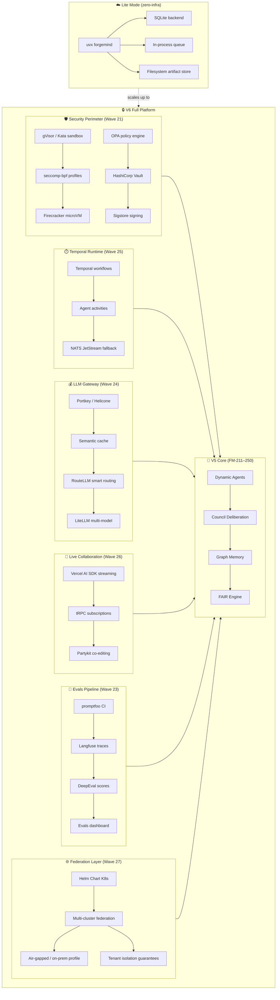

# ForgeMind V6 — Product Roadmap (FM-251 → FM-300)

> **Version:** V6 Architecture Draft
> **Date:** 2026-04-17
> **Status:** FUTURE — Architecture direction document. Not yet implemented.
> **Scope:** FM-251 through FM-300 (50 milestones across 7 waves + GA hardening)
> **Builds on:** ForgeMind V1–V5 (FM-001 through FM-250)

---

## 1. V6 Executive Summary

### What V5 Was

ForgeMind V5 transformed the platform into a **dynamic multi-agent orchestration platform** with graph-based persistent memory, structured council deliberation, and explainable FAIR-scored workflow selection. By the end of FM-250, ForgeMind is an adaptive reasoning system that can decompose any complex task, spawn specialized sub-agents, deliberate across perspectives, and transparently explain every routing decision.

### What V6 Is

ForgeMind V6 closes the remaining competitive gaps identified in the comparative analysis against OpenClaw, NemoClaw, and GitHub Spec Kit — and adds production-grade capabilities that no prior V1–V5 wave addressed.

V6 adds 50 milestones (FM-251 → FM-300) across 7 waves:

| Wave | Range           | Theme                                                                     |
| ---- | --------------- | ------------------------------------------------------------------------- |
| 21   | FM-251 → FM-257 | **Security Hardening** — kernel-level sandboxing, policy engine, vault, supply-chain |
| 22   | FM-258 → FM-262 | **Lite Mode & Developer Experience** — single-binary install, SQLite backend, zero-infra dev |
| 23   | FM-263 → FM-268 | **Evals & Benchmarks** — prompt regression, LLM observability, SWE-bench integration |
| 24   | FM-269 → FM-272 | **Cost & Prompt Optimization** — prompt caching, semantic cache, model routing gateway |
| 25   | FM-273 → FM-277 | **Durable Workflow Runtime** — Temporal-backed agent runtime replacing Redis Streams plan |
| 26   | FM-278 → FM-281 | **Live Collaboration UX** — token streaming, multiplayer artifacts |
| 27   | FM-282 → FM-287 | **Federated & Self-Hosted Deployment** — multi-cluster, air-gapped, compliance |
| GA   | FM-288 → FM-300 | **Hardening, docs, migration guides, GA readiness milestones** |

### How V6 Differs from Earlier Versions

| Version             | Focus            | Result                                                                    |
| ------------------- | ---------------- | ------------------------------------------------------------------------- |
| V1 (FM-001–050)     | Foundation       | Models, agents, execution engine, pre-release infra                       |
| V2 (FM-051–100)     | Breadth          | Collaboration, code ops, frontend parity, local mode                      |
| V3 (FM-101–140)     | Depth            | SPEC lifecycle, templates, checkpoints, release operations                |
| V4 (FM-141–210)     | Ecosystem        | Integration, intelligence, enterprise, and scale                          |
| V5 (FM-211–250)     | Intelligence     | Dynamic agents, graph memory, deliberation, explainability                |
| **V6 (FM-251–300)** | **Production GA** | **Security hardening, zero-friction install, evals, cost optimization, durable workflows, live UX, federation** |

### Why V6 Matters

After V5, ForgeMind leads the market in multi-agent orchestration, architecture intelligence, and observability. However, three competitive gaps remain unaddressed:

1. **Security**: NemoClaw's kernel-level sandboxing still outclasses ForgeMind's userspace allowlist approach. Wave 21 closes this with gVisor, seccomp-bpf, Firecracker, and OPA.
2. **Setup friction**: OpenClaw's `npm install -g` simplicity is unmatched. Wave 22 delivers `uvx forgemind` — a single-command, zero-Docker install backed by SQLite.
3. **Eval rigor**: Enterprise buyers expect prompt regression suites and LLM observability before committing to a platform. Wave 23 integrates promptfoo, Langfuse, DeepEval, and SWE-bench.

Beyond closing gaps, V6 also delivers capabilities that no competitive roadmap currently covers: Temporal-backed durable workflows, token-streaming live collaboration, and a full federated self-hosted deployment stack with SOC 2 evidence generation.

### Strategic Position

After V6, ForgeMind is the only AI engineering platform that combines kernel-isolated agent execution, enterprise compliance, zero-friction developer install, LLM cost optimization, durable workflow guarantees, live multi-user collaboration, and global self-hosted federation — all in a single coherent product. This is the foundation for GA and enterprise contract readiness.

---

## 2. V6 Architecture Vision

### Core Architecture Shift



### Key Technology Additions in V6

| Component               | Technology                           | Purpose                                              |
| ----------------------- | ------------------------------------ | ---------------------------------------------------- |
| Kernel sandbox          | gVisor / Kata Containers             | Kernel-level syscall isolation for agent execution   |
| Policy engine           | Open Policy Agent (OPA)              | Rego-based authorization policies for every agent op |
| Secrets management      | HashiCorp Vault                      | Dynamic secrets, rotation, audit — replaces custom vault |
| Artifact signing        | Sigstore / cosign                    | Supply-chain integrity for every generated artifact  |
| Lite DB                 | SQLite via SQLAlchemy dialect switch | Single-file DB for solo / laptop mode                |
| Single-binary install   | Astral uv / `uvx`                    | Zero-Docker developer experience                     |
| Prompt regression       | promptfoo                            | CI-wired regression testing for every prompt change  |
| LLM observability       | Langfuse / LangSmith                 | Full trace and diff of every LLM call                |
| Cost optimization       | Portkey + semantic cache + RouteLLM  | Prompt caching, gateway fallback, smart model routing |
| Durable workflows       | Temporal.io                          | Durable retries, versioning, replay — replaces Redis Streams plan |
| Live collaboration      | Vercel AI SDK + tRPC + Partykit      | Token streaming and multi-user co-editing            |
| K8s deployment          | Helm chart                           | Production-grade Kubernetes installation             |
| Compliance              | SOC 2 / ISO 27001 evidence generator | Leverages FM-171–180 audit infrastructure             |

---

## 3. V6 Theme by Block

### Wave 21 — FM-251 to FM-257: Security Hardening

**Purpose:** Close the most significant remaining competitive gap vs. NemoClaw by replacing ForgeMind's userspace command allowlist with multi-layer kernel-level isolation, a declarative policy engine, enterprise-grade secrets management, and supply-chain signing for every generated artifact.

**Why this comes first:** Security hardening is the highest-impact prerequisite for enterprise adoption. V6 cannot ship Federated Self-Hosted (Wave 27) or SOC 2 compliance (FM-285) without a defensible sandbox story. Addressing it first also de-risks every subsequent wave — the OPA policy engine introduced here is used by the LLM gateway (Wave 24) and federation layer (Wave 27).

**User value:** Enterprise customers can now run ForgeMind agents against their most sensitive codebases with confidence that kernel-level isolation, dynamic secret rotation, and policy-gated authorization make every execution auditable and contained.
**Engineering value:** OPA Rego policies replace ad-hoc `if` guards scattered across services, giving a single authoritative policy evaluation point. Vault dynamic secrets eliminate hardcoded credentials in agent configs.
**Differentiation:** Kernel-isolation + OPA + Vault + Sigstore in a single AI engineering platform — no open-source competitor offers this combination today.

#### Milestones

| FM     | Title                                        | Description                                                                                                           |
| ------ | -------------------------------------------- | --------------------------------------------------------------------------------------------------------------------- |
| FM-251 | gVisor / Kata Sandbox for Agent Execution    | Replace userspace allowlist with kernel syscall filtering; run sandbox_service workloads inside gVisor or Kata Containers |
| FM-252 | seccomp-bpf Profiles per Agent               | Generate per-agent syscall whitelists automatically from capability declarations; enforce via Linux seccomp-bpf       |
| FM-253 | Firecracker MicroVM Option                   | Optional MicroVM isolation for untrusted code execution; toggleable per-workspace policy                              |
| FM-254 | Open Policy Agent (OPA) Integration          | Pair with V5's FM-243 Policy Constraint Engine; author and evaluate Rego policies for agent authorization             |
| FM-255 | HashiCorp Vault Integration                  | Replace custom CredentialVault with Vault dynamic secrets + lease rotation; audit every secret access                |
| FM-256 | Sigstore / cosign Artifact Signing           | Sign every generated artifact with cosign at creation; verify signature on replay and export                         |
| FM-257 | CodeQL Integration in Reviewer Agent         | Add semantic vulnerability scanning pass to the Reviewer Agent; surface CWE findings as structured review comments   |

---

### Wave 22 — FM-258 to FM-262: Lite Mode & Developer Experience

**Purpose:** Close the setup-friction gap vs. OpenClaw by delivering a zero-Docker, single-command install experience backed by SQLite and an in-process queue, making ForgeMind accessible to any solo developer in under five minutes.

**Why this sequence:** Security hardening (Wave 21) establishes the OPA and policy primitives that Lite Mode must still respect — policy evaluation must work even without a Vault cluster. With that foundation in place, Wave 22 can safely strip the heavyweight infrastructure dependencies while preserving all security guarantees.

**User value:** A developer on a laptop can run `uvx forgemind run` and get a fully functional ForgeMind instance — no Docker Compose, no Postgres setup, no MinIO bucket. Lite Mode handles all of it transparently.
**Engineering value:** SQLAlchemy dialect abstraction makes the switch between SQLite and Postgres seamless; the embedded queue fallback documents the DragonflyDB and Turso upgrade paths so teams can graduate from Lite to Full without a rewrite.
**Differentiation:** `uvx forgemind` rivals `npm install -g` for simplicity while still being the same V6-grade platform — not a stripped demo.

#### Milestones

| FM     | Title                                  | Description                                                                                                           |
| ------ | -------------------------------------- | --------------------------------------------------------------------------------------------------------------------- |
| FM-258 | SQLite Backend Driver                  | SQLAlchemy dialect switch; single-file DB for solo mode; full parity with Postgres schema via Alembic migrations      |
| FM-259 | Embedded Queue Fallback                | Replace Redis with in-process queue + fakeredis shim for solo mode; document DragonflyDB and Turso graduation paths   |
| FM-260 | Filesystem Artifact Store              | Drop MinIO dependency in Lite mode; store artifacts on local filesystem; pluggable backend for S3/MinIO in full mode  |
| FM-261 | `uvx forgemind` Single-Command Install | PyPI distribution via Astral uv; `uvx forgemind run` bootstraps everything; auto-detects Lite vs. Full mode           |
| FM-262 | Docker Desktop Extension + Nix Flake  | One-click install for non-CLI users via Docker Desktop Extension; reproducible dev environment via Nix flake          |

---

### Wave 23 — FM-263 to FM-268: Evals & Benchmarks

**Purpose:** Add the evaluation rigor that enterprise buyers require before committing to an AI platform — prompt regression testing wired into CI, full LLM call tracing, unit-level faithfulness scores, industry-standard SWE-bench benchmarking, and a per-agent scorecard dashboard.

**Why this sequence:** Lite Mode (Wave 22) reduces the barrier to running ForgeMind locally, which is exactly the environment where prompt regression suites are run. With FM-261 delivering a `uvx`-installable binary, the promptfoo CI harness (FM-263) can be wired into any developer's pre-commit hook without standing up an entire cluster.

**User value:** Every prompt change surfaces in a regression report before it ships. Teams get faithfulness scores, hallucination rates, and SWE-bench rankings that let them compare their ForgeMind configuration against the industry leaderboard.
**Engineering value:** Langfuse traces expose the full token-level diff between prompt versions, making debugging LLM regressions fast and deterministic rather than guesswork.
**Differentiation:** No AI engineering platform currently ships a first-party eval dashboard with SWE-bench integration, faithfulness unit tests, and A/B prompt comparison in a single product.

#### Milestones

| FM     | Title                                  | Description                                                                                                           |
| ------ | -------------------------------------- | --------------------------------------------------------------------------------------------------------------------- |
| FM-263 | promptfoo Integration                  | Prompt regression test harness wired into CI (FM-076); YAML test suites per agent; diff report on every PR           |
| FM-264 | Langfuse / LangSmith LLM Observability | Trace every LLM call; diff prompts over time; token usage, latency, and cost per trace; feeds data into FM-265 DeepEval and FM-267 Braintrust scoring |
| FM-265 | DeepEval Unit Tests                    | Per-agent faithfulness, hallucination, and relevance scores as pytest assertions; fail CI on regression               |
| FM-266 | SWE-bench Harness                      | Benchmark Coder Agent performance vs. the SWE-bench industry leaderboard; automated nightly run                      |
| FM-267 | Braintrust A/B Evals                   | Compare prompt variants on held-out task sets; statistical significance testing; promote winning variant              |
| FM-268 | Evals Dashboard in Frontend            | Per-agent scorecards, trend charts, regression alerts, and SWE-bench percentile ranking in the web UI                 |

---

### Wave 24 — FM-269 to FM-272: Cost & Prompt Optimization

**Purpose:** Reduce per-run LLM cost by ≥50% through provider-side prompt caching, a smart gateway with semantic deduplication, and a confidence-based model routing layer that escalates to expensive models only when necessary.

**Why this sequence:** With the eval harness from Wave 23 in place, every cost optimization can be validated quantitatively — the promptfoo and Langfuse infrastructure shows exactly which cache hit rate is being achieved and whether cheaper models degrade quality below threshold.

**User value:** Operators see a direct reduction in monthly LLM spend with zero change to agent behavior. The semantic cache means near-identical prompts — common in iterative development cycles — are answered instantly.
**Engineering value:** Portkey/Helicone sits in front of the existing LiteLLM integration, requiring no agent-level changes; RouteLLM extends V1's composition_service with a confidence signal that the FAIR engine (FM-242) can already consume.
**Differentiation:** Semantic cache + smart model routing + provider caching as a layered cost stack — no competing platform ships all three integrated with an existing multi-agent orchestrator.

#### Milestones

| FM     | Title                                     | Description                                                                                                           |
| ------ | ----------------------------------------- | --------------------------------------------------------------------------------------------------------------------- |
| FM-269 | Anthropic + OpenAI Prompt Caching         | Exploit provider-side prefix caching for handoff context; measure cache hit rate via Langfuse traces                  |
| FM-270 | Portkey / Helicone LLM Gateway            | Caching, fallback, load balancing, and cost tagging layer in front of LiteLLM; unified dashboard                     |
| FM-271 | Semantic Cache via Embeddings + Redis     | Skip LLM calls on semantically similar prompts using embedding cosine similarity; configurable similarity threshold    |
| FM-272 | RouteLLM Smart Routing                    | Small model first; escalate only on low-confidence responses; extends V1 composition_service routing signal           |

---

### Wave 25 — FM-273 to FM-277: Durable Workflow Runtime

**Purpose:** Replace the Redis Streams–based agent messaging plan introduced in V5 Wave 17 (FM-213/214) with a production-grade durable workflow engine backed by Temporal.io, delivering automatic retries, workflow versioning, deterministic replay, and node-restart survival — capabilities Redis Streams cannot provide natively.

**Why this sequence:** Waves 21–24 have stabilized the security, install, eval, and cost layers. Temporal is a significant operational addition; deferring it until this wave means the dual-run migration (FM-276) can run against a hardened, eval-covered platform rather than a moving target.

**User value:** Long-running agent workflows — multi-hour coding tasks, large-scale review cycles — survive node restarts, cloud spot-instance preemptions, and network partitions with zero task loss and automatic resumption.
**Engineering value:** Temporal's workflow versioning solves the hard problem of deploying new agent logic without dropping in-flight runs; signals and queries replace the custom messaging protocol from FM-215, reducing custom code surface.
**Differentiation:** Temporal-backed agent workflows are unique in the AI engineering platform space — most competitors offer best-effort queues with no durability guarantees.

#### Milestones

| FM     | Title                                     | Description                                                                                                           |
| ------ | ----------------------------------------- | --------------------------------------------------------------------------------------------------------------------- |
| FM-273 | Temporal.io Integration Spike             | Prototype agent workflows as Temporal Workflows; compare durability, latency, and ops overhead vs. Redis Streams      |
| FM-274 | Port adaptive_orchestrator to Temporal    | Durable retries, versioning, and deterministic replay for the orchestration layer; drop Redis Streams fallback path   |
| FM-275 | Agent Activities as Temporal Activities   | Signals and queries replace custom FM-215 messaging; child workflow support for sub-agent task trees                  |
| FM-276 | Migration Path from Redis Streams         | Dual-run plan for existing V5 Wave 17 code; drain-and-migrate tooling; rollback procedure with zero message loss      |
| FM-277 | NATS JetStream Fallback Option            | Lighter alternative for self-hosted deployments unable to run Temporal; feature-parity documented; toggle in config   |

---

### Wave 26 — FM-278 to FM-281: Live Collaboration UX

**Purpose:** Deliver real-time, multi-user interaction with ForgeMind runs — token-by-token LLM streaming to the frontend, typed streaming between services via tRPC, Google-Docs-style co-editing of generated artifacts, and live cursor presence on run timelines.

**Why this sequence:** Live collaboration requires both a durable message backbone (Wave 25 Temporal signals/queries) and a stable streaming API surface. Building on Temporal's reliable event delivery means collaborative sessions never lose state during a node restart.

**User value:** Teams watch agent work unfold token-by-token in real time, collaborate on generated code as it is produced, and see each other's cursors on the run timeline — eliminating the "refresh and wait" cycle that currently breaks collaborative review.
**Engineering value:** Vercel AI SDK streaming integrates with the existing Next.js frontend at the edge; tRPC subscriptions add type safety to the streaming layer without a new serialization format; Partykit/Cloudflare Durable Objects handle multi-user session state without a custom WebSocket server.
**Differentiation:** Real-time multi-user AI artifact co-editing with typed streaming — no competitor in the AI engineering platform space ships this today.

#### Milestones

| FM     | Title                                          | Description                                                                                                           |
| ------ | ---------------------------------------------- | --------------------------------------------------------------------------------------------------------------------- |
| FM-278 | Vercel AI SDK Streaming                        | Token-by-token LLM response streaming to Next.js frontend; streaming context propagation through API layer           |
| FM-279 | tRPC Subscriptions for Typed Streams           | Type-safe streaming subscriptions between apps/web and apps/api; replaces SSE polling with push-based delivery       |
| FM-280 | Partykit / Cloudflare Durable Objects Co-editing | Google-Docs-style multi-user co-editing on generated code artifacts; conflict-free CRDT merge                        |
| FM-281 | Live Cursor + Presence on Run Timelines        | Extend FM-145 real-time activity feed to run-level: see collaborator cursors and selections on timeline nodes         |

---

### Wave 27 — FM-282 to FM-287: Federated & Self-Hosted Deployment

**Purpose:** Address the items explicitly deferred in V5 — self-hosted deployment and federated multi-instance — by delivering a production-grade Helm chart, air-gapped Ollama-only profile, multi-cluster workspace sharding, SOC 2 compliance evidence generation, enterprise custom LLM endpoint hardening, and hard tenant isolation at the infrastructure level.

**Why this comes last in the wave sequence:** Federation is the most operationally complex capability in V6. It requires the full security stack from Wave 21 (OPA, Vault, Sigstore), the install simplicity from Wave 22 (Helm chart extends the uv work), the eval coverage from Wave 23 (compliance evidence requires passing eval baselines), and the durable workflow runtime from Wave 25 (cross-cluster task coordination requires Temporal). All prior waves are direct prerequisites.

**User value:** Regulated enterprises can deploy ForgeMind entirely within their own infrastructure, with no outbound LLM calls (Ollama-only air-gapped mode), hard workspace isolation between tenants, and an automatically generated SOC 2 evidence pack that dramatically reduces audit preparation time.
**Engineering value:** The Helm chart codifies all operational knowledge accumulated across V1–V6 into a single declarative artifact; multi-cluster federation reuses the FAIR engine's capability discovery as the inter-cluster routing layer.
**Differentiation:** Air-gapped + SOC 2 evidence generation + federated multi-cluster in an AI engineering platform — the combination that enterprise procurement committees specifically request and that no open-source competitor currently delivers.

#### Milestones

| FM     | Title                                       | Description                                                                                                           |
| ------ | ------------------------------------------- | --------------------------------------------------------------------------------------------------------------------- |
| FM-282 | Helm Chart for Kubernetes Deployment        | Production-grade Helm chart covering all V6 services; values schema, upgrade hooks, and rollback support              |
| FM-283 | Air-Gapped / On-Prem Mode                   | No outbound LLM calls; Ollama-only profile; all model weights served locally; registry mirror support                  |
| FM-284 | Multi-Cluster Federation                    | Workspace sharding across clusters; FAIR capability discovery as inter-cluster routing; global run visibility          |
| FM-285 | SOC 2 / ISO 27001 Compliance Pack           | Automated audit evidence generator leveraging FM-171–180 audit infra; control mapping and continuous evidence export  |
| FM-286 | Bring-Your-Own LLM Endpoint Hardening   | Enterprise-grade custom OpenAI-compatible endpoint support; mTLS, API key rotation, circuit breaker, health probing   |
| FM-287 | Tenant Isolation Guarantees                 | Hard workspace boundaries at the infra level: namespace isolation, network policy, and storage encryption per tenant  |

---

### Extra — FM-288 to FM-300: GA Hardening

**Purpose:** Round out the V6 release with the hardening, documentation, migration, and readiness milestones needed to call ForgeMind V6 generally available. These milestones mirror the pattern used in V1–V5 end-of-wave hardening steps and ensure every new V6 capability ships production-validated, fully documented, and with a clear upgrade path from V5.

**Why this block:** No single wave covers cross-cutting concerns like end-to-end penetration testing, load benchmarking across the entire V6 stack, or the operator-facing migration guide that brings existing V5 deployments forward. This block addresses them all.

**User value:** Operators upgrading from V5 get a tested, documented migration path with no ambiguity. New adopters get a fully hardened release with published performance benchmarks and a completed accessibility audit.
**Engineering value:** Consolidates lessons from Waves 21–27 into a coherent release artifact — changelog, ADRs, architecture decision records, and automated compatibility checks that prevent V5→V6 regressions.
**Differentiation:** GA-quality documentation and migration tooling is table stakes for enterprise adoption — but rarely delivered on schedule. Making it first-class milestones ensures it ships with the release.

#### Milestones

| FM     | Title                                             | Description                                                                                                           |
| ------ | ------------------------------------------------- | --------------------------------------------------------------------------------------------------------------------- |
| FM-288 | V6 Security Penetration Testing                   | External pen test of the full V6 stack including gVisor sandbox, OPA policies, Vault integration, and API surface    |
| FM-289 | V6 Load & Scale Benchmarks                        | Sustained throughput tests: 100 concurrent runs, 1,000 agent-spawns/min, Temporal workflow saturation point          |
| FM-290 | V6 Migration Guide from V5                        | Step-by-step operator guide: Redis Streams → Temporal, custom vault → HashiCorp Vault, Postgres → SQLite/Postgres    |
| FM-291 | V6 API Stability & Versioning Contract             | Freeze public API surface; semver guarantees; deprecation timeline for any V5 endpoints changed in V6                |
| FM-292 | V6 Accessibility Audit (WCAG 2.1 AA)              | Full accessibility pass on new V6 frontend features: evals dashboard, live cursors, federation admin UI               |
| FM-293 | V6 Operator Runbook                               | Day-2 operations guide: scaling, failover, secret rotation, cluster federation, Temporal Worker scaling               |
| FM-294 | V6 SDK & Plugin API Docs                          | Developer-facing documentation for the V6 plugin API, agent blueprint format, and OPA policy authoring guide         |
| FM-295 | V6 Chaos Engineering Suite                        | Fault injection tests: Temporal Worker kill, Vault seal, OPA sidecar crash, cluster partition, artifact store loss   |
| FM-296 | V6 Cost Observability Dashboard                   | End-to-end cost attribution: per-run LLM spend, cache hit rates, model routing distribution, monthly trend charts    |
| FM-297 | V6 Architecture Decision Records (ADRs)           | Formal ADRs for: Temporal over Redis, gVisor over cgroups, OPA over custom policy, SQLite backend, Helm chart design |
| FM-298 | V6 Changelog & Release Notes                      | Curated changelog for FM-251–FM-300; breaking-change callouts; upgrade checklist per deployment profile              |
| FM-299 | V6 Community & Contribution Guide                 | Updated CONTRIBUTING.md, plugin authoring tutorial, wave contribution process, and public roadmap governance model    |
| FM-300 | V6 GA Release Validation & Sign-off               | Full regression suite across all 300 milestones; sign-off checklist; production deployment dry-run in staging cluster |

---

## 4. V6 Dependencies & Prerequisites

### Required Before V6 Begins

| Prerequisite                            | Source   | Why Required                                                                  |
| --------------------------------------- | -------- | ----------------------------------------------------------------------------- |
| FM-250 complete                         | V5       | All V5 dynamic agent, council, graph memory, and FAIR infrastructure is baseline |
| FM-243 Policy Constraint Engine shipped | V5       | Wave 21 OPA integration pairs with the V5 policy constraint model              |
| FM-171–180 Audit Infrastructure         | V4       | Wave 27 SOC 2 evidence generator (FM-285) consumes V4 audit event stream       |
| FM-145 Real-time Activity Feed          | V4       | Wave 26 live cursors (FM-281) extend FM-145 WebSocket infrastructure           |
| Redis 7+ in production                  | Infra    | Semantic cache (FM-271) and existing V5 messaging; migrated to Temporal in W25 |
| Kubernetes cluster available            | Infra    | Wave 27 Helm chart and multi-cluster federation require K8s                    |
| Python 3.11+ and uv installed           | Tooling  | Wave 22 `uvx forgemind` requires the Astral uv package manager                 |

### Cross-Wave Dependencies

```
Wave 21 (Security) ──────────────────────────────────────► Wave 27 (Federation)
         │                                                          ▲
         └──► Wave 22 (Lite Mode) ──────────────────────────────────┤
                      │                                              │
                      └──► Wave 23 (Evals) ──► Wave 24 (Cost Opt) ─┤
                                                                     │
         Wave 25 (Temporal Runtime) ────────────────────────────────┤
                      │                                              │
                      └──► Wave 26 (Live Collab) ───────────────────┘
                                                        │
                                              GA Hardening (FM-288–300)
```

- Wave 21 (Security) is a hard prerequisite for Wave 27 (Federation) and informs Wave 22 (Lite policy)
- Waves 22–24 can be developed in parallel after Wave 21
- Wave 25 (Temporal) can be developed in parallel with Waves 22–24
- Wave 26 (Live Collaboration) requires Wave 25 (Temporal) for message durability
- Wave 27 (Federation) requires Waves 21, 22, 23, and 25 to be substantially complete
- GA Hardening begins only after all Waves 21–27 milestones are complete

---

## 5. V6 Implementation Plan

### Phasing

| Phase   | Waves        | Milestones      | Duration (est.) | Gate                                      |
| ------- | ------------ | --------------- | --------------- | ----------------------------------------- |
| Phase H | Wave 21      | FM-251 → FM-257 | Foundation      | Security audit passed; OPA green in CI    |
| Phase I | Waves 22–24  | FM-258 → FM-272 | Parallel tracks | `uvx forgemind run` works; eval CI green  |
| Phase J | Waves 25–26  | FM-273 → FM-281 | Parallel tracks | Temporal workflows pass chaos tests       |
| Phase K | Wave 27      | FM-282 → FM-287 | Integration     | Helm chart boots in <10 min on clean K8s  |
| Phase L | GA Hardening | FM-288 → FM-300 | Release         | All 300 milestones green; pen test passed |

### Success Criteria

V6 is successful when:

- An operator can `uvx forgemind run` and get a working single-user install with **zero Docker** required
- Agent execution runs inside a **kernel-isolated sandbox** with OPA-evaluated policies on every authorization decision
- Every prompt change is **regression-tested in CI** via promptfoo before it reaches a staging environment
- The platform passes a **SOC 2 Type II audit** with evidence generated automatically by FM-285
- **Temporal-backed workflows survive node restarts** with zero task loss and deterministic replay
- Prompt caching + semantic cache reduce **per-run LLM cost by ≥50%** compared to V5 baseline (measured via Langfuse)
- A **self-hosted Kubernetes deployment boots** from the Helm chart in under 10 minutes on a clean cluster
- The Coder Agent achieves a **competitive SWE-bench score** (published on the public leaderboard)
- Test coverage remains **above 90%** across all V6 modules

### What V6 Does NOT Include

To keep scope bounded, the following are explicitly deferred to V7+:

- **Polyglot agent runtimes** — Agents remain Python-native; Go/Rust/TypeScript runtimes are V7+
- **Autonomous goal setting** — V6 agents execute human-defined goals; self-directed agents are V7+
- **Voice / video interfaces** — V6 focuses on text and code; multimodal native interfaces are V7+
- **Mobile native app** — V6 adds live collaboration on web; iOS/Android native apps are V7+
- **Marketplace / plugin store** — Wave 22 broadens the connector model; a public plugin marketplace is V7+

---

## 6. V6 Risk Assessment

| Risk                                                   | Likelihood | Impact | Mitigation                                                                          |
| ------------------------------------------------------ | ---------- | ------ | ----------------------------------------------------------------------------------- |
| Temporal adds operational complexity for self-hosters  | High       | Medium | NATS JetStream fallback (FM-277); Helm chart wraps both options transparently        |
| Self-hosted federation broadens attack surface         | High       | High   | Wave 21 hardening (gVisor + OPA + Vault + Sigstore) is a prerequisite for Wave 27  |
| Lite mode bifurcates the testing matrix                | Medium     | Medium | Document unsupported feature set clearly; CI matrix flag `FORGEMIND_LITE=1`         |
| Evals infrastructure is LLM-provider-dependent        | Medium     | Medium | Abstract eval runners behind a provider interface; support offline mock provider    |
| Vault adoption breaks existing CredentialVault migrations | Medium  | High   | Dual-write migration plan in FM-255; V5 CredentialVault read path kept for 2 releases |
| gVisor syscall filtering breaks existing agent workloads | High    | High   | Per-agent seccomp profiles (FM-252) allow escape hatches; staged rollout per workspace |
| Temporal dual-run period increases infra cost          | Medium     | Low    | Time-boxed to one release cycle; FM-276 drain-and-cutover tooling minimizes window  |
| SOC 2 evidence automation covers wrong controls        | Low        | High   | Map to AICPA Trust Services Criteria explicitly in FM-285; external auditor review  |
| RouteLLM small-model-first degrades response quality   | Medium     | Medium | Quality gate in FM-272: escalate if DeepEval faithfulness score drops below baseline |
| Multi-cluster federation introduces data residency gaps | Low       | High   | Tenant isolation guarantees (FM-287) enforce per-cluster data boundaries at storage  |

---

## Appendix: V6 Milestone Index

| FM     | Title                                             | Wave |
| ------ | ------------------------------------------------- | ---- |
| FM-251 | gVisor / Kata Sandbox for Agent Execution         | 21   |
| FM-252 | seccomp-bpf Profiles per Agent                    | 21   |
| FM-253 | Firecracker MicroVM Option                        | 21   |
| FM-254 | Open Policy Agent (OPA) Integration               | 21   |
| FM-255 | HashiCorp Vault Integration                       | 21   |
| FM-256 | Sigstore / cosign Artifact Signing                | 21   |
| FM-257 | CodeQL Integration in Reviewer Agent              | 21   |
| FM-258 | SQLite Backend Driver                             | 22   |
| FM-259 | Embedded Queue Fallback                           | 22   |
| FM-260 | Filesystem Artifact Store                         | 22   |
| FM-261 | `uvx forgemind` Single-Command Install            | 22   |
| FM-262 | Docker Desktop Extension + Nix Flake             | 22   |
| FM-263 | promptfoo Integration                             | 23   |
| FM-264 | Langfuse / LangSmith LLM Observability            | 23   |
| FM-265 | DeepEval Unit Tests                               | 23   |
| FM-266 | SWE-bench Harness                                 | 23   |
| FM-267 | Braintrust A/B Evals                              | 23   |
| FM-268 | Evals Dashboard in Frontend                       | 23   |
| FM-269 | Anthropic + OpenAI Prompt Caching                 | 24   |
| FM-270 | Portkey / Helicone LLM Gateway                    | 24   |
| FM-271 | Semantic Cache via Embeddings + Redis             | 24   |
| FM-272 | RouteLLM Smart Routing                            | 24   |
| FM-273 | Temporal.io Integration Spike                     | 25   |
| FM-274 | Port adaptive_orchestrator to Temporal            | 25   |
| FM-275 | Agent Activities as Temporal Activities           | 25   |
| FM-276 | Migration Path from Redis Streams                 | 25   |
| FM-277 | NATS JetStream Fallback Option                    | 25   |
| FM-278 | Vercel AI SDK Streaming                           | 26   |
| FM-279 | tRPC Subscriptions for Typed Streams              | 26   |
| FM-280 | Partykit / Cloudflare Durable Objects Co-editing  | 26   |
| FM-281 | Live Cursor + Presence on Run Timelines           | 26   |
| FM-282 | Helm Chart for Kubernetes Deployment              | 27   |
| FM-283 | Air-Gapped / On-Prem Mode                         | 27   |
| FM-284 | Multi-Cluster Federation                          | 27   |
| FM-285 | SOC 2 / ISO 27001 Compliance Pack                 | 27   |
| FM-286 | Bring-Your-Own LLM Endpoint Hardening             | 27   |
| FM-287 | Tenant Isolation Guarantees                       | 27   |
| FM-288 | V6 Security Penetration Testing                   | GA   |
| FM-289 | V6 Load & Scale Benchmarks                        | GA   |
| FM-290 | V6 Migration Guide from V5                        | GA   |
| FM-291 | V6 API Stability & Versioning Contract            | GA   |
| FM-292 | V6 Accessibility Audit (WCAG 2.1 AA)              | GA   |
| FM-293 | V6 Operator Runbook                               | GA   |
| FM-294 | V6 SDK & Plugin API Docs                          | GA   |
| FM-295 | V6 Chaos Engineering Suite                        | GA   |
| FM-296 | V6 Cost Observability Dashboard                   | GA   |
| FM-297 | V6 Architecture Decision Records (ADRs)           | GA   |
| FM-298 | V6 Changelog & Release Notes                      | GA   |
| FM-299 | V6 Community & Contribution Guide                 | GA   |
| FM-300 | V6 GA Release Validation & Sign-off               | GA   |

---

_End of ForgeMind V6 Roadmap — FM-251 through FM-300_
_Status: FUTURE — Not yet implemented. This is an architecture direction document._
