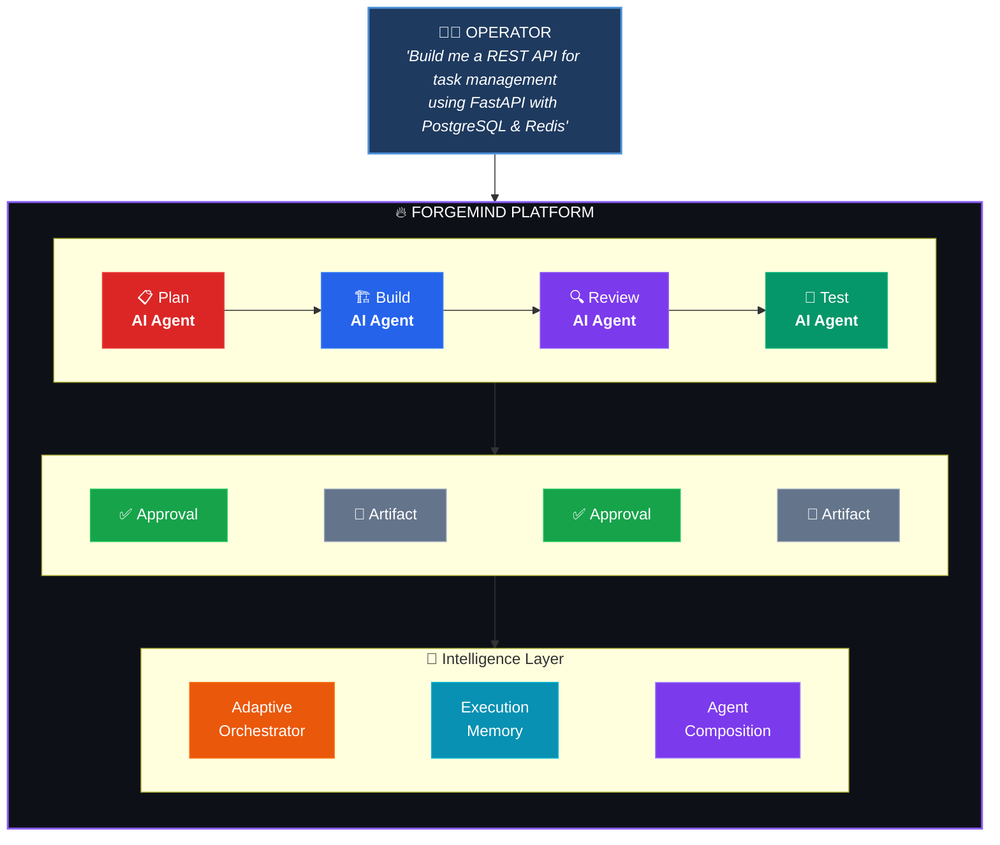
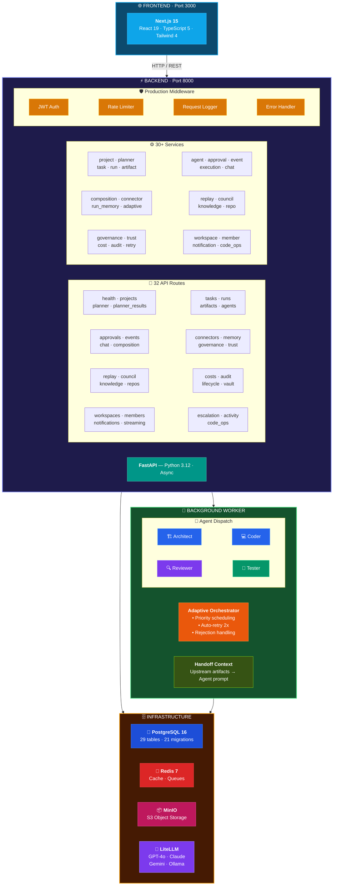
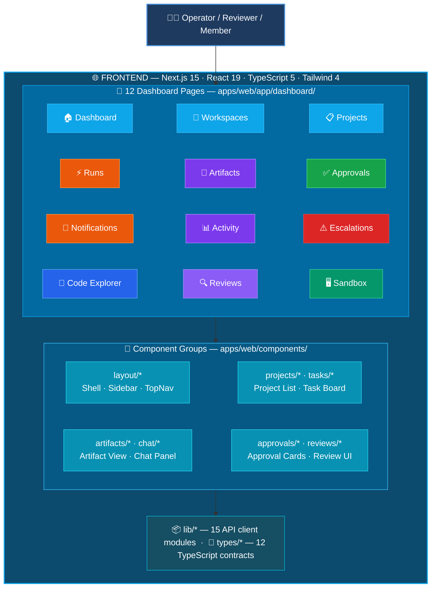
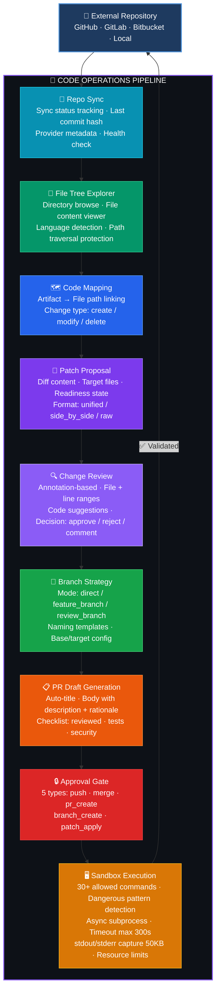
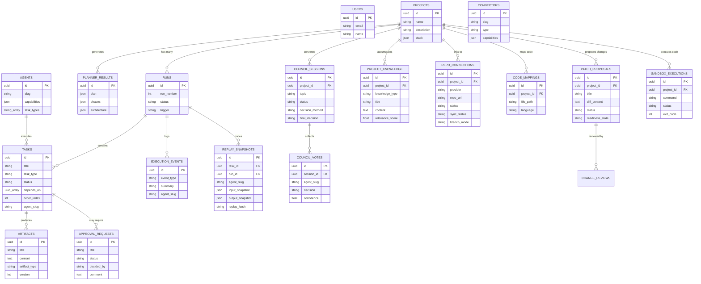
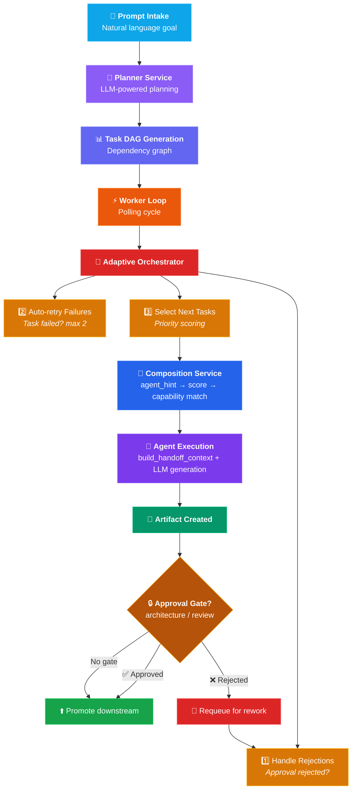
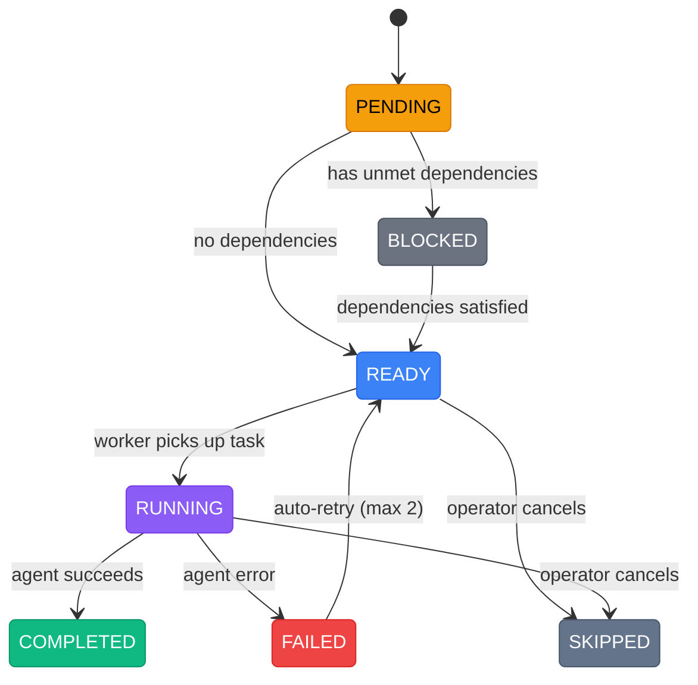
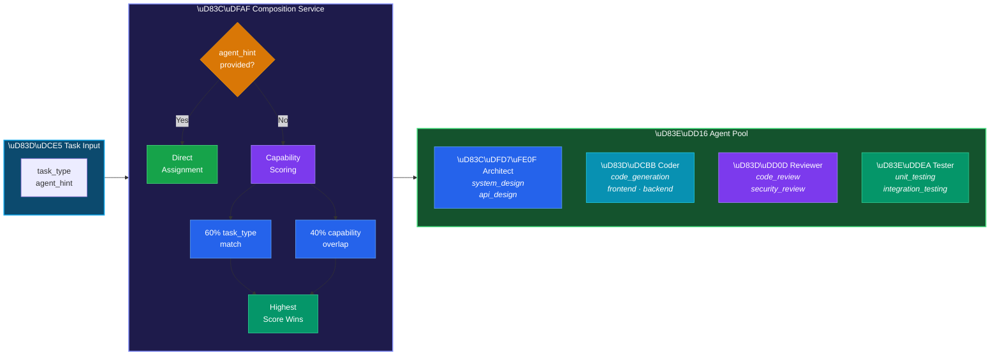
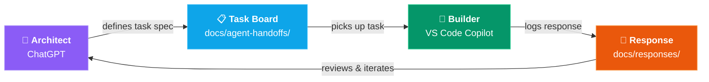

<div align="center">

# 🔥 ForgeMind

### **Adaptive AI Engineering Platform**

_Turn high-level goals into complete, verifiable software systems — with human-in-the-loop oversight and dynamic multi-agent execution._

[](https://python.org)
[](https://fastapi.tiangolo.com)
[](https://nextjs.org)
[](https://react.dev)
[](https://www.postgresql.org)
[](https://redis.io)
[](https://docs.docker.com/compose/)
[]()

</div>

---

## 📋 Table of Contents

- [Overview](#-overview)
- [Key Features](#-key-features)
- [Architecture](#-architecture)
- [Tech Stack](#-tech-stack)
- [Project Structure](#-project-structure)
- [Getting Started](#-getting-started)
- [API Reference](#-api-reference)
- [Development](#-development)
- [Milestone Progress](#-milestone-progress)
- [Technical Decisions](#-technical-decisions)

---

## 🧠 Overview

ForgeMind is an **operator-centered AI execution platform** that dynamically assembles specialized AI agents to plan, build, review, and test software projects — with human approval at every critical step.



**What makes it different:**

- 🤖 **Multi-agent execution** — Specialized AI agents (architect, coder, reviewer, tester) with capability scoring
- 👁️ **Human-in-the-loop** — Approval gates at critical steps, never runs blind
- 🔄 **Adaptive execution** — Auto-retry with agent re-routing, reacts to failures and approval rejections
- 📝 **Full observability** — Event timeline, execution chatbot, artifact history
- 🧠 **Execution memory** — Cached run summaries, failure analysis, contextual reasoning

---

## ✨ Key Features

### 🎯 AI Planning Engine

- Natural language prompt → structured project plan
- Architecture design, tech stack recommendation, phase breakdown
- Multi-provider LLM support via LiteLLM (OpenAI, Anthropic, Google, Ollama)
- Normalized/sanitized output with fallback-safe behavior

### 🤖 Dynamic Agent System

- **5 specialized agents**: Planner, Architect, Coder, Reviewer, Tester
- **Capability taxonomy**: 8 capability groups with 25+ skills for scoring
- **Smart composition**: Automatic agent selection based on task requirements
- **Handoff context**: Each agent receives upstream artifacts (reviewer sees code, tester sees architecture)

### ✅ Human-in-the-Loop Oversight

- Automatic approval requests for architecture & review tasks
- Approval inbox with filter, decide, and comment
- Approval rejection → automatic task requeue for rework
- Operator control: retry failed tasks, cancel running ones

### 🔄 Adaptive Execution

- Priority-based task selection (critical path first)
- Auto-retry failed tasks (max 2) with agent re-routing
- Approval rejection → task requeue with rejection context
- Execution memory with cached summaries for faster decisions

### 🔌 Connector Intelligence

- 7 built-in connectors (GitHub, Docker, PostgreSQL, Redis, S3, Slack, Jira)
- Keyword-based recommendation engine
- Project stack → connector requirement mapping

### 💬 Execution Chatbot

- AI-powered Q&A about any run
- Context-aware using execution memory service
- Stub fallback when LLM is unavailable

### 🔄 Run Replay & Execution Trace

- Capture deterministic snapshots of every agent execution step
- Replay past executions with SHA-256 hash comparison
- Full execution trace inspection per run
- Side-by-side diff of original vs replay outputs

### 🏛️ Multi-Agent Council Engine

- Collaborative agent decision-making for complex architectural choices
- 4 decision methods: consensus, majority, supermajority, weighted voting
- Automatic deadlock detection and human escalation

### 🧠 Project Knowledge Base

- Auto-extract patterns, lessons learned, and constraints from completed runs
- Cross-run memory with relevance scoring
- Knowledge context injection into agent prompts for smarter decisions

### 🔗 External Repo Integration

- Connect GitHub, GitLab, Bitbucket, or local repositories to projects
- Health checking and sync operations per connection
- Multi-repo support per project

### � Repository-Aware Code Operations

- **File tree explorer** — browse connected repo files with language detection and path traversal protection
- **Sync metadata** — track last synced commit, sync status (idle/syncing/success/failed), provider metadata
- **Code artifact mapping** — link execution artifacts to specific files with change type tracking (create/modify/delete)
- **Enhanced patch proposals** — target file lists, readiness state (incomplete/needs_review/ready/blocked), patch format
- **Annotation-based reviews** — file-specific review comments with line ranges and code suggestions
- **Branch strategy management** — configurable branch modes (direct/feature_branch/review_branch) with templates
- **PR draft generation** — auto-build PR title, body, and checklist from patch proposals
- **Approval gates** — per-action-type approval checks (push/merge/deploy/release/delete_branch)
- **Code execution sandbox** — command allowlist, shell injection prevention, async execution with timeout enforcement

### �🛡️ Production Hardening

- JWT authentication with dev-mode stub fallback
- Per-IP token bucket rate limiting (100 req/60s)
- Request logging with timing and unique request IDs
- Global error handlers for consistent JSON error responses

---

## 🏗️ Architecture

> _Complete master system architecture — every layer, service, model, and product flow, color-coded. Full reference: [FORGEMIND\_MASTER\_ARCHITECTURE.md](FORGEMIND_MASTER_ARCHITECTURE.md)_

### System Architecture Overview



### Frontend Architecture



### API → Service → Data Layer

```mermaid
flowchart LR
    subgraph API["📡 API LAYER — 32 Route Handlers"]
        direction TB
        RA["🔧 Platform Core\nhealth · projects · planner\ntasks · runs · artifacts"]
        RB["🤖 Execution Intelligence\nagents · chat · composition\nmemory · retry · lifecycle"]
        RC["🛡️ Governance\napprovals · governance · audit\ntrust · costs · council"]
        RD["🤝 Collaboration\nworkspaces · members · streaming\nnotifications · escalation · activity"]
        RE["📂 Repo & Code Ops\nrepos · code_ops\nreplay · knowledge · vault"]
    end

    subgraph SVC["⚙️ SERVICE LAYER — 33 Services"]
        direction TB
        SA["🔧 Core\nproject · planner · task\nexecution · artifact · event"]
        SB["🤖 Intelligence\nagent · chat · composition\nrun_memory · adaptive_retry\nadaptive_orchestrator"]
        SC["🛡️ Governance\napproval · governance · cost\ntrust · replay · council\nknowledge · audit"]
        SD["🤝 Collaboration\nworkspace · membership · authz\nstream · notification\nnotification_delivery\nescalation · activity\nuser_activity"]
        SE["📂 Code Ops\ncode_ops_service\nrepo_service"]
    end

    subgraph DATA["🗃️ DATA MODELS — 29+ Tables"]
        direction TB
        MA["🔧 Core Domain\nUser · Project · Run\nTask · PlannerResult\nArtifact · Agent"]
        MB["📋 Execution & Connectors\nApprovalRequest · ExecutionEvent\nReplaySnapshot · Connector\nProjectConnectorLink · CredentialVault"]
        MC["🛡️ Governance\nCostRecord · GovernancePolicy\nTrustScore · CouncilSession\nCouncilVote · ProjectKnowledge"]
        MD["🤝 Collaboration\nWorkspace · WorkspaceMember\nProjectMember · Notification\nNotificationDeliveryConfig\nEscalationRule · EscalationEvent\nActivityFeedEntry · UserPresence"]
        ME["📂 Code Ops\nRepoConnection · CodeMapping\nPatchProposal · ChangeReview\nBranchStrategy · PRDraft\nRepoActionApproval\nSandboxExecution"]
    end

    API --> SVC --> DATA

    style API fill:#1e1b4b,stroke:#818cf8,color:#fff,stroke-width:2px
    style SVC fill:#14532d,stroke:#4ade80,color:#fff,stroke-width:2px
    style DATA fill:#451a03,stroke:#f59e0b,color:#fff,stroke-width:2px
    style RA fill:#6366f1,stroke:#818cf8,color:#fff
    style RB fill:#8b5cf6,stroke:#a78bfa,color:#fff
    style RC fill:#d97706,stroke:#fbbf24,color:#fff
    style RD fill:#0891b2,stroke:#22d3ee,color:#fff
    style RE fill:#2563eb,stroke:#60a5fa,color:#fff
    style SA fill:#059669,stroke:#34d399,color:#fff
    style SB fill:#7c3aed,stroke:#a78bfa,color:#fff
    style SC fill:#ea580c,stroke:#fb923c,color:#fff
    style SD fill:#0ea5e9,stroke:#38bdf8,color:#fff
    style SE fill:#2563eb,stroke:#60a5fa,color:#fff
    style MA fill:#d97706,stroke:#fbbf24,color:#fff
    style MB fill:#be185d,stroke:#ec4899,color:#fff
    style MC fill:#dc2626,stroke:#ef4444,color:#fff
    style MD fill:#0891b2,stroke:#22d3ee,color:#fff
    style ME fill:#1d4ed8,stroke:#3b82f6,color:#fff
```



### Code Operations Pipeline



### Data Model



### Execution Flow



### Task State Machine



### Agent Capability Scoring



### System Layers Explained

<details>
<summary><b>🌐 1. Frontend Layer — <code>apps/web</code></b></summary>

The frontend is the operator control plane providing all user-facing workflows:

| Page | Purpose |
|------|---------|
| 🏠 **Dashboard** | Top-level operational summary |
| 🏢 **Workspaces** | Team/workspace management |
| 📋 **Projects** | Planning + execution entry point |
| ⚡ **Runs** | Live execution state |
| 📄 **Artifacts** | Outputs from planning/execution/code-ops |
| ✅ **Approvals** | Human-in-the-loop control |
| 🔔 **Notifications** | Alert center |
| 📊 **Activity Feed** | Cross-project operational awareness |
| ⚠️ **Escalations** | Overdue / high-risk conditions |
| 📂 **Code Explorer** | Repo/code context surface |
| 🔍 **Reviews** | Patch review workspace |
| 🖥️ **Sandbox** | Controlled validation surface |

**Folder structure:** `app/` (route pages) · `components/` (reusable UI) · `lib/` (API client wrappers) · `types/` (TypeScript contracts)

</details>

<details>
<summary><b>📡 2. API Layer — <code>apps/api/app/api/routes</code> — 32 Route Handlers</b></summary>

The API layer is thin and route-oriented — request validation → auth/authz → service delegation → response shaping.

| Category | Route Groups |
|----------|-------------|
| 🔧 **Platform Core** | `health` · `projects` · `planner` · `planner_results` · `tasks` · `runs` · `artifacts` |
| 🤖 **Execution Intelligence** | `agents` · `chat` · `composition` · `memory` · `retry` · `lifecycle` |
| 🛡️ **Governance** | `approvals` · `governance` · `audit` · `trust` · `costs` · `council` |
| 🤝 **Collaboration** | `workspaces` · `members` · `streaming` · `notifications` · `escalation` · `activity` |
| 📂 **Repo / Code-Ops** | `repos` · `code_ops` · `replay` · `knowledge` · `vault` · `connectors` |
| ⚙️ **Operational** | `events` · `run_lifecycle` |

</details>

<details>
<summary><b>⚙️ 3. Service Layer — <code>apps/api/app/services</code> — 33 Services</b></summary>

This is the real business-logic core.

**🔧 Core execution services:**
`project_service` · `planner_service` · `task_service` · `execution_service` · `artifact_service` · `agent_service` · `event_service`

**🤖 Intelligence services:**
`chat_service` · `composition_service` · `run_memory_service` · `adaptive_retry_service` · `adaptive_orchestrator`

**🔌 Connector / repo services:**
`connector_service` · `repo_service` · `code_ops_service`

**🛡️ Governance services:**
`approval_service` · `governance_service` · `cost_tracking_service` · `trust_scoring_service` · `replay_service` · `council_service` · `knowledge_service` · `audit_export_service`

**🤝 Collaboration services:**
`workspace_service` · `membership_service` · `authz_service` · `stream_service` · `notification_service` · `notification_delivery_service` · `escalation_service` · `activity_service` · `user_activity_service`

</details>

<details>
<summary><b>🔧 4. Worker Layer — <code>apps/worker</code></b></summary>

The worker is the runtime engine that executes tasks outside normal request flow.

**Main responsibilities:** poll for ready work → choose agent via capability scoring → build handoff context → LLM execution → update task state → create artifacts → emit events → invalidate caches

**Agents:** `architect_agent.py` · `coder_agent.py` · `reviewer_agent.py` · `tester_agent.py`

**Base/registry:** `base.py` (shared prompting + handoff context) · `registry.py` (dispatch resolution)

</details>

<details>
<summary><b>🗃️ 5. Model Layer — <code>apps/api/app/models</code> — 29+ Tables</b></summary>

**🔧 Core domain:**
`User` · `Project` · `Run` · `Task` · `PlannerResult` · `Artifact` · `Agent` · `ApprovalRequest` · `ExecutionEvent`

**🔌 Connector / governance:**
`Connector` · `ProjectConnectorLink` · `CredentialVault` · `CostRecord` · `GovernancePolicy` · `TrustScore` · `ReplaySnapshot` · `CouncilSession` · `CouncilVote` · `ProjectKnowledge` · `RepoConnection`

**🤝 Collaboration:**
`Workspace` · `WorkspaceMember` · `ProjectMember` · `Notification` · `NotificationDeliveryConfig` · `EscalationRule` · `EscalationEvent` · `ActivityFeedEntry` · `UserPresence`

**📂 Code-ops:**
`CodeMapping` · `PatchProposal` · `ChangeReview` · `BranchStrategy` · `PRDraft` · `RepoActionApproval` · `SandboxExecution`

</details>

<details>
<summary><b>🏗️ 6. Core Infrastructure — <code>apps/api/app/core</code></b></summary>

| Module | Purpose |
|--------|---------|
| `config.py` | Settings / environment |
| `auth.py` / `auth_stub.py` | JWT production auth / dev fallback |
| `rate_limit.py` | Per-IP token bucket (100 req / 60s) |
| `logging_middleware.py` | Request tracing + unique request IDs |
| `error_handlers.py` | Uniform JSON error responses |
| `llm.py` | LiteLLM wrapper (GPT-4o · Claude · Gemini · Ollama) |

</details>

<details>
<summary><b>🗄️ 7. Persistence / Infrastructure</b></summary>

| System | Version | Role |
|--------|---------|------|
| 🐘 **PostgreSQL** | 16 | Main relational persistence — 29+ tables, 21 migrations |
| 🔴 **Redis** | 7 | Worker / runtime support, caching, queues |
| 📦 **MinIO** | Latest | S3-compatible local object storage |
| 🐳 **Docker Compose** | — | 6-service local orchestration |

</details>

### End-to-End Product Flows

<details>
<summary><b>🅰 Planning Flow</b></summary>

```
1. User opens dashboard
2. User submits natural language prompt
3. planner_service creates: project → run → tasks → planner result
4. Frontend shows planner output + run context
```

</details>

<details>
<summary><b>🅱 Execution Flow</b></summary>

```
1. Worker polls for ready tasks
2. Composition/agent logic resolves best agent via capability scoring
3. Agent executes (LLM-powered generation)
4. Execution service updates task state
5. Artifacts are created
6. Execution events are emitted
7. Run page updates via API / SSE stream
```

</details>

<details>
<summary><b>🅲 Approval / Governance Flow</b></summary>

```
1. Execution or policy detects gated action
2. Approval request is created
3. Operator reviews in approval inbox
4. Governance policies / council may influence decision
5. Execution resumes or remains blocked
```

</details>

<details>
<summary><b>🅳 Chat / Memory Flow</b></summary>

```
1. User asks question on run page
2. Chat service assembles run summary + memory
3. Memory layer pulls: tasks, artifacts, approvals, events, project knowledge
4. LLM generates operator-facing answer
```

</details>

<details>
<summary><b>🅴 Collaboration Flow</b></summary>

```
1. Workspaces define tenant/team boundary
2. Workspace roles (owner → viewer) control permissions
3. Project membership controls scoped involvement
4. Notifications + activity feed keep users aware
5. Escalations surface overdue / high-risk situations
6. Presence shows recent activity / assignment context
7. SSE streaming provides live run updates
```

</details>

<details>
<summary><b>🅵 Repo / Code-Ops Flow</b></summary>

```
1. Project links to external repo/workspace
2. Code mapping ties artifacts to file paths
3. Patch proposals are generated (diff + target files)
4. Reviews are created on patches (annotation-based)
5. Branch strategy defines base/target patterns
6. PR drafts are auto-generated from patches
7. Repo-sensitive actions pass through approval gates
8. Sandbox validates code proposals safely (allowlist + timeout)
```

</details>

> **ForgeMind in one sentence:** A workspace-aware, approval-governed, multi-agent AI execution platform that can plan projects, orchestrate execution, manage human approvals, maintain operational memory, collaborate across teams, integrate with repositories, generate code-change proposals, review them, and validate them in a controlled sandbox.

---

## 🛠️ Tech Stack

| Layer                 | Technology           | Version     | Purpose                           |
| --------------------- | -------------------- | ----------- | --------------------------------- |
| 🎨 **Frontend**       | Next.js (App Router) | 15.x        | Server/client components, routing |
| ⚛️ **UI**             | React                | 19.x        | Component library                 |
| 📝 **Language**       | TypeScript           | 5.x         | Type safety                       |
| 🎨 **Styling**        | Tailwind CSS         | 4.x         | Utility-first CSS                 |
| ⚡ **Backend**        | FastAPI              | 0.115+      | Async REST API                    |
| 🐍 **Runtime**        | Python               | 3.12+       | Backend language                  |
| 🗃️ **ORM**            | SQLAlchemy           | 2.0 (async) | Database access                   |
| 📊 **Validation**     | Pydantic             | v2          | Schema validation                 |
| 🐘 **Database**       | PostgreSQL           | 16          | Primary data store                |
| 🔴 **Cache**          | Redis                | 7           | Caching, queues                   |
| 📦 **Storage**        | MinIO                | Latest      | S3-compatible object storage      |
| 🔄 **Migrations**     | Alembic              | 1.14+       | Database versioning               |
| 🤖 **LLM Gateway**    | LiteLLM              | 1.50+       | Multi-provider LLM abstraction    |
| �️ **Auth**            | python-jose (JWT)    | —           | Production JWT authentication     |
| �🐳 **Infrastructure** | Docker Compose       | —           | 6-service local stack             |

---

## 📁 Project Structure

```
forgemind/
│
├── 📄 docker-compose.yml          # 6 services: postgres, redis, minio, api, web, worker
├── 📄 Makefile                    # Developer commands (dev, test, lint, migrate)
├── 📄 .env.example                # Environment variable template
├── 📄 .gitignore                  # Python + Node + Docker ignores
│
├── 🔧 apps/
│   ├── api/                       # ⚡ FastAPI Backend
│   │   ├── pyproject.toml         #    Python dependencies
│   │   ├── alembic.ini            #    Migration config
│   │   ├── Dockerfile             #    Container build
│   │   ├── app/
│   │   │   ├── main.py            #    App entry + lifespan
│   │   │   ├── api/
│   │   │   │   ├── router.py      #    32 route mounts
│   │   │   │   └── routes/        #    Route handlers (32 files)
│   │   │   │       ├── health.py, projects.py, planner.py
│   │   │   │       ├── planner_results.py, tasks.py, runs.py
│   │   │   │       ├── artifacts.py, agents.py, approvals.py
│   │   │   │       ├── events.py, chat.py, composition.py
│   │   │   │       ├── connectors.py, memory.py
│   │   │   │       ├── credential_vault.py, retry.py
│   │   │   │       ├── run_lifecycle.py, costs.py
│   │   │   │       ├── governance.py, audit.py, trust.py
│   │   │   │       ├── replay.py, council.py
│   │   │   │       ├── knowledge.py, repos.py
│   │   │   │       ├── workspaces.py, workspace_members.py
│   │   │   │       ├── notifications.py, streaming.py
│   │   │   │       ├── escalation.py, activity.py, code_ops.py
│   │   │   │       └── __init__.py
│   │   │   ├── core/              #    Config, auth, middleware
│   │   │   │   ├── config.py      #    Settings (env-based)
│   │   │   │   ├── auth_stub.py   #    Auth placeholder (dev)
│   │   │   │   ├── auth.py        #    JWT authentication (prod)
│   │   │   │   ├── rate_limit.py  #    Token bucket rate limiter
│   │   │   │   ├── logging_middleware.py # Request logging
│   │   │   │   ├── error_handlers.py    # Global error handlers
│   │   │   │   └── llm.py         #    LiteLLM wrapper
│   │   │   ├── db/                #    Database setup
│   │   │   │   ├── base.py        #    Model imports (29 models)
│   │   │   │   ├── base_class.py  #    SQLAlchemy declarative base
│   │   │   │   └── session.py     #    Async session factory
│   │   │   ├── models/            #    SQLAlchemy models (26 files)
│   │   │   │   ├── user.py, project.py, run.py, task.py
│   │   │   │   ├── planner_result.py, artifact.py, agent.py
│   │   │   │   ├── approval_request.py, execution_event.py
│   │   │   │   ├── connector.py, credential_vault.py
│   │   │   │   ├── cost_record.py, governance_policy.py
│   │   │   │   ├── trust_score.py, replay_snapshot.py
│   │   │   │   ├── council.py, project_knowledge.py
│   │   │   │   ├── repo_connection.py, workspace.py
│   │   │   │   ├── activity.py, code_ops.py
│   │   │   │   └── notification.py, escalation.py
│   │   │   ├── schemas/           #    Pydantic schemas (23 files)
│   │   │   └── services/          #    Business logic (30+ services)
│   │   │       ├── project_service.py, planner_service.py
│   │   │       ├── task_service.py, artifact_service.py
│   │   │       ├── agent_service.py, approval_service.py
│   │   │       ├── event_service.py, execution_service.py
│   │   │       ├── chat_service.py, composition_service.py
│   │   │       ├── connector_service.py, run_memory_service.py
│   │   │       ├── adaptive_orchestrator.py
│   │   │       ├── credential_vault_service.py, adaptive_retry_service.py
│   │   │       ├── run_lifecycle_service.py, cost_tracking_service.py
│   │   │       ├── governance_service.py, audit_export_service.py
│   │   │       ├── trust_scoring_service.py, replay_service.py
│   │   │       ├── council_service.py, knowledge_service.py
│   │   │       ├── repo_service.py, workspace_service.py
│   │   │       ├── membership_service.py, notification_service.py
│   │   │       ├── notification_delivery_service.py, escalation_service.py
│   │   │       ├── activity_service.py, authz_service.py
│   │   │       ├── stream_service.py, user_activity_service.py
│   │   │       └── code_ops_service.py
│   │   └── alembic/versions/      #    21 migration files
│   │
│   ├── web/                       # 🌐 Next.js 15 Frontend
│   │   ├── package.json           #    Node dependencies
│   │   ├── Dockerfile             #    Container build
│   │   ├── app/                   #    Pages (App Router)
│   │   │   ├── layout.tsx         #    Root layout
│   │   │   ├── page.tsx           #    Landing → redirect
│   │   │   └── dashboard/         #    Dashboard pages (12)
│   │   │       ├── page.tsx       #    Main dashboard
│   │   │       ├── approvals/     #    Approval inbox
│   │   │       ├── artifacts/     #    Artifact detail
│   │   │       ├── projects/      #    Project detail
│   │   │       ├── runs/          #    Run detail
│   │   │       ├── workspaces/    #    Workspace management
│   │   │       ├── notifications/ #    Notification center
│   │   │       ├── activity/      #    Activity feed
│   │   │       ├── escalations/   #    Escalation rules
│   │   │       ├── code-explorer/ #    File tree browser
│   │   │       ├── reviews/       #    Review workspace
│   │   │       └── sandbox/       #    Code execution sandbox
│   │   ├── components/            #    React components (15+ files)
│   │   │   ├── layout/            #    Shell, sidebar, top nav
│   │   │   ├── approvals/         #    Approval card + list
│   │   │   ├── artifacts/         #    Artifact list section
│   │   │   ├── chat/              #    Run chat panel
│   │   │   ├── events/            #    Event timeline
│   │   │   ├── planner/           #    Prompt form, plan view
│   │   │   ├── projects/          #    Project list, create form
│   │   │   └── tasks/             #    Run task list
│   │   ├── lib/                   #    API client functions (15 files)
│   │   └── types/                 #    TypeScript interfaces (12 files)
│   │
│   └── worker/                    # 🔧 Background Worker
│       └── worker/
│           ├── main.py            #    Polling loop + adaptive orchestrator
│           └── agents/            #    Agent implementations
│               ├── base.py        #    Base agent + handoff context
│               ├── architect_agent.py
│               ├── coder_agent.py
│               ├── reviewer_agent.py
│               ├── tester_agent.py
│               └── registry.py    #    Agent dispatch registry
│
├── 📚 docs/
│   ├── ARCHITECTURE.md            #    Full system architecture reference
│   ├── MILESTONE_SUMMARY.md       #    What ForgeMind can do
│   ├── TECHNICAL_DEBT.md          #    Known debt items (22)
│   └── agent-handoffs/            #    Task board + response docs
│       ├── TASKS.md               #    FM-001 to FM-040
│       └── FM-0XX-response.md     #    Per-task implementation logs (70 docs)
│
└── 📦 packages/                   #    Future shared packages
    ├── agents/, connectors/, core/
    ├── orchestrator/, schemas/
    ├── security/, utils/, verification/
```

---

## 🚀 Getting Started

### Prerequisites

| Tool                    | Version | Required      |
| ----------------------- | ------- | ------------- |
| Docker & Docker Compose | Latest  | ✅ Yes        |
| Python                  | 3.12+   | For local dev |
| Node.js                 | 20+     | For local dev |
| Git                     | Latest  | ✅ Yes        |

### Option 1: Docker Compose (Recommended)

```bash
# 1. Clone the repository
git clone https://github.com/priyankmistry21699-web/Forgemind.git
cd Forgemind

# 2. Copy environment file
cp .env.example .env

# 3. Configure your LLM API key (at least one required for AI features)
#    Edit .env and set ONE of:
#    OPENAI_API_KEY=sk-...
#    ANTHROPIC_API_KEY=sk-ant-...
#    GOOGLE_API_KEY=AI...

# 4. Start all services
docker compose up -d

# 5. Run database migrations
docker compose exec api alembic upgrade head

# 6. Open the app
#    Frontend:  http://localhost:3000
#    API Docs:  http://localhost:8000/docs
#    MinIO:     http://localhost:9001
```

### Option 2: Local Development

```bash
# 1. Start infrastructure only
docker compose up -d postgres redis minio

# 2. Install Python dependencies
cd apps/api
pip install -e ".[dev]"

# 3. Run migrations
alembic upgrade head

# 4. Start the API server
uvicorn app.main:app --reload --host 0.0.0.0 --port 8000

# 5. In a new terminal — start the worker
cd apps/worker
python -m worker.main

# 6. In a new terminal — start the frontend
cd apps/web
npm install
npm run dev

# 7. Open http://localhost:3000
```

### Option 3: Make Commands

```bash
# Install everything
make install

# Start development (API + Web + Infra)
make dev

# Start worker separately
make dev-worker

# Run migrations
make migrate

# Run tests
make test

# Lint & format
make lint && make format
```

### Environment Variables

| Variable                     | Default                 | Description                    |
| ---------------------------- | ----------------------- | ------------------------------ |
| `APP_ENV`                    | `development`           | Environment mode               |
| `SECRET_KEY`                 | `change-me...`          | App secret key                 |
| `POSTGRES_HOST`              | `localhost`             | Database host                  |
| `POSTGRES_PORT`              | `5432`                  | Database port                  |
| `POSTGRES_DB`                | `forgemind`             | Database name                  |
| `POSTGRES_USER`              | `forgemind`             | Database user                  |
| `POSTGRES_PASSWORD`          | `change-me`             | Database password              |
| `REDIS_HOST`                 | `localhost`             | Redis host                     |
| `REDIS_PORT`                 | `6379`                  | Redis port                     |
| `OPENAI_API_KEY`             | —                       | OpenAI API key                 |
| `ANTHROPIC_API_KEY`          | —                       | Anthropic API key              |
| `GOOGLE_API_KEY`             | —                       | Google AI API key              |
| `PLANNER_MODEL`              | `gpt-4o`                | LLM model for planning         |
| `WORKER_POLL_INTERVAL`       | `5`                     | Worker poll interval (seconds) |
| `WORKER_MAX_TASKS_PER_CYCLE` | `3`                     | Max tasks per worker cycle     |
| `CORS_ORIGINS`               | `http://localhost:3000` | Allowed CORS origins           |

---

## 📡 API Reference

Base URL: `http://localhost:8000`

### Core Endpoints

| Method | Path                    | Description         |
| ------ | ----------------------- | ------------------- |
| `GET`  | `/health`               | Health check        |
| `POST` | `/projects`             | Create project      |
| `GET`  | `/projects`             | List projects       |
| `GET`  | `/projects/{id}`        | Get project details |
| `POST` | `/projects/{id}/plan`   | Generate AI plan    |
| `GET`  | `/planner-results/{id}` | Get planner result  |

### Execution

| Method | Path                 | Description       |
| ------ | -------------------- | ----------------- |
| `GET`  | `/runs`              | List runs         |
| `GET`  | `/runs/{id}`         | Get run details   |
| `GET`  | `/runs/{id}/tasks`   | Get run tasks     |
| `POST` | `/tasks/{id}/retry`  | Retry failed task |
| `POST` | `/tasks/{id}/cancel` | Cancel task       |

### Artifacts & Approvals

| Method | Path                     | Description    |
| ------ | ------------------------ | -------------- |
| `GET`  | `/artifacts`             | List artifacts |
| `GET`  | `/artifacts/{id}`        | Get artifact   |
| `GET`  | `/approvals`             | List approvals |
| `POST` | `/approvals/{id}/decide` | Approve/reject |

### Intelligence

| Method | Path                                 | Description               |
| ------ | ------------------------------------ | ------------------------- |
| `POST` | `/runs/{id}/chat`                    | Chat about a run          |
| `GET`  | `/composition/capabilities`          | Agent capability taxonomy |
| `GET`  | `/runs/{id}/composition`             | Team composition analysis |
| `GET`  | `/connectors`                        | List connectors           |
| `GET`  | `/runs/{id}/connectors/requirements` | Connector recommendations |

### Memory & Analysis

| Method | Path                         | Description           |
| ------ | ---------------------------- | --------------------- |
| `GET`  | `/runs/{id}/memory/summary`  | Cached run summary    |
| `GET`  | `/runs/{id}/memory/failures` | Failure analysis      |
| `GET`  | `/runs/{id}/memory/context`  | Text context for chat |

### Replay & Council

| Method | Path                               | Description               |
| ------ | ---------------------------------- | ------------------------- |
| `GET`  | `/runs/{id}/trace`                 | Execution trace           |
| `GET`  | `/tasks/{id}/snapshots`            | Task snapshots            |
| `POST` | `/replay/snapshots`                | Capture snapshot          |
| `POST` | `/replay/snapshots/{id}/replay`    | Replay execution          |
| `GET`  | `/replay/compare`                  | Compare original/replay   |
| `POST` | `/council/sessions`                | Convene council           |
| `POST` | `/council/sessions/{id}/vote`      | Cast agent vote           |
| `POST` | `/council/sessions/{id}/resolve`   | Resolve decision          |

### Knowledge & Repos

| Method   | Path                                     | Description           |
| -------- | ---------------------------------------- | --------------------- |
| `POST`   | `/projects/{id}/knowledge`               | Create knowledge      |
| `GET`    | `/projects/{id}/knowledge`               | List knowledge        |
| `POST`   | `/runs/{id}/extract-knowledge`           | Auto-extract          |
| `GET`    | `/projects/{id}/knowledge/context`       | Knowledge context     |
| `POST`   | `/projects/{id}/repos`                   | Connect repo          |
| `GET`    | `/projects/{id}/repos`                   | List connections      |
| `POST`   | `/repos/{id}/health`                     | Health check          |
| `POST`   | `/repos/{id}/sync`                       | Sync repo             |

### Governance & Trust

| Method | Path                              | Description               |
| ------ | --------------------------------- | ------------------------- |
| `POST` | `/governance/policies`            | Create policy             |
| `GET`  | `/governance/evaluate/task`       | Evaluate approval         |
| `GET`  | `/governance/evaluate/with-council` | Evaluate with council   |
| `POST` | `/trust/tasks/{id}/assess`        | Assess task trust         |
| `GET`  | `/trust/runs/{id}/risk-summary`   | Run risk summary          |
| `GET`  | `/audit/export/json`              | Export audit log          |
| `GET`  | `/costs/runs/{id}/summary`        | Cost summary              |

### Agent Registry

| Method | Path             | Description            |
| ------ | ---------------- | ---------------------- |
| `GET`  | `/agents`        | List registered agents |
| `GET`  | `/agents/{slug}` | Get agent by slug      |
| `GET`  | `/events`        | List execution events  |

### Workspaces & Membership

| Method   | Path                                     | Description               |
| -------- | ---------------------------------------- | ------------------------- |
| `POST`   | `/workspaces`                            | Create workspace          |
| `GET`    | `/workspaces`                            | List workspaces           |
| `GET`    | `/workspaces/{id}`                       | Get workspace             |
| `PATCH`  | `/workspaces/{id}`                       | Update workspace          |
| `DELETE` | `/workspaces/{id}`                       | Delete workspace          |
| `POST`   | `/workspaces/{id}/members`               | Add workspace member      |
| `GET`    | `/workspaces/{id}/members`               | List workspace members    |
| `PATCH`  | `/workspaces/{id}/members/{user_id}`     | Update member role        |
| `DELETE` | `/workspaces/{id}/members/{user_id}`     | Remove workspace member   |
| `POST`   | `/projects/{id}/members`                 | Add project member        |
| `GET`    | `/projects/{id}/members`                 | List project members      |
| `PATCH`  | `/projects/{id}/members/{user_id}`       | Update project member     |
| `DELETE` | `/projects/{id}/members/{user_id}`       | Remove project member     |

### Notifications & Streaming

| Method | Path                              | Description               |
| ------ | --------------------------------- | ------------------------- |
| `GET`  | `/stream/events`                  | SSE event stream          |
| `POST` | `/notifications`                  | Create notification       |
| `GET`  | `/notifications`                  | List notifications        |
| `POST` | `/notifications/{id}/read`        | Mark notification read    |
| `POST` | `/notifications/read-all`         | Mark all read             |
| `POST` | `/notifications/delivery`         | Create delivery config    |
| `GET`  | `/notifications/delivery`         | List delivery configs     |

### Escalation & Activity

| Method   | Path                                         | Description            |
| -------- | -------------------------------------------- | ---------------------- |
| `POST`   | `/projects/{id}/escalation/rules`            | Create escalation rule |
| `GET`    | `/projects/{id}/escalation/rules`            | List escalation rules  |
| `GET`    | `/escalation/rules/{id}`                     | Get escalation rule    |
| `PATCH`  | `/escalation/rules/{id}`                     | Update escalation rule |
| `DELETE` | `/escalation/rules/{id}`                     | Delete escalation rule |
| `GET`    | `/projects/{id}/escalation/events`           | List escalation events |
| `POST`   | `/activity`                                  | Create activity entry  |
| `GET`    | `/activity`                                  | List activity feed     |
| `PUT`    | `/presence`                                  | Update presence        |
| `GET`    | `/presence`                                  | List all presence      |
| `GET`    | `/presence/{user_id}`                        | Get user presence      |

### Code Operations

| Method   | Path                                     | Description               |
| -------- | ---------------------------------------- | ------------------------- |
| `POST`   | `/projects/{id}/code-mappings`           | Create code mapping       |
| `GET`    | `/projects/{id}/code-mappings`           | List code mappings        |
| `DELETE` | `/code-mappings/{id}`                    | Delete code mapping       |
| `POST`   | `/projects/{id}/patches`                 | Create patch proposal     |
| `GET`    | `/projects/{id}/patches`                 | List patch proposals      |
| `GET`    | `/patches/{id}`                          | Get patch proposal        |
| `PATCH`  | `/patches/{id}`                          | Update patch proposal     |
| `POST`   | `/patches/{id}/reviews`                  | Create change review      |
| `GET`    | `/patches/{id}/reviews`                  | List change reviews       |
| `POST`   | `/projects/{id}/branch-strategy`         | Create branch strategy    |
| `GET`    | `/projects/{id}/branch-strategies`       | List branch strategies    |
| `PATCH`  | `/branch-strategies/{id}`                | Update branch strategy    |
| `POST`   | `/projects/{id}/pr-drafts`               | Create PR draft           |
| `GET`    | `/projects/{id}/pr-drafts`               | List PR drafts            |
| `GET`    | `/pr-drafts/{id}`                        | Get PR draft              |
| `PATCH`  | `/pr-drafts/{id}`                        | Update PR draft           |
| `POST`   | `/projects/{id}/repo-approvals`          | Create repo approval      |
| `GET`    | `/projects/{id}/repo-approvals`          | List repo approvals       |
| `PATCH`  | `/repo-approvals/{id}/decide`            | Decide repo approval      |
| `POST`   | `/projects/{id}/sandbox`                 | Create sandbox execution  |
| `GET`    | `/projects/{id}/sandbox`                 | List sandbox executions   |
| `GET`    | `/sandbox/{id}`                          | Get sandbox execution     |
| `POST`   | `/sandbox/{id}/complete`                 | Complete sandbox execution|

#### Repo File Explorer & Sync

| Method | Endpoint                                 | Description               |
| ------ | ---------------------------------------- | ------------------------- |
| `GET`  | `/repos/{id}/sync-status`                | Get repo sync status      |
| `POST` | `/repos/{id}/refresh-sync`               | Refresh repo sync         |
| `GET`  | `/repos/{id}/tree`                       | Get repo file tree        |
| `GET`  | `/repos/{id}/file`                       | Get file contents         |
| `GET`  | `/repos/{id}/file-meta`                  | Get file metadata         |

#### Enhanced Code Operations

| Method | Endpoint                                 | Description               |
| ------ | ---------------------------------------- | ------------------------- |
| `POST` | `/projects/{id}/pr-drafts/generate`      | Auto-generate PR draft    |
| `POST` | `/projects/{id}/repo-approvals/check`    | Auto-check approval gates |
| `POST` | `/projects/{id}/sandbox/run`             | Run sandbox with auto-complete |

> Full interactive docs at `http://localhost:8000/docs` (Swagger UI)

---

## 🧑‍💻 Development

### Database Migrations

```bash
# Run all pending migrations
cd apps/api && alembic upgrade head

# Create a new migration
alembic revision --autogenerate -m "add_new_table"

# Rollback one migration
alembic downgrade -1
```

### Migration History

| #    | Migration                    | Description                                  |
| ---- | ---------------------------- | -------------------------------------------- |
| 0001 | `initial_schema`             | users, projects, runs, tasks                 |
| 0002 | `add_planner_results`        | planner_results table                        |
| 0003 | `add_artifacts`              | artifacts table                              |
| 0004 | `add_agents`                 | agents table + seed data                     |
| 0005 | `add_task_execution_columns` | agent_slug, error_message on tasks           |
| 0006 | `add_approval_requests`      | approval_requests table                      |
| 0007 | `add_execution_events`       | execution_events table                       |
| 0008 | `add_connectors`             | connectors table                             |
| 0009 | `add_connector_readiness`    | project_connector_links table                |
| 0010 | `add_credential_vault`       | credential_vault table                       |
| 0011 | `add_retry_columns`          | +max_retries, +retry_count on tasks          |
| 0012 | `add_cost_tracking`          | cost_records table                           |
| 0013 | `add_governance_policies`    | governance_policies table                    |
| 0014 | `add_trust_scores`           | trust_scores table                           |
| 0015 | `add_replay_snapshots`       | replay_snapshots table                       |
| 0016 | `add_council_tables`         | council_sessions + council_votes tables      |
| 0017 | `add_project_knowledge`      | project_knowledge table                      |
| 0018 | `add_repo_connections`       | repo_connections table                       |
| 0019 | `add_collaboration_and_code_ops` | workspaces, workspace_members, project_members, notifications, notification_delivery_configs, escalation_rules, escalation_events, activity_feed_entries, user_presences, code_mappings, patch_proposals, change_reviews, branch_strategies, pr_drafts, repo_action_approvals, sandbox_executions |
| 0020 | `add_project_workspace_fk`       | +workspace_id FK on projects table                   |
| 0021 | `add_code_ops_enhancements`      | +sync_status/branch_mode on repo_connections, +annotation columns on change_reviews, +strategy_metadata on branch_strategies, +generation_metadata on pr_drafts, +execution_metadata on sandbox_executions, 5 new enum types |

### Code Quality

```bash
# Lint Python
cd apps/api && ruff check .

# Format Python
cd apps/api && ruff format .

# Lint TypeScript
cd apps/web && npm run lint

# Format TypeScript
cd apps/web && npm run format
```

### Testing

```bash
# Python tests
cd apps/api && pytest -v

# Frontend tests
cd apps/web && npm test

# All tests
make test
```

---

## 📊 Milestone Progress

### Completed: 13 Milestones — 70 Tasks ✅

| #   | Milestone                                | Tasks                      | Status      |
| --- | ---------------------------------------- | -------------------------- | ----------- |
| 1   | **Platform Foundation**                  | FM-001 → FM-005            | ✅ Complete |
| 2   | **Backend Core**                         | FM-006 → FM-011 (+FM-010A) | ✅ Complete |
| 3   | **Frontend MVP**                         | FM-012 → FM-015A           | ✅ Complete |
| 4   | **AI Planning Intelligence**             | FM-016 → FM-020A           | ✅ Complete |
| 5   | **Execution Foundations**                | FM-021 → FM-025            | ✅ Complete |
| 6   | **Controlled Execution & Observability** | FM-026 → FM-030            | ✅ Complete |
| 7   | **Operator Control & Interaction**       | FM-031 → FM-035            | ✅ Complete |
| 8   | **Adaptive Multi-Agent Foundations**     | FM-036 → FM-040            | ✅ Complete |
| 9   | **Pre-Release Infrastructure**           | FM-041 → FM-045            | ✅ Complete |
| 10  | **Platform Intelligence & Hardening**    | FM-046 → FM-050            | ✅ Complete |
| 11  | **Team Collaboration & Real-Time**       | FM-051 → FM-059            | ✅ Complete |
| 12  | **Collaboration Hardening & Code Foundations** | FM-060 → FM-069       | ✅ Complete |
| 13  | **Code Ops Enhancements**                | FM-061 → FM-070 (enhanced) | ✅ Complete |

<details>
<summary><strong>Milestone 1 — Platform Foundation</strong></summary>

- FM-001: Initialize monorepo structure
- FM-002: Create FastAPI app skeleton
- FM-003: Create Next.js app shell
- FM-004: Add Docker Compose with Postgres & Redis
- FM-005: SQLAlchemy base/session config
</details>

<details>
<summary><strong>Milestone 2 — Backend Core</strong></summary>

- FM-006: Alembic migration setup
- FM-007: Core domain models (users/projects/runs/tasks)
- FM-008: Project CRUD API
- FM-009: Prompt intake + planner stub flow
- FM-010: Task DAG service + orchestration foundations
- FM-010A: Task service + orchestration fixes
- FM-011: Task CRUD API
</details>

<details>
<summary><strong>Milestone 3 — Frontend MVP</strong></summary>

- FM-012: Basic dashboard UI
- FM-013: Prompt intake page
- FM-014: Simple planner service stub
- FM-015: MVP polish + frontend validation
- FM-015A: Frontend validation fixes
</details>

<details>
<summary><strong>Milestone 4 — AI Planning Intelligence</strong></summary>

- FM-016: Project detail page
- FM-017: Planner result persistence model + API
- FM-018: Frontend planner result view
- FM-019: LiteLLM integration
- FM-020: Real planner generation
- FM-020A: Planner quality + robustness gate
</details>

<details>
<summary><strong>Milestone 5 — Execution Foundations</strong></summary>

- FM-021: Execution artifact model and persistence
- FM-022: Agent registry and capability model
- FM-023: Execution service for task claiming/completion
- FM-024: Worker/orchestrator foundation
- FM-025: Fixed execution agents (architect, coder, reviewer, tester)
</details>

<details>
<summary><strong>Milestone 6 — Controlled Execution & Observability</strong></summary>

- FM-026: Approval request model and workflow
- FM-027: Run timeline / execution event log
- FM-028: Frontend execution run view
- FM-029: Frontend approval inbox and decision flow
- FM-030: End-to-end execution UX polish
</details>

<details>
<summary><strong>Milestone 7 — Operator Control & Interaction</strong></summary>

- FM-031: Artifact detail view and navigation
- FM-032: Execution control actions (retry / cancel)
- FM-033: Execution chatbot foundation
- FM-034: Planner-to-execution handoff refinement
- FM-035: End-to-end operator UX polish
</details>

<details>
<summary><strong>Milestone 8 — Adaptive Multi-Agent Foundations</strong></summary>

- FM-036: Dynamic agent composition foundations
- FM-037: Agent handoff and collaboration model
- FM-038: Connector intelligence foundation
- FM-039: Execution memory and contextual reasoning
- FM-040: Adaptive execution loop v1
</details>

<details>
<summary><strong>Milestone 9 — Pre-Release Infrastructure</strong></summary>

- FM-041: Connector readiness tracking & project-connector links
- FM-042: Credential vault with encrypted secret references
- FM-043: Adaptive retry with agent re-routing (max 2)
- FM-044: Run lifecycle management & health scanning
- FM-045: Cost tracking, governance policies, audit export, trust scoring, quality evals
</details>

<details>
<summary><strong>Milestone 10 — Platform Intelligence & Hardening</strong></summary>

- FM-046: Run Replay & Execution Trace Inspection — snapshot capture, deterministic hashing, replay comparison
- FM-047A: Multi-Agent Council Decision Engine — consensus/majority/supermajority/weighted voting
- FM-047: Policy-Based Approval Rules — multi-trigger evaluation (cost, agent, artifact, custom rules)
- FM-048: Multi-Run Memory & Project Knowledge Base — auto-extraction, knowledge context for agents
- FM-049: External Repo / Workspace Integration — GitHub/GitLab/Bitbucket/local connections
- FM-050: Production Hardening — JWT auth, rate limiting, request logging, global error handlers
</details>

<details>
<summary><strong>Milestone 11 — Team Collaboration & Real-Time</strong></summary>

- FM-051: Workspace model & multi-tenant shell
- FM-052: Workspace member roles
- FM-053: Project-level member & permissions
- FM-054: SSE streaming foundation
- FM-055: In-app notification engine
- FM-056: Notification delivery config
- FM-057: Escalation rule engine
- FM-058: Activity feed & audit extension
- FM-059: User presence tracking
</details>

<details>
<summary><strong>Milestone 12 — Collaboration Hardening & Code Foundations</strong></summary>

- FM-060: Collaboration hardening — presence heartbeat, notification batching, escalation dedup, activity pagination
- FM-061: Code mapping model — file-to-artifact mapping with language metadata
- FM-062: Patch proposal model — structured diff proposals with line-level targeting
- FM-063: Change review workflow — annotation-based code review with resolution tracking
- FM-064: Branch strategy configuration — per-project branch naming and protection rules
- FM-065: PR draft composer — auto-generated pull request descriptions from patches
- FM-066: Repo action approval gate — multi-reviewer approval checks before merge
- FM-067: Sandbox execution engine — isolated code execution with resource limits
- FM-068: Code ops REST API — 8 route groups, 30+ endpoints
- FM-069: Code ops integration tests — 50+ tests covering all code ops workflows
</details>

<details>
<summary><strong>Milestone 13 — Code Ops Enhancements</strong></summary>

- FM-061 (enhanced): Sync status tracking — repo connection health monitoring with last-sync timestamps
- FM-062 (enhanced): Branch mode configuration — trunk-based / feature-branch / GitFlow strategy selection
- FM-063 (enhanced): Annotation-based reviews — inline code annotations with severity and category
- FM-064 (enhanced): Strategy metadata — branch naming patterns, protection rules, auto-merge config
- FM-065 (enhanced): PR generation metadata — template selection, auto-description, label assignment
- FM-066 (enhanced): Approval gate automation — auto-check rules with configurable thresholds
- FM-067 (enhanced): Execution metadata — runtime stats, resource usage, output capture
- FM-068 (enhanced): Enhanced API layer — file explorer, sync refresh, auto-generate, auto-check endpoints
- FM-069 (enhanced): Extended test coverage — 303 total tests, migration verification, enum validation
- FM-070: Database migration — 0020 workspace FK + 0021 code ops column enhancements, 5 new enum types
</details>

---

## 🧩 Technical Decisions

| Decision             | Choice                                 | Rationale                                                 |
| -------------------- | -------------------------------------- | --------------------------------------------------------- |
| **Monorepo**         | Single repo with `apps/` + `packages/` | Shared types, atomic commits, simpler CI                  |
| **Async everywhere** | SQLAlchemy 2.0 async + asyncpg         | Non-blocking I/O for agent dispatch                       |
| **LiteLLM**          | Multi-provider gateway                 | Switch models without code changes                        |
| **App Router**       | Next.js 15 App Router                  | Server components, streaming, layouts                     |
| **Pydantic v2**      | Schema validation                      | 5-17x faster than v1, native JSON mode                    |
| **UUID PKs**         | UUID4 primary keys                     | Globally unique, no sequence contention                   |
| **ARRAY deps**       | `depends_on: UUID[]`                   | Simple DAG without junction table (fine for <100 tasks)   |
| **In-memory cache**  | Dict-based run summary cache           | Single-process MVP; Redis upgrade path documented         |
| **Agent scoring**    | Weighted capability match              | Extensible to learned weights from execution history      |
| **Retry tracking**   | `[retry N]` in error_message           | Zero-migration approach; proper column can be added later |

---

<div align="center">

**Built with ❤️ by [Priyank Mistry](https://github.com/priyankmistry21699-web)**

_ForgeMind v1.0.0 — 70 tasks completed across 13 milestones · 303 tests passing_

</div>

---

## 🔄 Development Workflow

This project uses a **ChatGPT (architect) + VS Code Copilot (builder)** collaboration model:



1. Tasks are defined as handoff specs in `docs/agent-handoffs/`
2. The implementation agent executes each task
3. Responses are logged in `docs/agent-handoffs/responses/`
4. The architect reviews and generates the next task

See [docs/agent-handoffs/TASKS.md](docs/agent-handoffs/TASKS.md) for the current task board.

---

## 📜 License

Proprietary — All rights reserved.
