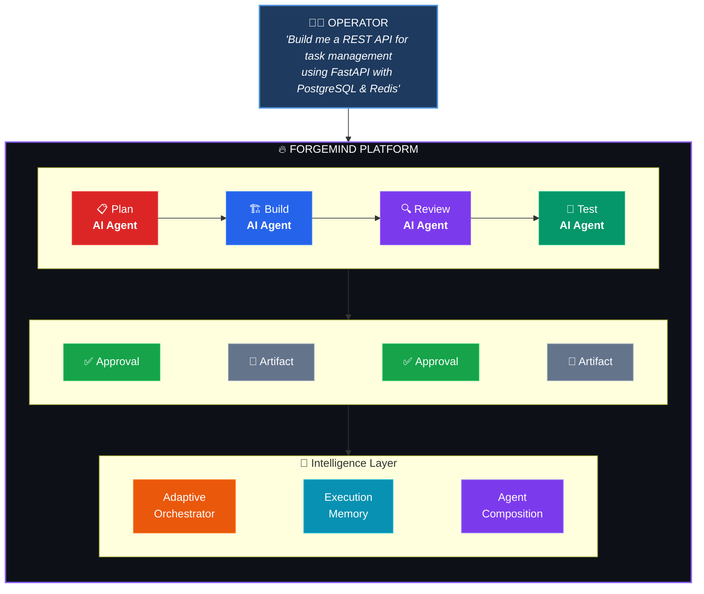
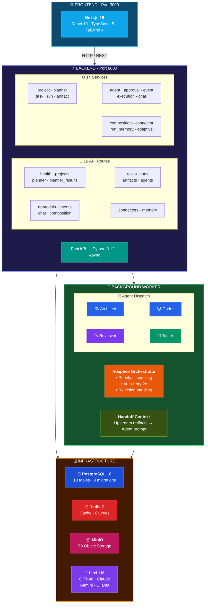
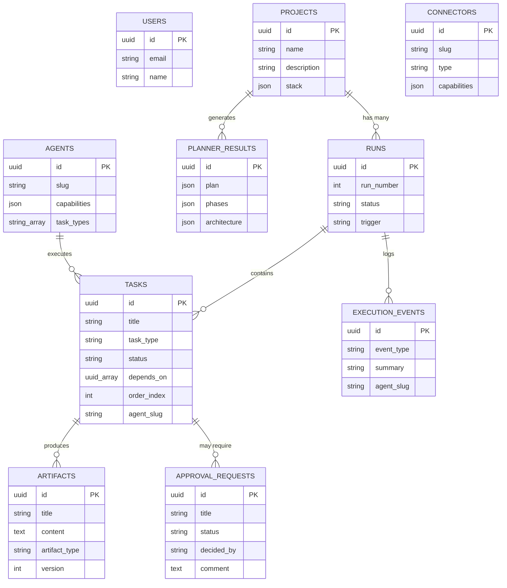
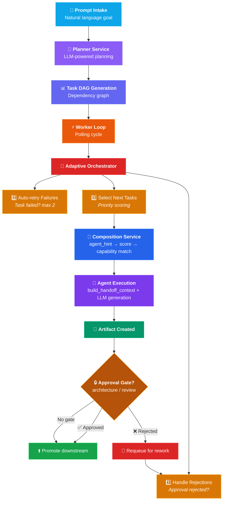
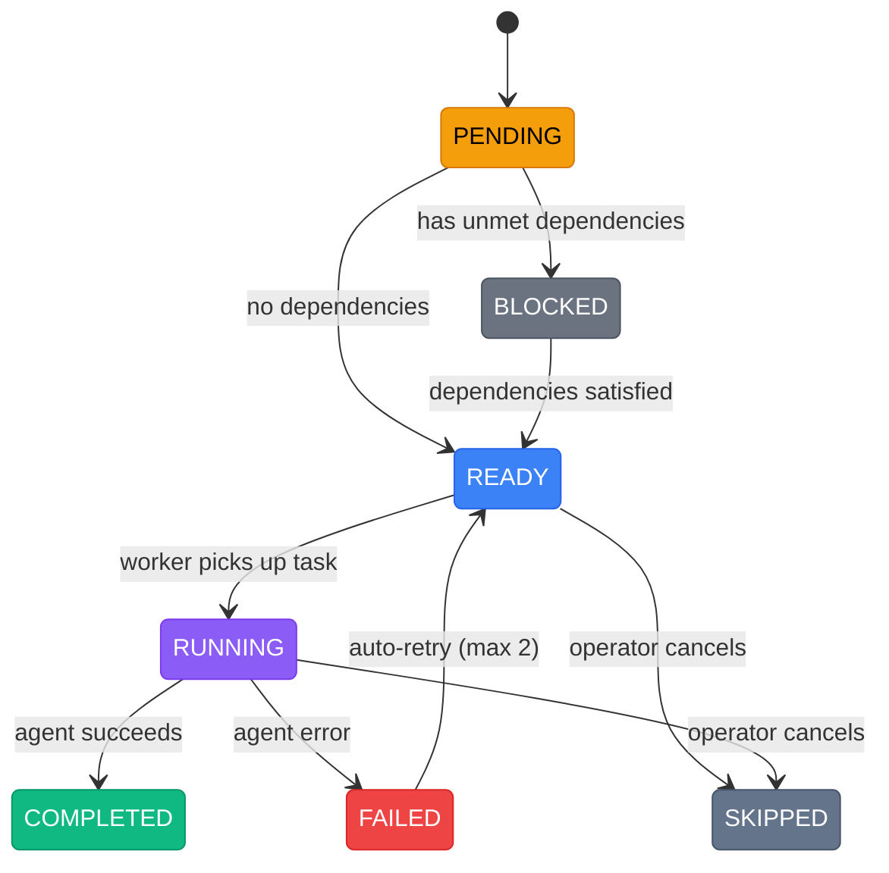
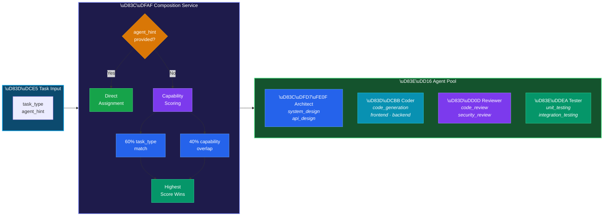
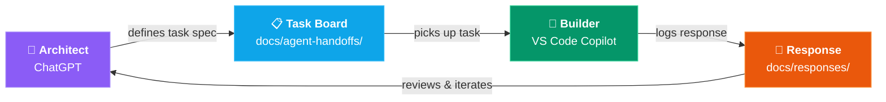

<div align="center">

# 🔥 ForgeMind

### **Adaptive AI Engineering Platform**

_Turn high-level goals into complete, verifiable software systems — with human-in-the-loop oversight and dynamic multi-agent execution._

[](https://python.org)
[](https://fastapi.tiangolo.com)
[](https://nextjs.org)
[](https://react.dev)
[](https://www.postgresql.org)
[](https://redis.io)
[](https://docs.docker.com/compose/)
[]()

</div>

---

## 📋 Table of Contents

- [Overview](#-overview)
- [Key Features](#-key-features)
- [Architecture](#-architecture)
- [Tech Stack](#-tech-stack)
- [Project Structure](#-project-structure)
- [Getting Started](#-getting-started)
- [API Reference](#-api-reference)
- [Development](#-development)
- [Milestone Progress](#-milestone-progress)
- [Technical Decisions](#-technical-decisions)

---

## 🧠 Overview

ForgeMind is an **operator-centered AI execution platform** that dynamically assembles specialized AI agents to plan, build, review, and test software projects — with human approval at every critical step.



**What makes it different:**

- 🤖 **Multi-agent execution** — Specialized AI agents (architect, coder, reviewer, tester) with capability scoring
- 👁️ **Human-in-the-loop** — Approval gates at critical steps, never runs blind
- 🔄 **Adaptive execution** — Auto-retry with agent re-routing, reacts to failures and approval rejections
- 📝 **Full observability** — Event timeline, execution chatbot, artifact history
- 🧠 **Execution memory** — Cached run summaries, failure analysis, contextual reasoning

---

## ✨ Key Features

### 🎯 AI Planning Engine

- Natural language prompt → structured project plan
- Architecture design, tech stack recommendation, phase breakdown
- Multi-provider LLM support via LiteLLM (OpenAI, Anthropic, Google, Ollama)
- Normalized/sanitized output with fallback-safe behavior

### 🤖 Dynamic Agent System

- **5 specialized agents**: Planner, Architect, Coder, Reviewer, Tester
- **Capability taxonomy**: 8 capability groups with 25+ skills for scoring
- **Smart composition**: Automatic agent selection based on task requirements
- **Handoff context**: Each agent receives upstream artifacts (reviewer sees code, tester sees architecture)

### ✅ Human-in-the-Loop Oversight

- Automatic approval requests for architecture & review tasks
- Approval inbox with filter, decide, and comment
- Approval rejection → automatic task requeue for rework
- Operator control: retry failed tasks, cancel running ones

### 🔄 Adaptive Execution

- Priority-based task selection (critical path first)
- Auto-retry failed tasks (max 2) with agent re-routing
- Approval rejection → task requeue with rejection context
- Execution memory with cached summaries for faster decisions

### 🔌 Connector Intelligence

- 7 built-in connectors (GitHub, Docker, PostgreSQL, Redis, S3, Slack, Jira)
- Keyword-based recommendation engine
- Project stack → connector requirement mapping

### 💬 Execution Chatbot

- AI-powered Q&A about any run
- Context-aware using execution memory service
- Stub fallback when LLM is unavailable

---

## 🏗️ Architecture

### System Architecture



### Data Model



### Execution Flow



### Task State Machine



### Agent Capability Scoring



---

## 🛠️ Tech Stack

| Layer                 | Technology           | Version     | Purpose                           |
| --------------------- | -------------------- | ----------- | --------------------------------- |
| 🎨 **Frontend**       | Next.js (App Router) | 15.x        | Server/client components, routing |
| ⚛️ **UI**             | React                | 19.x        | Component library                 |
| 📝 **Language**       | TypeScript           | 5.x         | Type safety                       |
| 🎨 **Styling**        | Tailwind CSS         | 4.x         | Utility-first CSS                 |
| ⚡ **Backend**        | FastAPI              | 0.115+      | Async REST API                    |
| 🐍 **Runtime**        | Python               | 3.12+       | Backend language                  |
| 🗃️ **ORM**            | SQLAlchemy           | 2.0 (async) | Database access                   |
| 📊 **Validation**     | Pydantic             | v2          | Schema validation                 |
| 🐘 **Database**       | PostgreSQL           | 16          | Primary data store                |
| 🔴 **Cache**          | Redis                | 7           | Caching, queues                   |
| 📦 **Storage**        | MinIO                | Latest      | S3-compatible object storage      |
| 🔄 **Migrations**     | Alembic              | 1.14+       | Database versioning               |
| 🤖 **LLM Gateway**    | LiteLLM              | 1.50+       | Multi-provider LLM abstraction    |
| 🐳 **Infrastructure** | Docker Compose       | —           | 6-service local stack             |

---

## 📁 Project Structure

```
forgemind/
│
├── 📄 docker-compose.yml          # 6 services: postgres, redis, minio, api, web, worker
├── 📄 Makefile                    # Developer commands (dev, test, lint, migrate)
├── 📄 .env.example                # Environment variable template
├── 📄 .gitignore                  # Python + Node + Docker ignores
│
├── 🔧 apps/
│   ├── api/                       # ⚡ FastAPI Backend
│   │   ├── pyproject.toml         #    Python dependencies
│   │   ├── alembic.ini            #    Migration config
│   │   ├── Dockerfile             #    Container build
│   │   ├── app/
│   │   │   ├── main.py            #    App entry + lifespan
│   │   │   ├── api/
│   │   │   │   ├── router.py      #    16 route mounts
│   │   │   │   └── routes/        #    Route handlers (15 files)
│   │   │   │       ├── health.py, projects.py, planner.py
│   │   │   │       ├── planner_results.py, tasks.py, runs.py
│   │   │   │       ├── artifacts.py, agents.py, approvals.py
│   │   │   │       ├── events.py, chat.py, composition.py
│   │   │   │       ├── connectors.py, memory.py
│   │   │   │       └── __init__.py
│   │   │   ├── core/              #    Config, auth, LLM integration
│   │   │   │   ├── config.py      #    Settings (env-based)
│   │   │   │   ├── auth_stub.py   #    Auth placeholder
│   │   │   │   └── llm.py         #    LiteLLM wrapper
│   │   │   ├── db/                #    Database setup
│   │   │   │   ├── base.py        #    Model imports (metadata)
│   │   │   │   ├── base_class.py  #    SQLAlchemy declarative base
│   │   │   │   └── session.py     #    Async session factory
│   │   │   ├── models/            #    SQLAlchemy models (10)
│   │   │   │   ├── user.py, project.py, run.py, task.py
│   │   │   │   ├── planner_result.py, artifact.py, agent.py
│   │   │   │   ├── approval_request.py, execution_event.py
│   │   │   │   └── connector.py
│   │   │   ├── schemas/           #    Pydantic schemas (11 files)
│   │   │   └── services/          #    Business logic (14 services)
│   │   │       ├── project_service.py, planner_service.py
│   │   │       ├── task_service.py, artifact_service.py
│   │   │       ├── agent_service.py, approval_service.py
│   │   │       ├── event_service.py, execution_service.py
│   │   │       ├── chat_service.py, composition_service.py
│   │   │       ├── connector_service.py, run_memory_service.py
│   │   │       └── adaptive_orchestrator.py
│   │   └── alembic/versions/      #    8 migration files
│   │
│   ├── web/                       # 🌐 Next.js 15 Frontend
│   │   ├── package.json           #    Node dependencies
│   │   ├── Dockerfile             #    Container build
│   │   ├── app/                   #    Pages (App Router)
│   │   │   ├── layout.tsx         #    Root layout
│   │   │   ├── page.tsx           #    Landing → redirect
│   │   │   └── dashboard/         #    Dashboard pages
│   │   │       ├── page.tsx       #    Main dashboard
│   │   │       ├── approvals/     #    Approval inbox
│   │   │       ├── artifacts/     #    Artifact detail
│   │   │       ├── projects/      #    Project detail
│   │   │       └── runs/          #    Run detail
│   │   ├── components/            #    React components (14 files)
│   │   │   ├── layout/            #    Shell, sidebar, top nav
│   │   │   ├── approvals/         #    Approval card + list
│   │   │   ├── artifacts/         #    Artifact list section
│   │   │   ├── chat/              #    Run chat panel
│   │   │   ├── events/            #    Event timeline
│   │   │   ├── planner/           #    Prompt form, plan view
│   │   │   ├── projects/          #    Project list, create form
│   │   │   └── tasks/             #    Run task list
│   │   ├── lib/                   #    API client functions (9 files)
│   │   └── types/                 #    TypeScript interfaces (7 files)
│   │
│   └── worker/                    # 🔧 Background Worker
│       └── worker/
│           ├── main.py            #    Polling loop + adaptive orchestrator
│           └── agents/            #    Agent implementations
│               ├── base.py        #    Base agent + handoff context
│               ├── architect_agent.py
│               ├── coder_agent.py
│               ├── reviewer_agent.py
│               ├── tester_agent.py
│               └── registry.py    #    Agent dispatch registry
│
├── 📚 docs/
│   ├── MILESTONE_SUMMARY.md       #    What ForgeMind can do
│   ├── TECHNICAL_DEBT.md          #    Known debt items (21)
│   └── agent-handoffs/            #    Task board + response docs
│       ├── TASKS.md               #    FM-001 to FM-040
│       └── responses/             #    Per-task implementation logs
│
└── 📦 packages/                   #    Future shared packages
    ├── agents/, connectors/, core/
    ├── orchestrator/, schemas/
    ├── security/, utils/, verification/
```

---

## 🚀 Getting Started

### Prerequisites

| Tool                    | Version | Required      |
| ----------------------- | ------- | ------------- |
| Docker & Docker Compose | Latest  | ✅ Yes        |
| Python                  | 3.12+   | For local dev |
| Node.js                 | 20+     | For local dev |
| Git                     | Latest  | ✅ Yes        |

### Option 1: Docker Compose (Recommended)

```bash
# 1. Clone the repository
git clone https://github.com/priyankmistry21699-web/Forgemind.git
cd Forgemind

# 2. Copy environment file
cp .env.example .env

# 3. Configure your LLM API key (at least one required for AI features)
#    Edit .env and set ONE of:
#    OPENAI_API_KEY=sk-...
#    ANTHROPIC_API_KEY=sk-ant-...
#    GOOGLE_API_KEY=AI...

# 4. Start all services
docker compose up -d

# 5. Run database migrations
docker compose exec api alembic upgrade head

# 6. Open the app
#    Frontend:  http://localhost:3000
#    API Docs:  http://localhost:8000/docs
#    MinIO:     http://localhost:9001
```

### Option 2: Local Development

```bash
# 1. Start infrastructure only
docker compose up -d postgres redis minio

# 2. Install Python dependencies
cd apps/api
pip install -e ".[dev]"

# 3. Run migrations
alembic upgrade head

# 4. Start the API server
uvicorn app.main:app --reload --host 0.0.0.0 --port 8000

# 5. In a new terminal — start the worker
cd apps/worker
python -m worker.main

# 6. In a new terminal — start the frontend
cd apps/web
npm install
npm run dev

# 7. Open http://localhost:3000
```

### Option 3: Make Commands

```bash
# Install everything
make install

# Start development (API + Web + Infra)
make dev

# Start worker separately
make dev-worker

# Run migrations
make migrate

# Run tests
make test

# Lint & format
make lint && make format
```

### Environment Variables

| Variable                     | Default                 | Description                    |
| ---------------------------- | ----------------------- | ------------------------------ |
| `APP_ENV`                    | `development`           | Environment mode               |
| `SECRET_KEY`                 | `change-me...`          | App secret key                 |
| `POSTGRES_HOST`              | `localhost`             | Database host                  |
| `POSTGRES_PORT`              | `5432`                  | Database port                  |
| `POSTGRES_DB`                | `forgemind`             | Database name                  |
| `POSTGRES_USER`              | `forgemind`             | Database user                  |
| `POSTGRES_PASSWORD`          | `change-me`             | Database password              |
| `REDIS_HOST`                 | `localhost`             | Redis host                     |
| `REDIS_PORT`                 | `6379`                  | Redis port                     |
| `OPENAI_API_KEY`             | —                       | OpenAI API key                 |
| `ANTHROPIC_API_KEY`          | —                       | Anthropic API key              |
| `GOOGLE_API_KEY`             | —                       | Google AI API key              |
| `PLANNER_MODEL`              | `gpt-4o`                | LLM model for planning         |
| `WORKER_POLL_INTERVAL`       | `5`                     | Worker poll interval (seconds) |
| `WORKER_MAX_TASKS_PER_CYCLE` | `3`                     | Max tasks per worker cycle     |
| `CORS_ORIGINS`               | `http://localhost:3000` | Allowed CORS origins           |

---

## 📡 API Reference

Base URL: `http://localhost:8000`

### Core Endpoints

| Method | Path                    | Description         |
| ------ | ----------------------- | ------------------- |
| `GET`  | `/health`               | Health check        |
| `POST` | `/projects`             | Create project      |
| `GET`  | `/projects`             | List projects       |
| `GET`  | `/projects/{id}`        | Get project details |
| `POST` | `/projects/{id}/plan`   | Generate AI plan    |
| `GET`  | `/planner-results/{id}` | Get planner result  |

### Execution

| Method | Path                 | Description       |
| ------ | -------------------- | ----------------- |
| `GET`  | `/runs`              | List runs         |
| `GET`  | `/runs/{id}`         | Get run details   |
| `GET`  | `/runs/{id}/tasks`   | Get run tasks     |
| `POST` | `/tasks/{id}/retry`  | Retry failed task |
| `POST` | `/tasks/{id}/cancel` | Cancel task       |

### Artifacts & Approvals

| Method | Path                     | Description    |
| ------ | ------------------------ | -------------- |
| `GET`  | `/artifacts`             | List artifacts |
| `GET`  | `/artifacts/{id}`        | Get artifact   |
| `GET`  | `/approvals`             | List approvals |
| `POST` | `/approvals/{id}/decide` | Approve/reject |

### Intelligence

| Method | Path                                 | Description               |
| ------ | ------------------------------------ | ------------------------- |
| `POST` | `/runs/{id}/chat`                    | Chat about a run          |
| `GET`  | `/composition/capabilities`          | Agent capability taxonomy |
| `GET`  | `/runs/{id}/composition`             | Team composition analysis |
| `GET`  | `/connectors`                        | List connectors           |
| `GET`  | `/runs/{id}/connectors/requirements` | Connector recommendations |

### Memory & Analysis

| Method | Path                         | Description           |
| ------ | ---------------------------- | --------------------- |
| `GET`  | `/runs/{id}/memory/summary`  | Cached run summary    |
| `GET`  | `/runs/{id}/memory/failures` | Failure analysis      |
| `GET`  | `/runs/{id}/memory/context`  | Text context for chat |

### Agent Registry

| Method | Path             | Description            |
| ------ | ---------------- | ---------------------- |
| `GET`  | `/agents`        | List registered agents |
| `GET`  | `/agents/{slug}` | Get agent by slug      |
| `GET`  | `/events`        | List execution events  |

> Full interactive docs at `http://localhost:8000/docs` (Swagger UI)

---

## 🧑‍💻 Development

### Database Migrations

```bash
# Run all pending migrations
cd apps/api && alembic upgrade head

# Create a new migration
alembic revision --autogenerate -m "add_new_table"

# Rollback one migration
alembic downgrade -1
```

### Migration History

| #    | Migration                    | Description                        |
| ---- | ---------------------------- | ---------------------------------- |
| 0001 | `initial_schema`             | users, projects, runs, tasks       |
| 0002 | `add_planner_results`        | planner_results table              |
| 0003 | `add_artifacts`              | artifacts table                    |
| 0004 | `add_agents`                 | agents table + seed data           |
| 0005 | `add_task_execution_columns` | agent_slug, error_message on tasks |
| 0006 | `add_approval_requests`      | approval_requests table            |
| 0007 | `add_execution_events`       | execution_events table             |
| 0008 | `add_connectors`             | connectors table                   |

### Code Quality

```bash
# Lint Python
cd apps/api && ruff check .

# Format Python
cd apps/api && ruff format .

# Lint TypeScript
cd apps/web && npm run lint

# Format TypeScript
cd apps/web && npm run format
```

### Testing

```bash
# Python tests
cd apps/api && pytest -v

# Frontend tests
cd apps/web && npm test

# All tests
make test
```

---

## 📊 Milestone Progress

### Completed: 8 Milestones — 42 Tasks ✅

| #   | Milestone                                | Tasks                      | Status      |
| --- | ---------------------------------------- | -------------------------- | ----------- |
| 1   | **Platform Foundation**                  | FM-001 → FM-005            | ✅ Complete |
| 2   | **Backend Core**                         | FM-006 → FM-011 (+FM-010A) | ✅ Complete |
| 3   | **Frontend MVP**                         | FM-012 → FM-015A           | ✅ Complete |
| 4   | **AI Planning Intelligence**             | FM-016 → FM-020A           | ✅ Complete |
| 5   | **Execution Foundations**                | FM-021 → FM-025            | ✅ Complete |
| 6   | **Controlled Execution & Observability** | FM-026 → FM-030            | ✅ Complete |
| 7   | **Operator Control & Interaction**       | FM-031 → FM-035            | ✅ Complete |
| 8   | **Adaptive Multi-Agent Foundations**     | FM-036 → FM-040            | ✅ Complete |

<details>
<summary><strong>Milestone 1 — Platform Foundation</strong></summary>

- FM-001: Initialize monorepo structure
- FM-002: Create FastAPI app skeleton
- FM-003: Create Next.js app shell
- FM-004: Add Docker Compose with Postgres & Redis
- FM-005: SQLAlchemy base/session config
</details>

<details>
<summary><strong>Milestone 2 — Backend Core</strong></summary>

- FM-006: Alembic migration setup
- FM-007: Core domain models (users/projects/runs/tasks)
- FM-008: Project CRUD API
- FM-009: Prompt intake + planner stub flow
- FM-010: Task DAG service + orchestration foundations
- FM-010A: Task service + orchestration fixes
- FM-011: Task CRUD API
</details>

<details>
<summary><strong>Milestone 3 — Frontend MVP</strong></summary>

- FM-012: Basic dashboard UI
- FM-013: Prompt intake page
- FM-014: Simple planner service stub
- FM-015: MVP polish + frontend validation
- FM-015A: Frontend validation fixes
</details>

<details>
<summary><strong>Milestone 4 — AI Planning Intelligence</strong></summary>

- FM-016: Project detail page
- FM-017: Planner result persistence model + API
- FM-018: Frontend planner result view
- FM-019: LiteLLM integration
- FM-020: Real planner generation
- FM-020A: Planner quality + robustness gate
</details>

<details>
<summary><strong>Milestone 5 — Execution Foundations</strong></summary>

- FM-021: Execution artifact model and persistence
- FM-022: Agent registry and capability model
- FM-023: Execution service for task claiming/completion
- FM-024: Worker/orchestrator foundation
- FM-025: Fixed execution agents (architect, coder, reviewer, tester)
</details>

<details>
<summary><strong>Milestone 6 — Controlled Execution & Observability</strong></summary>

- FM-026: Approval request model and workflow
- FM-027: Run timeline / execution event log
- FM-028: Frontend execution run view
- FM-029: Frontend approval inbox and decision flow
- FM-030: End-to-end execution UX polish
</details>

<details>
<summary><strong>Milestone 7 — Operator Control & Interaction</strong></summary>

- FM-031: Artifact detail view and navigation
- FM-032: Execution control actions (retry / cancel)
- FM-033: Execution chatbot foundation
- FM-034: Planner-to-execution handoff refinement
- FM-035: End-to-end operator UX polish
</details>

<details>
<summary><strong>Milestone 8 — Adaptive Multi-Agent Foundations</strong></summary>

- FM-036: Dynamic agent composition foundations
- FM-037: Agent handoff and collaboration model
- FM-038: Connector intelligence foundation
- FM-039: Execution memory and contextual reasoning
- FM-040: Adaptive execution loop v1
</details>

---

## 🧩 Technical Decisions

| Decision             | Choice                                 | Rationale                                                 |
| -------------------- | -------------------------------------- | --------------------------------------------------------- |
| **Monorepo**         | Single repo with `apps/` + `packages/` | Shared types, atomic commits, simpler CI                  |
| **Async everywhere** | SQLAlchemy 2.0 async + asyncpg         | Non-blocking I/O for agent dispatch                       |
| **LiteLLM**          | Multi-provider gateway                 | Switch models without code changes                        |
| **App Router**       | Next.js 15 App Router                  | Server components, streaming, layouts                     |
| **Pydantic v2**      | Schema validation                      | 5-17x faster than v1, native JSON mode                    |
| **UUID PKs**         | UUID4 primary keys                     | Globally unique, no sequence contention                   |
| **ARRAY deps**       | `depends_on: UUID[]`                   | Simple DAG without junction table (fine for <100 tasks)   |
| **In-memory cache**  | Dict-based run summary cache           | Single-process MVP; Redis upgrade path documented         |
| **Agent scoring**    | Weighted capability match              | Extensible to learned weights from execution history      |
| **Retry tracking**   | `[retry N]` in error_message           | Zero-migration approach; proper column can be added later |

---

<div align="center">

**Built with ❤️ by [Priyank Mistry](https://github.com/priyankmistry21699-web)**

_ForgeMind v0.3.0 — 42 tasks completed across 8 milestones_

</div>

---

## 🔄 Development Workflow

This project uses a **ChatGPT (architect) + VS Code Copilot (builder)** collaboration model:



1. Tasks are defined as handoff specs in `docs/agent-handoffs/`
2. The implementation agent executes each task
3. Responses are logged in `docs/agent-handoffs/responses/`
4. The architect reviews and generates the next task

See [docs/agent-handoffs/TASKS.md](docs/agent-handoffs/TASKS.md) for the current task board.

---

## 📜 License

Proprietary — All rights reserved.
