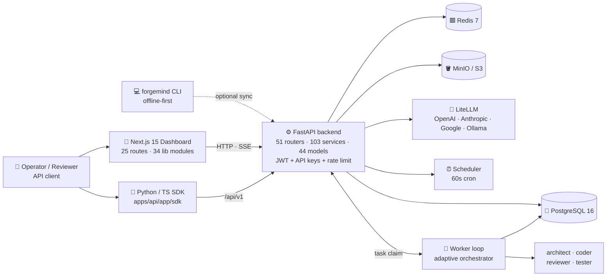
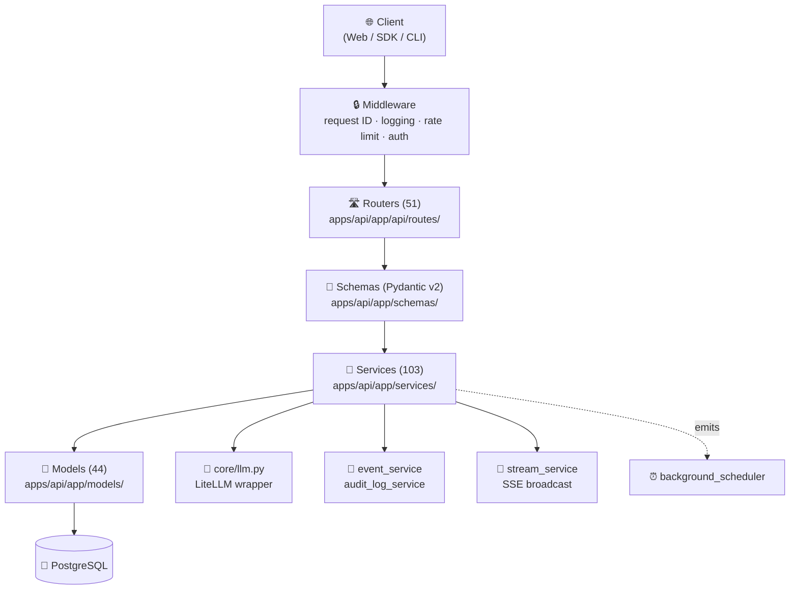
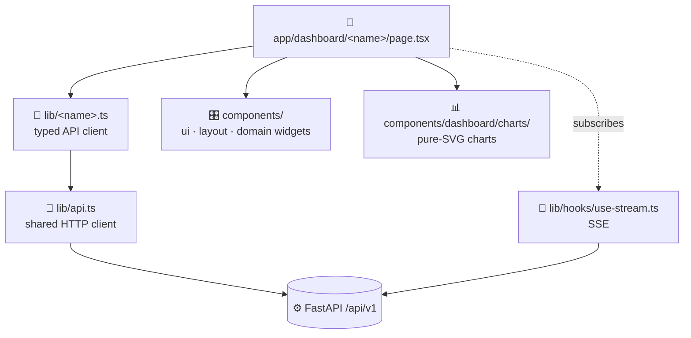
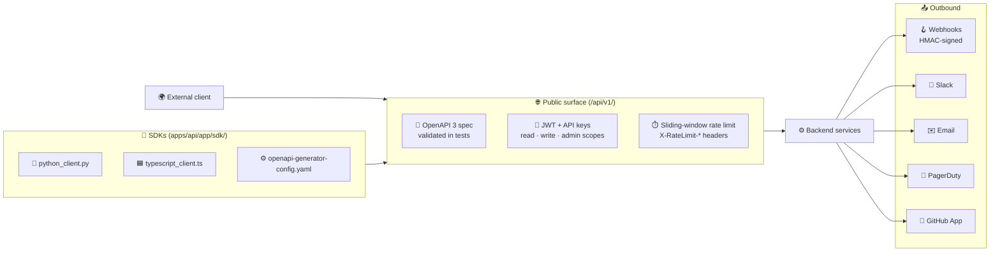

<div align="center">


### **An operator-centered, AI-native engineering platform**

_Turn natural-language goals into governed, auditable, multi-agent software delivery — with human approvals, cost tracking, code-change proposals, architecture intelligence, analytics, and a public API._

---


</div>

---

> ForgeMind plans work from a prompt, executes it through specialized AI agents with full governance, and surfaces every step — plan, artifact, event, cost, approval — in an operator-centered dashboard. It is a governed execution runtime, not a chat window.

<br />

## 📖 Table of Contents

<table>
<tr>
<td>

- [✨ What it is](#-what-it-is)
- [🎯 Why it exists](#-why-it-exists)
- [🧩 Core capability areas](#-core-capability-areas)
- [🗂️ Repository structure](#️-repository-structure)

</td>
<td>

- [🏛️ Architecture](#️-architecture)
- [🚀 Running locally](#-running-locally)
- [🧪 Testing & validation](#-testing--validation)
- [📚 Documentation map](#-documentation-map)

</td>
</tr>
</table>

---

## ✨ What it is

ForgeMind is a **multi-agent AI platform** for teams that need governed, observable, programmable software delivery. It does three things:

| | |
| :-- | :-- |
| 📋 **Plans work** from a prompt | An LLM planner breaks a goal into a typed task DAG with agent hints and approval gates. |
| ⚙️ **Executes work** with specialized agents | Architect · Coder · Reviewer · Tester, composed adaptively with handoff context, retry, cost tracking, and deterministic replay snapshots. |
| 🛡️ **Governs work** end to end | Approvals, project constitution, trust scoring, architecture rules, council deliberation, SSO/RBAC, audit exports, compliance reports. |

V4 extended that engine with collaboration, GitHub integration, cross-project search & memory, enterprise governance, code intelligence, analytics & portfolio operations, a versioned public API + SDKs, webhooks, and a standalone local CLI.

---

## 🎯 Why it exists

> LLMs are powerful; unattended LLMs are dangerous. ForgeMind treats every agent action as a reviewable, auditable, reversible operation.

| Problem | ForgeMind's answer |
| :--- | :--- |
| 🔍 LLM output is unreviewable and unauditable | Every agent step produces a **typed artifact**, an **execution event**, and an optional **replay snapshot** (SHA-256 hashed). Approvals are first-class records. |
| 🧑‍⚖️ Agentic systems skip oversight | Approval gates, project constitution, trust scoring, council deliberation, architecture approvals on HIGH / CRITICAL blast-radius changes. |
| 💸 Costs run away | Per-call cost tracking with per-project budgets and threshold alerts. |
| 🧬 Code changes bypass governance | Patch proposals → annotation reviews → branch strategy → PR drafts → approval gates → bounded sandbox execution. |
| 🏗️ Architecture drift is invisible | Graph-based topology, drift detection, rule engine, and BFS impact analysis. |
| 🔌 Integrating is hard | Versioned `/api/v1/`, JWT + API keys, OpenAPI 3, Python + TypeScript SDKs, webhooks, Slack / email / PagerDuty / GitHub connectors. |

---

## 🧩 Core capability areas

<table>
<tr>
<td width="50%" valign="top">

**🧠 Planning & Execution**
Prompt intake · LLM planner · adaptive orchestrator · agent composition · artifacts · events · replay snapshots.

**🛡️ Governance**
Approvals · project constitution · trust scoring · council · architecture approvals · enterprise governance (SSO, IP allowlists, compliance reports, retention).

**🏛️ Code & Architecture Intelligence**
Repo sync · patch / PR flow · sandbox exec · topology graph · drift detection · rule engine · impact analysis · refactor recommendations · dependency graph · coverage maps · debt / flakiness / complexity.

**📊 Analytics & Portfolio**
Composite health score · cost budgets + alerts · velocity + quality · portfolio summary · custom SVG-rendered dashboards · scheduled reports · executive summary narrative.

</td>
<td width="50%" valign="top">

**🤝 Collaboration**
Workspaces · RBAC · threaded comments · mentions · saved views · activity feed · presence · SSE live updates.

**🔗 Integrations**
GitHub App (install · sync · PR status · CI pipeline view) · webhooks · Slack / email / PagerDuty connectors.

**🌐 Public API & SDKs**
Versioned `/api/v1/` · JWT + API keys (read/write/admin scopes) · sliding-window rate limiter · OpenAPI 3 · Python + TypeScript clients.

**💻 Local Developer Mode**
`forgemind` CLI — repo attach · indexing · Q&A · bounded exec · patches · PR prep · IDE integration · offline state.

</td>
</tr>
</table>

> **Deep-dive guides:** [code-intelligence.md](docs/code-intelligence.md) · [analytics-portfolio.md](docs/analytics-portfolio.md) · [api-ecosystem.md](docs/api-ecosystem.md)

---

## 🗂️ Repository structure

```
Forgemind/
├── 📦 apps/
│   ├── api/       FastAPI backend  — 51 routers · 103 services · 44 models · 1559 tests
│   ├── web/       Next.js 15 frontend — 25 dashboard routes · 34 lib modules · 231 tests
│   ├── worker/    async agent loop (architect · coder · reviewer · tester)
│   └── local/     forgemind standalone CLI — 61 tests
│
├── 📚 packages/   shared: agents · connectors · core · orchestrator · schemas · security · utils · verification
├── 📖 docs/       architecture · workflow · milestones · topical guides
├── 🛠️ scripts/    operator exercise + data helpers
├── 🚢 deployment/ Docker images + reverse-proxy templates
│
├── docker-compose.yml
├── Makefile
└── .github/workflows/ci.yml   3-job CI (backend · frontend · local-cli)
```

> All counts verified against HEAD. Navigation map: **[docs/REPOSITORY_GUIDE.md](docs/REPOSITORY_GUIDE.md)**.

---

## 🏛️ Architecture

ForgeMind runs four cooperating process types around a single authoritative backend. The sections below cover **system-level**, **backend internals**, **frontend internals**, and **integration / SDK** — with a diagram and a concise reference list per layer.

<br />

### 🌐 1. System architecture

The **API** is the only tier that owns business logic and persistence. The **Web** surface renders, the **Worker** executes agents, the **Local CLI** runs on developer workstations with optional server sync. A background scheduler lives inside the API's FastAPI lifespan.


```mermaid
flowchart LR
    U["👤 Operator / Reviewer<br/>API client"] --> FE["🎨 Next.js 15 Dashboard<br/>25 routes · 34 lib modules"]
    U --> SDK["🔌 Python / TS SDK<br/>apps/api/app/sdk"]
    CLI["💻 forgemind CLI<br/>offline-first"] -. optional sync .-> API

    FE -->|HTTP · SSE| API
    SDK -->|/api/v1| API

    API["⚙️ FastAPI backend<br/>51 routers · 103 services · 44 models<br/>JWT + API keys + rate limit"]

    API --> PG[("🐘 PostgreSQL 16")]
    API --> RD[("🟥 Redis 7")]
    API --> S3[("🪣 MinIO / S3")]
    API --> LLM["🧠 LiteLLM<br/>OpenAI · Anthropic · Google · Ollama"]
    API --> SCHED["⏰ Scheduler<br/>60s cron"]
    API <-->|task claim| WORK

    WORK["🤖 Worker loop<br/>adaptive orchestrator"] --> AG["architect · coder<br/>reviewer · tester"]
    WORK --> PG
```

**Key properties:**

- **API is authoritative** — every other process reaches the database through the API layer, never directly.
- **Tests never hit migrations** — backend tests use `Base.metadata.create_all()` against aiosqlite; CI is fast and hermetic.
- **Persistence split** — PostgreSQL is the relational source of truth, Redis is cache + queue, MinIO/S3 holds binary artifacts.
- **Single scheduler** — reports, digests, health rollups, and budget evaluations all share one 60-second tick.

> 📘 Full reference: **[docs/ARCHITECTURE.md](docs/ARCHITECTURE.md)**

<br />

### ⚙️ 2. Backend architecture

A strict **routes → services → models** layering, with thin routes, fat services, and typed DTOs at the boundaries.


```mermaid
flowchart TD
    Client["🌐 Client<br/>(Web / SDK / CLI)"] --> MW["🔒 Middleware<br/>request ID · logging · rate limit · auth"]
    MW --> Router["🛣️ Routers (51)<br/>apps/api/app/api/routes/"]
    Router --> Schema["📐 Schemas (Pydantic v2)<br/>apps/api/app/schemas/"]
    Schema --> Service["🧠 Services (103)<br/>apps/api/app/services/"]
    Service --> Model["🧱 Models (44)<br/>apps/api/app/models/"]
    Service --> LLM["🧠 core/llm.py<br/>LiteLLM wrapper"]
    Service --> Event["📝 event_service<br/>audit_log_service"]
    Service --> Stream["📡 stream_service<br/>SSE broadcast"]
    Model --> DB[("🐘 PostgreSQL")]
    Service -.emits.-> SCH["⏰ background_scheduler"]
```

**House rules:**

- 🧵 **Routes stay thin** — they validate, authorize, and call a service. No DB access, no LLM calls in routes.
- 🧠 **Services own logic** — every database query, LLM call, and external I/O lives in a service.
- 🚫 **No ORM leakage** — services return Pydantic models / dataclasses, never raw SQLAlchemy instances.
- 🧪 **Tests use aiosqlite** via the `session` fixture in `apps/api/tests/conftest.py` — no live Postgres required.

**Core infrastructure** (`apps/api/app/core/`):

| Module | Purpose |
| :-- | :-- |
| `config.py` | Env-driven settings (pydantic-settings) |
| `auth.py` · `authz_deps.py` | JWT + API-key auth · scope / RBAC DI |
| `llm.py` | LiteLLM wrapper with cost recording |
| `rate_limit.py` | Per-IP + per-API-key sliding window |
| `logging_middleware.py` · `error_handlers.py` | Uniform logs + JSON error shape |
| `metrics.py` · `metrics_middleware.py` | Prometheus `/metrics` |
| `ip_allowlist_middleware.py` | Enterprise IP allowlist enforcement |

**Migrations** — Alembic, chained. Head: `fm161_170_search_knowledge`. Local-boot quirk (migration `0022` duplicate-enum) + workaround documented in **[docs/DEVELOPMENT_WORKFLOW.md §5.2](docs/DEVELOPMENT_WORKFLOW.md)**.

<br />

### 🎨 3. Frontend architecture

Next.js 15 App Router, React 19, strict TypeScript, Tailwind 4. The frontend is a **pure view layer**: every page lifts data through a typed `lib/*.ts` client and delegates logic to the backend.


```mermaid
flowchart TD
    Route["📄 app/dashboard/&lt;name&gt;/page.tsx"] --> LibClient["🧰 lib/&lt;name&gt;.ts<br/>typed API client"]
    Route --> UI["🎛️ components/<br/>ui · layout · domain widgets"]
    Route --> Chart["📊 components/dashboard/charts/<br/>pure-SVG charts"]
    Route -. subscribes .-> Stream["📡 lib/hooks/use-stream.ts<br/>SSE"]
    LibClient --> Shared["🔧 lib/api.ts<br/>shared HTTP client"]
    Shared --> Backend[("⚙️ FastAPI /api/v1")]
    Stream --> Backend
```

**Organization:**

- **25 dashboard routes** under [`apps/web/app/dashboard/`](apps/web/app/dashboard/) — one folder per domain (projects, runs, approvals, analytics, architecture, …).
- **34 `lib/` modules** under [`apps/web/lib/`](apps/web/lib/) — one typed API client per backend domain, plus [`hooks/use-stream.ts`](apps/web/lib/hooks/use-stream.ts) for live SSE subscriptions.
- **Components** grouped by concern under [`apps/web/components/`](apps/web/components/): `ui/` (shadcn primitives), `layout/`, and domain widgets (chat, tasks, artifacts, dashboard, analytics, …).
- **Charts** are **dependency-free pure SVG** — no chart library. See [`apps/web/components/dashboard/charts/`](apps/web/components/dashboard/charts/).
- **Tests** use Vitest + Testing Library — 231 tests / 37 files, v8 coverage uploaded from CI.

<br />

### 🔌 4. Integration & SDK architecture

The public surface is deliberately separated from the internal routes. `/api/v1/` is what external clients, SDKs, and automations consume.


```mermaid
flowchart LR
    subgraph Public["🌐 Public surface (/api/v1/)"]
      direction TB
      OpenAPI["📜 OpenAPI 3 spec<br/>validated in tests"]
      Auth["🔑 JWT + API keys<br/>read · write · admin scopes"]
      RL["⏱️ Sliding-window rate limit<br/>X-RateLimit-* headers"]
    end

    subgraph SDKs["🔌 SDKs (apps/api/app/sdk/)"]
      direction TB
      Py["🐍 python_client.py"]
      Ts["🟦 typescript_client.ts"]
      Cfg["⚙️ openapi-generator-config.yaml"]
    end

    subgraph Out["📤 Outbound"]
      direction TB
      Hooks["🪝 Webhooks<br/>HMAC-signed"]
      Slack["💬 Slack"]
      Email["✉️ Email"]
      PD["🚨 PagerDuty"]
      GH["🐙 GitHub App"]
    end

    Ext["🌍 External client"] --> Public
    SDKs --> Public
    Public --> Core["⚙️ Backend services"]
    Core --> Hooks
    Core --> Slack
    Core --> Email
    Core --> PD
    Core --> GH
```

**Highlights:**

- **OpenAPI spec** is validated by `TestOpenAPISpecCompleteness` — every path has an operation, every schema is populated, everything is JSON-serializable.
- **Interactive docs** — Swagger at `/docs`, ReDoc at `/redoc`, raw spec at `/openapi.json`.
- **SDK regeneration** — `apps/api/app/sdk/openapi-generator-config.yaml` ships the client config; `python_client.py` and `typescript_client.ts` are published-ready (see `pyproject.toml` / `package.json` in the SDK folder).
- **Webhooks** — stored as `WebhookEndpoint`, delivered by [`webhook_service`](apps/api/app/services/webhook_service.py) with HMAC signing and a `WebhookDelivery` audit trail.
- **Connectors** — Slack, email, PagerDuty, and generic HTTP live in [`webhook_connector_service`](apps/api/app/services/webhook_connector_service.py) + [`packages/connectors/`](packages/connectors/).

> 📘 Full Wave 16 reference: **[docs/api-ecosystem.md](docs/api-ecosystem.md)**

---

## 🚀 Running locally

<details open>
<summary><strong>Option A — Docker Compose (recommended)</strong></summary>

```bash
git clone https://github.com/priyankmistry21699-web/Forgemind.git
cd Forgemind
cp .env.example .env            # set one LLM key to enable real planning
docker compose up -d
docker compose exec api alembic upgrade head
```

| Service | URL |
| :-- | :-- |
| 🎨 Frontend | http://localhost:3000 |
| 📘 API docs (Swagger) | http://localhost:8000/docs |
| 📗 ReDoc | http://localhost:8000/redoc |
| 🪣 MinIO console | http://localhost:9001 |

</details>

<details>
<summary><strong>Option B — Hybrid (infra in Docker, apps on host)</strong></summary>

Fastest iteration loop — code reloads without container rebuilds.
Full steps and `make` targets live in **[docs/DEVELOPMENT_WORKFLOW.md §2](docs/DEVELOPMENT_WORKFLOW.md)**.

</details>

<details>
<summary><strong>Option C — Local CLI only (no server)</strong></summary>

```bash
pip install -e apps/local
cd <some-git-repo>
forgemind init && forgemind attach
forgemind ask "where does X live?"
```

</details>

> ⚠️ **Known boot quirk** — migration `0022_add_architecture_tables` raises `DuplicateObjectError` for the `arch_node_type` enum on a fresh Postgres. Tests bypass Alembic, so CI never caught it. Workaround: see **[docs/DEVELOPMENT_WORKFLOW.md §5.2](docs/DEVELOPMENT_WORKFLOW.md)**.

---

## 🧪 Testing & validation

| Surface | Command | Count at HEAD |
| :-- | :-- | --: |
| 🐍 Backend pytest | `cd apps/api && pytest` | **1559 / 1559** ✅ |
| ⚛️ Frontend Vitest | `cd apps/web && npm test` | **231 / 231** across 37 files ✅ |
| 📊 Frontend coverage (v8) | `cd apps/web && npm run test:coverage` | stmts 51.00 · branches 55.57 · funcs 55.48 · lines 51.73 |
| 💻 Local CLI pytest | `cd apps/local && pytest` | **61 / 61** ✅ |
| ✨ Lint / format / typecheck / build | see workflow doc | clean on all surfaces ✅ |

**CI** ([`.github/workflows/ci.yml`](.github/workflows/ci.yml)) — three jobs, all green on `main`:

| Job | Steps |
| :-- | :-- |
| 🐍 **backend** | `ruff check` → `ruff format --check` → `pytest` |
| ⚛️ **frontend** | `tsc --noEmit` → ESLint → Vitest (+ v8 coverage) → `next build` |
| 💻 **local-cli** | `pytest` against `apps/local` |

> Playwright browser E2E and axe-based a11y checks are deferred — tracked as maturity work in [docs/MILESTONE_SUMMARY.md](docs/MILESTONE_SUMMARY.md#deferred--residual).

---

## 📚 Documentation map

| If you are… | Start here |
| :-- | :-- |
| 👥 A reviewer or stakeholder | this README → [docs/MILESTONE_SUMMARY.md](docs/MILESTONE_SUMMARY.md) |
| 🧑‍💻 A new engineer joining the codebase | [docs/REPOSITORY_GUIDE.md](docs/REPOSITORY_GUIDE.md) → [docs/ARCHITECTURE.md](docs/ARCHITECTURE.md) |
| 🤖 An agent / LLM onboarding to this repo | [docs/project-memory/](docs/project-memory/) — graph-style memory: backend · frontend · integrations · flows · change guide · milestone map |
| 🛠️ About to run or modify the stack | [docs/DEVELOPMENT_WORKFLOW.md](docs/DEVELOPMENT_WORKFLOW.md) |
| 🚢 Deploying to production | [docs/DEPLOYMENT.md](docs/DEPLOYMENT.md) |
| 🔌 Integrating via the public API / webhooks | [docs/api-ecosystem.md](docs/api-ecosystem.md) |
| 📊 Building dashboards / reports / metrics | [docs/analytics-portfolio.md](docs/analytics-portfolio.md) |
| 🏛️ Working on code-intelligence features | [docs/code-intelligence.md](docs/code-intelligence.md) |
| 🧾 Auditing tech debt | [docs/TECHNICAL_DEBT.md](docs/TECHNICAL_DEBT.md) |
| 🕰️ Tracing one milestone end-to-end | [docs/agent-handoffs/](docs/agent-handoffs/) |
| 🗺️ Reading the product plans | [FORGEMIND_V4_ROADMAP.md](FORGEMIND_V4_ROADMAP.md) · [FORGEMIND_ROADMAP.md](FORGEMIND_ROADMAP.md) |

---

## 📈 Current status

<table>
<tr>
<td width="50%" valign="top">

**🎯 Scope**
FM-001 → FM-210 complete · V4 tally **30 / 0 / 0** across Waves 10–16.

**🧪 Tests**
1559 BE · 231 FE (37 files) · 61 CLI — all passing.

**✨ Quality gates**
ruff check + format · ESLint · `tsc --noEmit` · `next build` · pytest — all clean.

</td>
<td width="50%" valign="top">

**⚙️ CI**
3-job pipeline green on `main`.

**🖥️ Runtime**
Docker + hybrid stacks both boot. Smoke validated on `/health`, `/api/v1/projects`, `/dashboard`, `/dashboard/projects/<id>`, `/dashboard/approvals`.

**⚠️ Known quirks**
Migration `0022` duplicate-enum on fresh Postgres · Playwright / a11y / visual snapshots deferred.

</td>
</tr>
</table>

> ForgeMind is ready for reviewer / stakeholder inspection, new-engineer onboarding, external integration via the public API, and V5 (FM-211 → FM-250) scoping.

---

<div align="center">

**Built by [Priyank Mistry](https://github.com/priyankmistry21699-web)** · _Governed AI execution, not a chat window._

</div>
