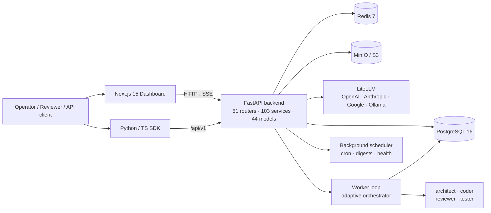

# ForgeMind

> **An operator-centered, AI-native engineering platform.**
> ForgeMind turns a natural-language goal into a governed, auditable, multi-agent execution plan — and runs that plan end-to-end with human approvals, cost tracking, code-change proposals, architecture intelligence, analytics, and a public API.

**Status (2026-04-20):** V4 feature-complete. FM-001 → FM-210 closed. Backend **1559** pytest, frontend **231** Vitest, local CLI **61** pytest — all green on `main`.

---

## What it is

ForgeMind is a multi-agent AI platform for teams that need **governed, observable, programmable delivery** — not a chat window that writes code and hopes. It does three things:

1. **Plans work** from a prompt — an LLM planner breaks a goal into a typed task DAG with agent hints and approval gates.
2. **Executes work** through specialized agents (architect, coder, reviewer, tester) with capability-based composition, handoff context, adaptive retry, cost tracking, and deterministic replay snapshots.
3. **Governs work** through approval inboxes, a project constitution, trust scores, architecture rules, council deliberation, SSO / RBAC, audit exports, and enterprise compliance reports.

Around that engine, V4 added collaboration, GitHub integration, cross-project search & memory, enterprise governance, code intelligence, analytics & portfolio, a versioned public API + SDKs, webhooks, and a standalone local CLI.

---

## Why it exists

| Problem | ForgeMind's answer |
| ------- | ------------------ |
| LLM output is unreviewable and unauditable | Every agent step produces a typed artifact, an execution event, and an optional replay snapshot (SHA-256 hashed). Approvals are first-class records. |
| Agentic systems skip oversight | Approval gates, project constitution, trust scoring, council deliberation, architecture approvals on HIGH / CRITICAL blast-radius changes. |
| Costs run away | Per-call cost tracking with per-project budgets and threshold alerts. |
| Code changes bypass governance | Patch proposals → annotation reviews → branch strategy → PR drafts → approval gates → bounded sandbox execution. |
| Architecture drift is invisible | Graph-based topology, drift detection, a rule engine, and BFS impact analysis. |
| Integrating is hard | Versioned `/api/v1/`, JWT + API keys, OpenAPI 3, Python + TypeScript SDKs, webhooks, Slack / email / PagerDuty / GitHub connectors. |

---

## Core capability areas

- **Planning & execution** — prompt intake, LLM planner, adaptive orchestrator, agent composition, artifacts, events, replay.
- **Governance** — approvals, constitution, trust scoring, council, architecture approvals, enterprise governance (SSO, IP allowlists, compliance reports, retention).
- **Code & architecture intelligence** — repo sync, patch / PR flow, sandbox exec, graph + drift + rules + impact + refactor recommendations, dependency graph, coverage maps, debt / flakiness / complexity.
- **Analytics & portfolio** — composite health score, cost budgets + alerts, velocity + quality, portfolio summary, custom SVG-rendered dashboards, scheduled reports, executive summary narrative.
- **Collaboration** — workspaces, RBAC, threaded comments, mentions, saved views, activity feed, presence, SSE live updates.
- **Integrations** — GitHub App (install + sync + PR status + CI pipeline view), webhooks, Slack / email / PagerDuty connectors.
- **Local developer mode** — `forgemind` CLI with repo attach, indexing, Q&A, bounded exec, patches, PR prep, IDE integration, offline state.

Deep-dive docs: [code-intelligence.md](docs/code-intelligence.md) · [analytics-portfolio.md](docs/analytics-portfolio.md) · [api-ecosystem.md](docs/api-ecosystem.md).

---

## Repo structure

```
Forgemind/
├── apps/
│   ├── api/       FastAPI backend — 51 routers · 103 services · 44 models · 1559 tests
│   ├── web/       Next.js 15 frontend — 25 dashboard routes · 34 lib modules · 231 tests
│   ├── worker/    async agent loop (architect · coder · reviewer · tester)
│   └── local/     `forgemind` standalone CLI — 61 tests
├── packages/      shared: agents, connectors, core, orchestrator, schemas, security, utils, verification
├── docs/          architecture, workflow, milestones, topical guides
├── scripts/       operator exercise + data helpers
├── deployment/    Docker images + reverse-proxy templates
├── docker-compose.yml
├── Makefile
└── .github/workflows/ci.yml   3-job CI (backend · frontend · local-cli)
```

Counts verified against HEAD. Full navigation map: [docs/REPOSITORY_GUIDE.md](docs/REPOSITORY_GUIDE.md).

---

## Architecture at a glance


```mermaid
flowchart LR
    U[Operator / Reviewer / API client] --> FE[Next.js 15 Dashboard]
    U --> SDK[Python / TS SDK]
    FE -->|HTTP · SSE| API
    SDK -->|/api/v1| API
    API[FastAPI backend<br/>51 routers · 103 services · 44 models]
    API --> PG[(PostgreSQL 16)]
    API --> RD[(Redis 7)]
    API --> S3[(MinIO / S3)]
    API --> LLM[LiteLLM<br/>OpenAI · Anthropic · Google · Ollama]
    API --> WORK[Worker loop<br/>adaptive orchestrator]
    WORK --> AG[architect · coder<br/>reviewer · tester]
    WORK --> PG
    API --> SCHED[Background scheduler<br/>cron · digests · health]
```

- **Frontend** renders and controls. Calls the backend over HTTP and subscribes to SSE streams.
- **Backend** owns all business logic. Routes stay thin — they validate, authorize, and delegate to services.
- **Worker** is the runtime for async agent work: polls ready tasks, resolves the best agent, executes, persists artifacts, emits events.
- **Scheduler** lives in the FastAPI lifespan, runs every 60s for reports, digests, health rollups, and cost-budget evaluations.
- **Persistence** — PostgreSQL is the only relational source of truth; Redis is cache + queue; MinIO / S3 holds binary artifacts.

Full design reference: [docs/ARCHITECTURE.md](docs/ARCHITECTURE.md).

---

## How to run locally

### Docker Compose (recommended)

```bash
git clone https://github.com/priyankmistry21699-web/Forgemind.git
cd Forgemind
cp .env.example .env            # set one LLM key to enable real planning
docker compose up -d
docker compose exec api alembic upgrade head
```

- Frontend: <http://localhost:3000>
- API docs: <http://localhost:8000/docs> · ReDoc: `/redoc` · raw spec: `/openapi.json`
- MinIO: <http://localhost:9001>

### Hybrid / `make`

For host-side API or web with Dockerized infra, the `make` targets, and the known **migration 0022 duplicate-enum** workaround, see [docs/DEVELOPMENT_WORKFLOW.md](docs/DEVELOPMENT_WORKFLOW.md).

### Local CLI only

```bash
pip install -e apps/local
cd <some-git-repo>
forgemind init && forgemind attach
forgemind ask "where does X live?"
```

---

## Testing and validation

| Surface | Command | Count at HEAD |
| ------- | ------- | ------------- |
| Backend pytest | `cd apps/api && pytest` | **1559 / 1559** |
| Frontend Vitest | `cd apps/web && npm test` | **231 / 231** across 37 files |
| Frontend coverage (v8) | `cd apps/web && npm run test:coverage` | stmts 51.00 · branches 55.57 · funcs 55.48 · lines 51.73 |
| Local CLI pytest | `cd apps/local && pytest` | **61 / 61** |
| Lint / format / typecheck / build | see workflow doc | clean on all surfaces |

CI (`.github/workflows/ci.yml`) runs three jobs: **backend** (ruff check + ruff format --check + pytest), **frontend** (tsc + ESLint + Vitest + coverage + build), **local-cli** (pytest). Full command matrix: [docs/DEVELOPMENT_WORKFLOW.md](docs/DEVELOPMENT_WORKFLOW.md).

Playwright browser E2E and axe-based a11y checks are deferred — tracked as maturity work in [docs/MILESTONE_SUMMARY.md](docs/MILESTONE_SUMMARY.md#deferred--residual).

---

## Documentation map

| If you are… | Start here |
| ----------- | ---------- |
| A reviewer or stakeholder | this README, then [docs/MILESTONE_SUMMARY.md](docs/MILESTONE_SUMMARY.md) |
| A new engineer joining the codebase | [docs/REPOSITORY_GUIDE.md](docs/REPOSITORY_GUIDE.md) → [docs/ARCHITECTURE.md](docs/ARCHITECTURE.md) |
| About to run or modify the stack | [docs/DEVELOPMENT_WORKFLOW.md](docs/DEVELOPMENT_WORKFLOW.md) |
| Deploying to production | [docs/DEPLOYMENT.md](docs/DEPLOYMENT.md) |
| Integrating via the public API / webhooks | [docs/api-ecosystem.md](docs/api-ecosystem.md) |
| Working on dashboards / reports / metrics | [docs/analytics-portfolio.md](docs/analytics-portfolio.md) |
| Working on code-intelligence features | [docs/code-intelligence.md](docs/code-intelligence.md) |
| Auditing tech debt | [docs/TECHNICAL_DEBT.md](docs/TECHNICAL_DEBT.md) |
| Tracing one milestone end-to-end | [docs/agent-handoffs/](docs/agent-handoffs/) |
| Reading the product plans | [FORGEMIND_V4_ROADMAP.md](FORGEMIND_V4_ROADMAP.md) · [FORGEMIND_ROADMAP.md](FORGEMIND_ROADMAP.md) |

---

## Current status

- **Scope** — FM-001 → FM-210 complete. V4 tally **30 / 0 / 0** across Waves 10–16.
- **Tests** — 1559 BE · 231 FE (37 files) · 61 CLI, all passing.
- **Quality gates** — ruff check + format, ESLint, `tsc --noEmit`, `next build`, pytest — all clean.
- **CI** — 3-job pipeline green on `main`.
- **Runtime** — Docker stack and hybrid stack both boot; smoke validated against `/health`, `/api/v1/projects`, `/dashboard`, `/dashboard/projects/<id>`, `/dashboard/approvals`.
- **Known quirks** — migration 0022 duplicate-enum on fresh Postgres; deferred maturity work (Playwright / a11y / visual snapshots).

Ready for reviewer / stakeholder inspection, new-engineer onboarding, external integrations via the public API, and V5 (FM-211 → FM-250) scoping.
