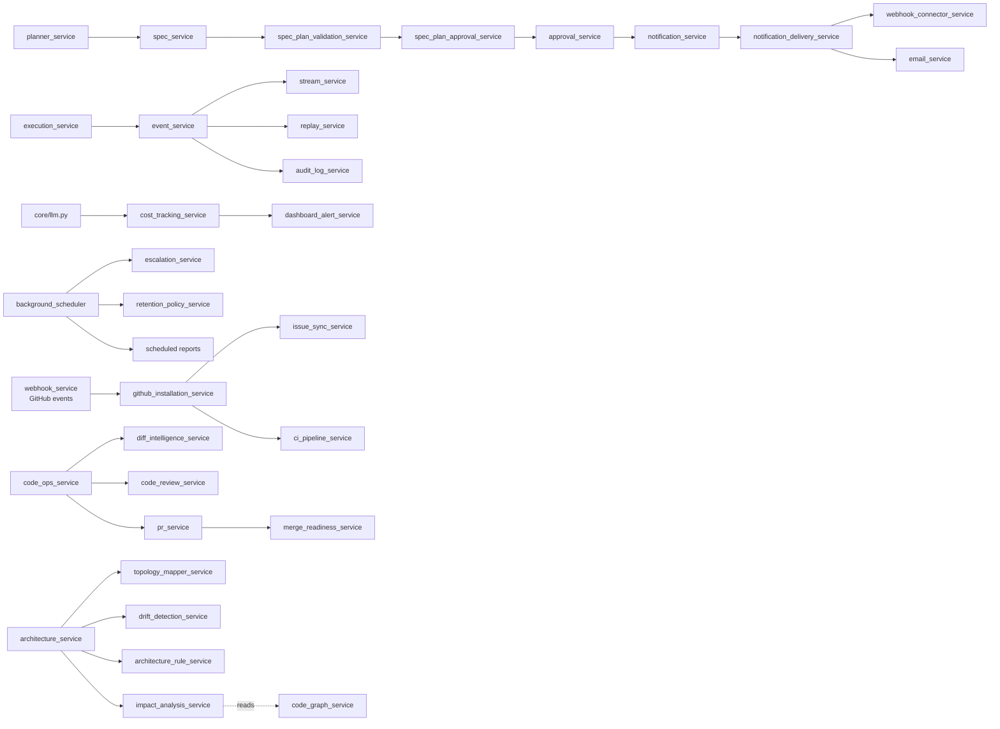

# 3 · Backend Graph

> 53 routers → 109 services → 42 models, all under [apps/api/app/](../../apps/api/app/). This file maps routers to the services they call, services to the models they persist, and the core infra every request goes through.

## Middleware stack (order applied in [main.py](../../apps/api/app/main.py))

```
request
  ↓
CORSMiddleware                                  (core/config.py — allowed_origins)
  ↓
RateLimitMiddleware                             (core/rate_limit.py — 100/60s default)
  ↓
RequestLoggingMiddleware                        (core/logging_middleware.py — request_id, timing, JSON logs)
  ↓
MetricsMiddleware                               (core/metrics_middleware.py — Prometheus /metrics)
  ↓
IPAllowlistMiddleware                           (core/ip_allowlist_middleware.py — enterprise gating)
  ↓
api_router  (app.include_router)
  ↓
route handler  →  auth / authz DI  →  service  →  model  →  Postgres
```

Error handlers registered via `core/error_handlers.py` produce a uniform JSON error envelope.

## Core infrastructure ([apps/api/app/core/](../../apps/api/app/core/))

| Module | Purpose | Key exports |
| :-- | :-- | :-- |
| [config.py](../../apps/api/app/core/config.py) | Env-driven settings (pydantic-settings) | `Settings`, `get_settings()` |
| [auth.py](../../apps/api/app/core/auth.py) | JWT creation / decode · password hashing · user resolver | `create_access_token`, `get_current_user` |
| [authz_deps.py](../../apps/api/app/core/authz_deps.py) | DI for scopes / RBAC on routes | `require_scope`, `require_role`, `require_project_role` |
| [llm.py](../../apps/api/app/core/llm.py) | LiteLLM wrapper with cost recording | `complete()`, `stream()` |
| [rate_limit.py](../../apps/api/app/core/rate_limit.py) | Sliding-window limiter per IP + per API key | `RateLimitMiddleware` |
| [logging_middleware.py](../../apps/api/app/core/logging_middleware.py) | Request ID + JSON logs | `RequestLoggingMiddleware` |
| [error_handlers.py](../../apps/api/app/core/error_handlers.py) | Uniform JSON errors | `register_error_handlers()` |
| [metrics.py](../../apps/api/app/core/metrics.py) · [metrics_middleware.py](../../apps/api/app/core/metrics_middleware.py) | Prometheus counters / histograms | `MetricsMiddleware`, `/metrics` |
| [ip_allowlist_middleware.py](../../apps/api/app/core/ip_allowlist_middleware.py) | Enterprise IP gating | `IPAllowlistMiddleware` |

## Route → service adjacency

Below every route module is paired with its primary services. Routes commonly call multiple services; only the principal ones are listed.

| Route module ([`api/routes/`](../../apps/api/app/api/routes/)) | Primary services ([`services/`](../../apps/api/app/services/)) |
| :-- | :-- |
| `activity.py` | `activity_service`, `unified_activity_service`, `user_activity_service` |
| `agents.py` | `agent_service`, `phase_agent_profile_service` |
| `analytics.py` | `execution_health_service`, `structural_health_service`, `velocity_quality_service`, `project_overview_service` |
| `annotations.py` | `run_annotation_service` |
| `api_ecosystem.py` | `api_key_service` |
| `approvals.py` | `approval_service`, `approval_enhanced_service`, `spec_plan_approval_service` |
| `architecture.py` | `architecture_service`, `topology_mapper_service`, `architecture_rule_service`, `drift_detection_service`, `impact_analysis_service`, `code_graph_service` |
| `artifacts.py` | `artifact_service`, `artifact_version_service`, `delivery_artifact_service` |
| `audit.py` | `audit_log_service`, `audit_export_service` |
| `auth.py` | `core/auth.py` helpers, `membership_service` |
| `chat.py` | `chat_service`, `slash_command_service`, `stream_service` |
| `checkpoints.py` | `execution_checkpoint_service` |
| `code_intelligence.py` | `code_graph_service`, `pattern_debt_service`, `flakiness_complexity_service`, `refactor_recommendation_service`, `convention_service` |
| `code_ops.py` | `code_ops_service`, `code_review_service`, `diff_intelligence_service`, `pr_service`, `merge_readiness_service` |
| `collaboration.py` | `comment_service`, `mention_service`, `saved_view_service`, `workspace_service` |
| `comments.py` | `comment_service`, `mention_service` |
| `composition.py` | `composition_service`, `adaptive_orchestrator` |
| `connectors.py` | `connector_service`, `webhook_connector_service` |
| `constitution.py` · `constitution_suggestions.py` | `constitution_service`, `constitution_suggestion_service` |
| `costs.py` | `cost_tracking_service`, `dashboard_alert_service` |
| `council.py` | `council_service` |
| `credential_vault.py` | `credential_vault_service`, `encryption_service` |
| `delivery.py` | `delivery_artifact_service`, `release_confidence_service`, `release_gate_service`, `release_package_service`, `post_release_service`, `rollback_readiness_service`, `deployment_readiness_service` |
| `enterprise_governance.py` | `sso_configuration_service`, `ip_allowlist_service`, `compliance_report_service`, `retention_policy_service` |
| `escalation.py` | `escalation_service`, `notification_service` |
| `events.py` | `event_service`, `stream_service` |
| `github_integration.py` | `github_client`, `github_installation_service`, `github_rate_limiter`, `issue_sync_service`, `ci_pipeline_service` |
| `governance.py` | `governance_service`, `governance_engine_service` |
| `health.py` | liveness/readiness — no service dep |
| `knowledge.py` | `knowledge_service`, `embedding_service` |
| `members.py` | `membership_service`, `authz_service` |
| `memory.py` | `run_memory_service`, `run_memory_enrichment_service` |
| `metrics.py` | Prometheus endpoint |
| `notifications.py` | `notification_service`, `notification_delivery_service`, `notification_digest_service` |
| `phase_agent_profiles.py` | `phase_agent_profile_service` |
| `planner.py` | `planner_service` (LLM planner), `spec_service`, `spec_plan_validation_service`, `plan_artifact_service` |
| `planner_results.py` | `planner_service` result fetch |
| `projects.py` | `project_service`, `project_overview_service`, `project_template_service`, `template_inheritance_service` |
| `project_templates.py` | `project_template_service`, `template_inheritance_service` |
| `release_ops.py` | `release_gate_service`, `release_confidence_service`, `release_package_service`, `post_release_service`, `operational_timeline_service`, `rollback_readiness_service` |
| `replay.py` | `replay_service` |
| `repos.py` | `repo_service`, `github_client` |
| `retry.py` | `adaptive_retry_service`, `adaptive_orchestrator` |
| `runs.py` | `execution_service`, `run_lifecycle_service`, `run_comparison_service` |
| `run_lifecycle.py` | `run_lifecycle_service` |
| `saved_views.py` | `saved_view_service` |
| `search_knowledge.py` | `search_service`, `knowledge_service`, `embedding_service` |
| `streaming.py` | `stream_service` (SSE fanout) |
| `tasks.py` | `task_service`, `task_assignment_service` |
| `trust.py` | `trust_scoring_service` |
| `workspaces.py` | `workspace_service`, `membership_service` |

## Service → model ownership

Each model file under [`apps/api/app/models/`](../../apps/api/app/models/) has a primary service owner.

| Model | Owned by | Also read by |
| :-- | :-- | :-- |
| `activity.py` | `activity_service` | `unified_activity_service`, `user_activity_service` |
| `agent.py` | `agent_service` | `composition_service`, `phase_agent_profile_service` |
| `analytics_metrics.py` | `execution_health_service` | `structural_health_service`, `velocity_quality_service`, `project_overview_service` |
| `api_ecosystem.py` | `api_key_service` | `core/authz_deps.py` (scope check) |
| `approval_request.py` · `approval_delegation.py` | `approval_service` | `approval_enhanced_service`, `spec_plan_approval_service`, `architecture_approval_service` |
| `architecture.py` | `architecture_service` | `topology_mapper_service`, `drift_detection_service`, `architecture_rule_service`, `impact_analysis_service`, `architecture_approval_service` |
| `artifact.py` | `artifact_service` | `artifact_version_service`, `delivery_artifact_service`, `plan_artifact_service` |
| `code_intelligence.py` | `code_graph_service` | `pattern_debt_service`, `flakiness_complexity_service`, `refactor_recommendation_service`, `convention_service`, `impact_analysis_service` |
| `code_ops.py` | `code_ops_service` | `code_review_service`, `diff_intelligence_service`, `pr_service`, `merge_readiness_service` |
| `comment.py` | `comment_service` | `mention_service` |
| `connector.py` · `project_connector_link.py` | `connector_service` | `webhook_connector_service`, `notification_delivery_service` |
| `constitution_suggestion.py` | `constitution_suggestion_service` | `constitution_service` |
| `cost_record.py` | `cost_tracking_service` | `core/llm.py` (writes), `dashboard_alert_service` (reads) |
| `council.py` | `council_service` | |
| `credential_vault.py` | `credential_vault_service` | `encryption_service`, `github_client`, `connector_service` |
| `enterprise_governance.py` | `compliance_report_service`, `retention_policy_service` | `core/ip_allowlist_middleware.py` via `ip_allowlist_service` |
| `escalation.py` | `escalation_service` | `background_scheduler` (loop), `notification_service` |
| `execution_checkpoint.py` | `execution_checkpoint_service` | `execution_service` |
| `execution_event.py` | `event_service` | `stream_service`, `replay_service`, `audit_log_service` |
| `github_integration.py` | `github_installation_service` | `github_client`, `issue_sync_service`, `ci_pipeline_service`, `webhook_service` |
| `governance_policy.py` | `governance_service` | `governance_engine_service` |
| `membership.py` | `membership_service` | `authz_service`, `workspace_service` |
| `notification.py` | `notification_service` | `notification_delivery_service`, `notification_digest_service` |
| `phase_agent_profile.py` | `phase_agent_profile_service` | `composition_service` |
| `planner_result.py` | `planner_service` | `spec_service`, `spec_plan_validation_service` |
| `project.py` | `project_service` | almost every other service (FK owner) |
| `project_constitution.py` | `constitution_service` | |
| `project_knowledge.py` | `knowledge_service` | `search_service`, `embedding_service` |
| `project_template.py` | `project_template_service` | `template_inheritance_service` |
| `release_ops.py` | `release_gate_service` | `release_confidence_service`, `release_package_service`, `post_release_service`, `operational_timeline_service`, `rollback_readiness_service`, `deployment_readiness_service` |
| `replay_snapshot.py` | `replay_service` | `event_service` (writes on demand) |
| `repo_connection.py` | `repo_service` | `github_client`, `code_ops_service` |
| `run.py` | `execution_service` | `run_lifecycle_service`, `run_comparison_service`, `run_memory_service`, `run_annotation_service`, `replay_service` |
| `run_annotation.py` | `run_annotation_service` | |
| `saved_view.py` | `saved_view_service` | |
| `search_knowledge.py` | `search_service` | `knowledge_service`, `embedding_service` |
| `sso_configuration.py` | `sso_configuration_service` | enterprise governance route |
| `task.py` | `task_service` | `task_assignment_service`, `execution_service` |
| `trust_score.py` | `trust_scoring_service` | `approval_enhanced_service`, `council_service` |
| `user.py` | `core/auth.py`, `membership_service` | everywhere |
| `workspace.py` | `workspace_service` | `membership_service` |

## Cross-service relationships (non-obvious edges)



## Scheduler jobs ([background_scheduler.py](../../apps/api/app/services/background_scheduler.py))

- `escalation_loop` → `_run_escalation_cycle` → `escalation_service.process_due_escalations()`
- `retention_loop` → `_run_retention_cycle` → `retention_policy_service.apply_policies()`
- `scheduled_report_loop` → `_run_scheduled_reports_cycle` → `project_overview_service` + delivery via `notification_delivery_service`
- Single 60s tick started inside FastAPI lifespan in [main.py](../../apps/api/app/main.py).

## Persistence layer

- All models inherit from a shared `Base` in `apps/api/app/db/`.
- Async session via `AsyncSession` factory; DI: `async def db(session: AsyncSession = Depends(get_session))`.
- Alembic chain head: `fm161_170_search_knowledge`. Tests bypass Alembic — they use `Base.metadata.create_all()` against aiosqlite (see [apps/api/tests/conftest.py](../../apps/api/tests/conftest.py)).
