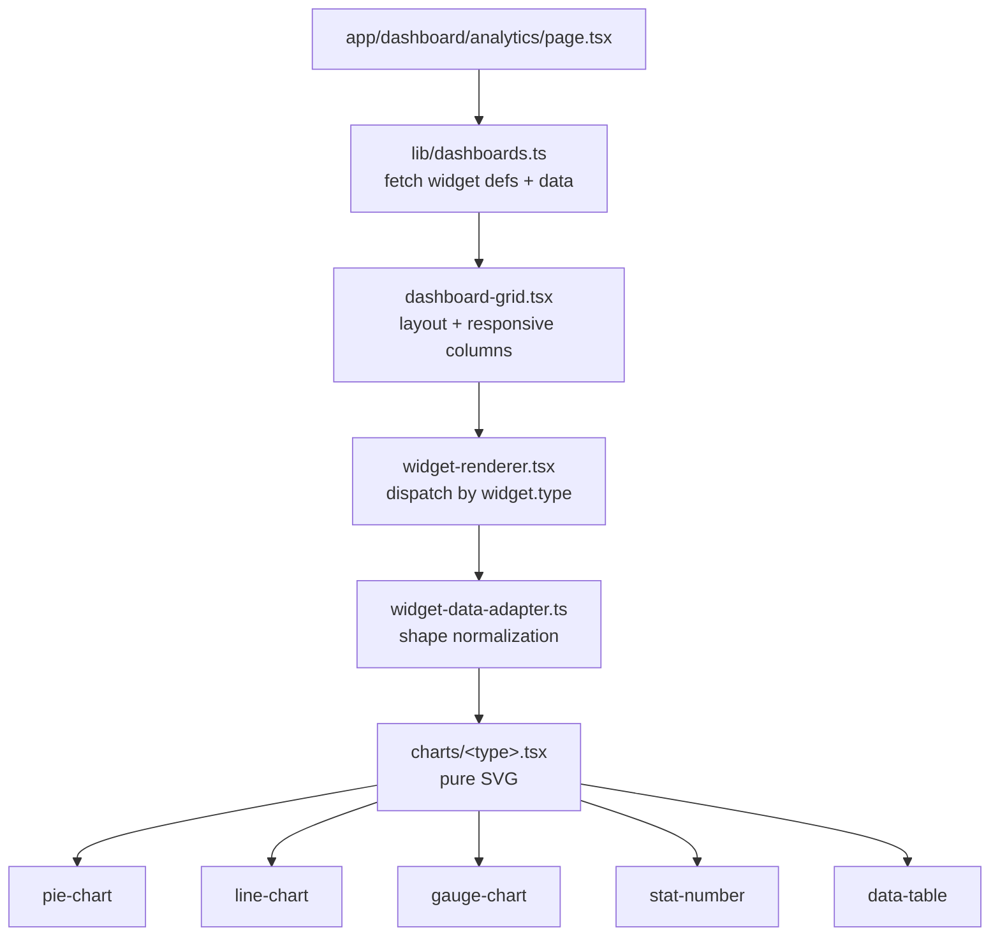

# 4 · Frontend Graph

> Next.js 15 App Router. Pages are pure views that lift data through `lib/<domain>.ts` typed clients. No business logic in components.

## Route tree ([apps/web/app/](../../apps/web/app/))

```
app/
├── login/                                 sign-in page
└── dashboard/                             25 domain folders
    ├── activity/                          live activity feed
    ├── agents/                            agent directory + phase profiles
    ├── analytics/                         composite health · velocity · quality · portfolio
    ├── approvals/                         approval inbox + detail
    ├── architecture/                      topology · rules · drift · impact
    ├── artifacts/                         artifact browser + versions
    ├── audit/                             audit log + export
    ├── code-explorer/                     code graph · refactor · debt · complexity
    ├── connectors/                        Slack / email / PagerDuty / generic
    ├── costs/                             cost tracking + budget alerts
    ├── council/                           multi-agent deliberation view
    ├── escalations/                       escalation queue
    ├── governance/                        constitution · policies · enterprise
    ├── knowledge/                         cross-project search + memory
    ├── notifications/                     inbox + digest settings
    ├── projects/                          project list + per-project detail
    │   └── [projectId]/                   scoped run / task / artifact views
    ├── releases/                          release ops (gates · confidence · rollback)
    ├── replay/                            replay snapshots
    ├── reviews/                           code review threads
    ├── runs/                              run list + detail + comparison
    ├── sandbox/                           bounded execution UI
    ├── settings/                          workspace / user settings
    ├── trust/                             trust scoring
    ├── vault/                             credential vault
    └── workspaces/                        workspace administration
```

## Data layer ([apps/web/lib/](../../apps/web/lib/))

Every module is a **typed API client** for one backend domain, routed through the shared [`api.ts`](../../apps/web/lib/api.ts) HTTP wrapper.

| lib module | Hits route(s) | Consumed by page(s) |
| :-- | :-- | :-- |
| [`api.ts`](../../apps/web/lib/api.ts) | — | ALL lib modules (shared fetch + auth headers) |
| [`auth-context.tsx`](../../apps/web/lib/auth-context.tsx) | `/api/v1/auth/*` | root layout, `login/` |
| [`stream.ts`](../../apps/web/lib/stream.ts) | `/api/v1/streaming/*` (SSE) | `runs/`, `activity/`, `chat`, live widgets |
| `activity.ts` | `/api/v1/activity/*` | `dashboard/activity/` |
| `agents.ts` | `/api/v1/agents/*` | `dashboard/agents/` |
| `approvals.ts` | `/api/v1/approvals/*` | `dashboard/approvals/` |
| `architecture.ts` | `/api/v1/architecture/*` | `dashboard/architecture/` |
| `artifacts.ts` | `/api/v1/artifacts/*` | `dashboard/artifacts/` |
| `audit.ts` | `/api/v1/audit/*` | `dashboard/audit/` |
| `chat.ts` | `/api/v1/chat/*` | chat components |
| `connectors.ts` | `/api/v1/connectors/*` | `dashboard/connectors/` |
| `constitution.ts` · `constitution-suggestions.ts` | `/api/v1/constitution/*`, `/api/v1/constitution-suggestions/*` | `dashboard/governance/` |
| `costs.ts` | `/api/v1/costs/*` | `dashboard/costs/` |
| `council.ts` | `/api/v1/council/*` | `dashboard/council/` |
| `dashboards.ts` | `/api/v1/analytics/*` + widget shapes | `dashboard/analytics/` |
| `escalations.ts` | `/api/v1/escalation/*` | `dashboard/escalations/` |
| `events.ts` | `/api/v1/events/*` | run/task detail timelines |
| `governance.ts` | `/api/v1/governance/*` + `/api/v1/enterprise-governance/*` | `dashboard/governance/` |
| `knowledge.ts` | `/api/v1/knowledge/*` + `/api/v1/search-knowledge/*` | `dashboard/knowledge/` |
| `notifications.ts` | `/api/v1/notifications/*` | `dashboard/notifications/` |
| `phase-profiles.ts` | `/api/v1/phase-agent-profiles/*` | `dashboard/agents/` |
| `planner.ts` | `/api/v1/planner/*` + `/api/v1/planner-results/*` | prompt-intake, plan detail |
| `project-members.ts` | `/api/v1/members/*` | `dashboard/workspaces/`, `dashboard/projects/[projectId]/` |
| `projects.ts` | `/api/v1/projects/*` + `/api/v1/project-templates/*` | `dashboard/projects/` |
| `release-ops.ts` | `/api/v1/release-ops/*` + `/api/v1/delivery/*` | `dashboard/releases/` |
| `replay.ts` | `/api/v1/replay/*` | `dashboard/replay/` |
| `runs.ts` | `/api/v1/runs/*` + `/api/v1/run-lifecycle/*` | `dashboard/runs/` |
| `tasks.ts` | `/api/v1/tasks/*` | run detail, task boards |
| `templates.ts` | `/api/v1/project-templates/*` | project create form |
| `trust.ts` | `/api/v1/trust/*` | `dashboard/trust/` |
| `vault.ts` | `/api/v1/credential-vault/*` | `dashboard/vault/` |
| `workspaces.ts` | `/api/v1/workspaces/*` | `dashboard/workspaces/`, `dashboard/settings/` |

## Component organization ([apps/web/components/](../../apps/web/components/))

```
components/
├── ui/             shadcn primitives (button, card, dialog, table, tabs, tooltip, ...)
├── layout/         shell, sidebar, topbar, breadcrumbs
├── approvals/      approval cards + modal
├── artifacts/      artifact viewer, version picker
├── chat/           chat pane + message renderers
├── dashboard/      widget system + charts (see below)
├── events/         event timeline components
├── planner/        prompt intake form, plan viewer
├── projects/       project list, create form
└── tasks/          task cards, kanban columns
```

### Dashboard widget system ([apps/web/components/dashboard/](../../apps/web/components/dashboard/))



- **No chart library** — all visualizations are dependency-free SVG in [`apps/web/components/dashboard/charts/`](../../apps/web/components/dashboard/charts/).
- **Widget definitions come from the backend** — `lib/dashboards.ts` fetches widget configs; `widget-data-adapter.ts` normalizes backend shapes for each chart type.
- **Tests** covering the widget pipeline live in [`apps/web/components/dashboard/__tests__/`](../../apps/web/components/dashboard/__tests__/).

## State + data-flow rules

- **No global client state store.** Each page fetches via its lib client and holds its own state.
- **Auth context** is the one exception: [`auth-context.tsx`](../../apps/web/lib/auth-context.tsx) provides current user + tokens.
- **Live updates** via SSE: pages subscribe through [`stream.ts`](../../apps/web/lib/stream.ts) using the `useStream` hook; SSE reconnection + heartbeat handled there.
- **Type safety** — every lib client exports interfaces matching backend Pydantic schemas; drift is caught at `tsc --noEmit` in CI.

## Page → lib → route canonical example

```
dashboard/approvals/page.tsx
   ↓ imports
lib/approvals.ts   (listApprovals, submitDecision, delegateApproval)
   ↓ via lib/api.ts
GET /api/v1/approvals
POST /api/v1/approvals/{id}/decisions
POST /api/v1/approvals/{id}/delegations
   ↓ hits
api/routes/approvals.py
   ↓ calls
services/approval_service.py  (+ approval_enhanced_service for extended flows)
   ↓ persists
models/approval_request.py · models/approval_delegation.py
```

Every domain follows this same spine — that is the sole routing idiom in the frontend.

## Test map

| Area | Location |
| :-- | :-- |
| Route-level page tests | `apps/web/app/dashboard/**/[__tests__]/*.test.tsx` |
| Component tests | `apps/web/components/**/__tests__/*.test.tsx` |
| Lib (API client) tests | `apps/web/lib/__tests__/*.test.ts` |
| Dashboard widget tests | `apps/web/components/dashboard/__tests__/*.test.*` |

Vitest config: [`apps/web/vitest.config.ts`](../../apps/web/vitest.config.ts) · v8 coverage uploaded from CI.
