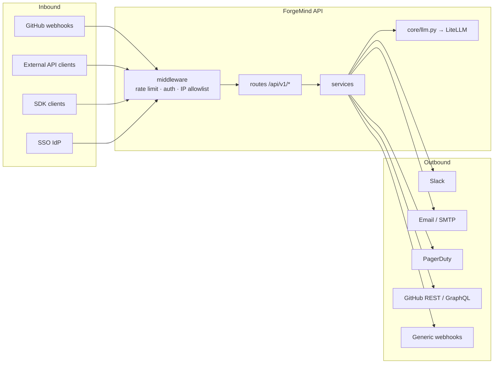

# 5 · Integrations Graph

> How ForgeMind talks to the outside world: inbound (GitHub webhooks, SSO, public API, SDKs) and outbound (Slack, email, PagerDuty, generic webhooks).

## Surface map



## Inbound — public API surface

### Routing & versioning

- Single version prefix: **`/api/v1/`**, mounted in [`apps/api/app/main.py`](../../apps/api/app/main.py) via `app.include_router(api_router)`.
- 53 route modules registered in [`apps/api/app/api/routes/__init__.py`](../../apps/api/app/api/routes/__init__.py).
- Interactive docs: `/docs` (Swagger), `/redoc`, raw spec `/openapi.json`.
- OpenAPI completeness enforced by a backend test (`TestOpenAPISpecCompleteness`).

### Authentication

| Mechanism | Defined in | Used by |
| :-- | :-- | :-- |
| **JWT bearer** | [`core/auth.py`](../../apps/api/app/core/auth.py) | end-user browser + SDK login |
| **API keys** (scopes: `read`/`write`/`admin`) | [`services/api_key_service.py`](../../apps/api/app/services/api_key_service.py), [`models/api_ecosystem.py`](../../apps/api/app/models/api_ecosystem.py) | server-to-server SDK calls |
| **Scope / RBAC DI** | [`core/authz_deps.py`](../../apps/api/app/core/authz_deps.py) | every protected route |

### Rate limiting

- Middleware: [`core/rate_limit.py`](../../apps/api/app/core/rate_limit.py) — `RateLimitMiddleware` (sliding window).
- Defaults: 100 requests / 60s per IP (overridable per key via `api_key_service`).
- Emits `X-RateLimit-Limit`, `X-RateLimit-Remaining`, `X-RateLimit-Reset` headers.

### SSO + IP allowlist (enterprise)

- SSO config: [`services/sso_configuration_service.py`](../../apps/api/app/services/sso_configuration_service.py) + [`models/sso_configuration.py`](../../apps/api/app/models/sso_configuration.py).
- IP allowlist enforced by [`core/ip_allowlist_middleware.py`](../../apps/api/app/core/ip_allowlist_middleware.py) backed by [`services/ip_allowlist_service.py`](../../apps/api/app/services/ip_allowlist_service.py).
- Compliance reports: [`services/compliance_report_service.py`](../../apps/api/app/services/compliance_report_service.py).
- Data retention: [`services/retention_policy_service.py`](../../apps/api/app/services/retention_policy_service.py) (driven by `background_scheduler`).

## Inbound — GitHub webhooks

```
GitHub webhook POST
   ↓
api/routes/github_integration.py
   ↓ verify_github_signature()  (webhook_service.py)
   ↓
services/webhook_service.py — ingest_event()
   ↓ dispatch by event type
┌──────────────────────────────────────────────────┐
│ process_pr_event          → pr_service           │
│ process_workflow_run_event → ci_pipeline_service  │
│ process_issues_event       → issue_sync_service  │
│ process_push_event         → code_ops_service    │
│ process_release_event      → release_gate_service│
│ process_check_run_event    → ci_pipeline_service │
└──────────────────────────────────────────────────┘
   ↓
services/github_installation_service.py  (installation + repo bindings)
services/github_client.py                 (outbound REST/GraphQL)
services/github_rate_limiter.py           (client-side GitHub rate ctrl)
```

Models: [`models/github_integration.py`](../../apps/api/app/models/github_integration.py) · [`models/repo_connection.py`](../../apps/api/app/models/repo_connection.py).

## Outbound — generic webhooks ([`webhook_connector_service.py`](../../apps/api/app/services/webhook_connector_service.py))

| Function | Purpose |
| :-- | :-- |
| `create_webhook` · `list_webhooks` · `get_webhook` · `delete_webhook` | CRUD on `WebhookEndpoint` |
| `sign_payload(payload, secret)` | HMAC-SHA256 signature (`X-ForgeMind-Signature`) |
| `dispatch_webhook(endpoint, payload)` | actual POST with retry |
| `fire_event(event_type, payload, project_id)` | fan-out to all subscribed endpoints |
| `record_delivery` · `mark_delivery_success` · `mark_delivery_failed` | audit trail in `WebhookDelivery` |
| `get_delivery_history` | paginated history for UI |
| `register_connector` · `list_connectors` · `get_connector` · `update_connector_status` · `health_check_connector` · `delete_connector` | connector registry (typed instances per project) |

Models: [`models/connector.py`](../../apps/api/app/models/connector.py) · [`models/project_connector_link.py`](../../apps/api/app/models/project_connector_link.py).

## Outbound — Slack / Email / PagerDuty

All notification delivery flows through a single pipeline:

```
event source
   ↓
notification_service.enqueue()
   ↓
notification_delivery_service.process_pending()
   ↓ per subscription channel
┌──────────────────────────────────────────┐
│ Slack     → webhook_connector_service    │
│ Email     → email_service (SMTP)         │
│ PagerDuty → webhook_connector_service    │
│ in-app    → stored for inbox UI          │
└──────────────────────────────────────────┘
   ↓
notification_digest_service  (daily / weekly rollups)
```

- [`services/email_service.py`](../../apps/api/app/services/email_service.py) — SMTP sender.
- [`services/notification_service.py`](../../apps/api/app/services/notification_service.py) — core enqueue + preferences.
- [`services/notification_delivery_service.py`](../../apps/api/app/services/notification_delivery_service.py) — dispatch + retry.
- [`services/notification_digest_service.py`](../../apps/api/app/services/notification_digest_service.py) — scheduled digests, driven by `background_scheduler`.
- Connector config CRUD: [`services/connector_service.py`](../../apps/api/app/services/connector_service.py).

### Credentials

Connector credentials (Slack webhook URL, SMTP auth, PagerDuty routing key, etc.) are stored via [`credential_vault_service`](../../apps/api/app/services/credential_vault_service.py) using [`encryption_service`](../../apps/api/app/services/encryption_service.py) (symmetric-key envelope encryption). Never stored in plaintext.

## SDKs ([`apps/api/app/sdk/`](../../apps/api/app/sdk/))

| File | Role |
| :-- | :-- |
| [`python_client.py`](../../apps/api/app/sdk/python_client.py) | Python SDK (auth, core resource clients, streaming helper) |
| [`typescript_client.ts`](../../apps/api/app/sdk/typescript_client.ts) | TypeScript SDK (same surface, isomorphic fetch) |
| [`pyproject.toml`](../../apps/api/app/sdk/pyproject.toml) · [`package.json`](../../apps/api/app/sdk/package.json) | publishable package metadata |
| [`openapi-generator-config.yaml`](../../apps/api/app/sdk/openapi-generator-config.yaml) | regeneration config; SDK can be re-scaffolded from `/openapi.json` |

**Call path:**

```
user code → SDK client method → HTTP /api/v1/... → route → service → model
```

SDKs are thin — they do not duplicate validation or business logic. They carry:
- auth header management (JWT or API key),
- typed request/response shapes,
- pagination iterators,
- SSE helper for streaming endpoints (`runs/{id}/stream`, `events/stream`, etc.).

## What to touch when adding an integration

| You want to add… | Touch |
| :-- | :-- |
| New outbound channel (Teams, Discord, …) | `connector_service` + `webhook_connector_service` dispatch branch + `notification_delivery_service` switch + UI in `dashboard/connectors/` |
| New inbound webhook source | `services/webhook_service.py` new `process_*_event` + route dispatcher in `routes/github_integration.py` or new route module |
| New API key scope | Extend scopes in [`api_key_service.py`](../../apps/api/app/services/api_key_service.py) + guard in [`core/authz_deps.py`](../../apps/api/app/core/authz_deps.py) + migration if persisted |
| New SDK method | Add route first → update `python_client.py` + `typescript_client.ts` → optionally regen from OpenAPI |
